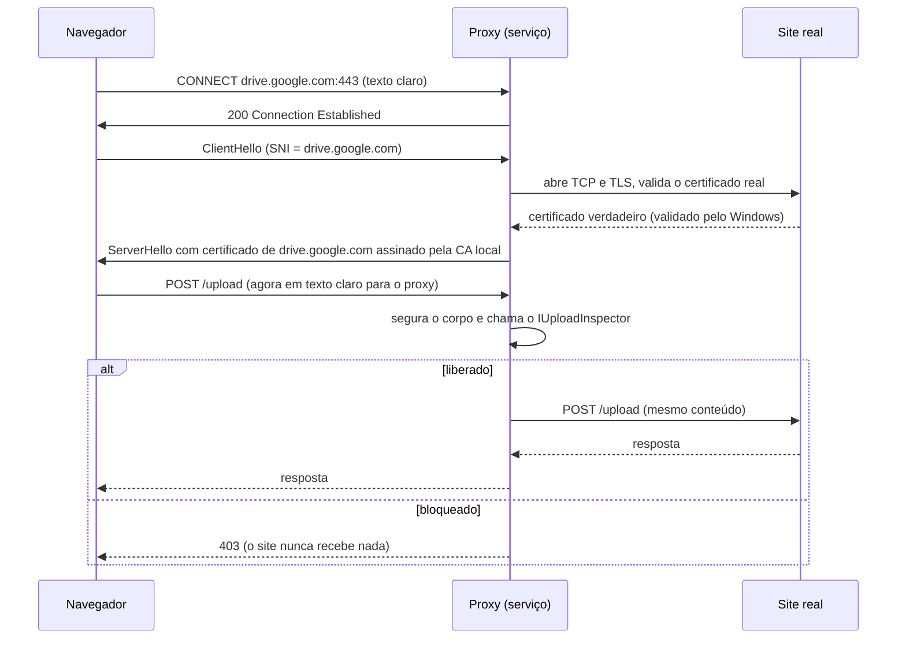

# Arquitetura da inspeção TLS — estado atual

Documento de referência do que **está implementado** na inspeção do tráfego
web. O [plano](PLANO-INSPECAO-TLS.md) registra as intenções e a ordem das
fases; este documento descreve o código como ele é, por que é assim e o que
falta. Cada fase concluída atualiza este documento no mesmo PR.

| Fase | Estado | PR |
|---|---|---|
| 0 — Estudo do tráfego | Concluída ([resultado](FASE0-ESTUDO-TRAFEGO.md)) | #17 |
| 1 — CA e certificados | Concluída | #20 |
| 2 — Núcleo do proxy | Concluída | #22 |
| 3 — Desvio do tráfego (navegadores) | Concluída | #23 |
| 4 — Exceções | Pendente | |
| 5 — Inspeção de upload | Pendente: o proxy vê tudo, mas ainda libera tudo | |
| 6 — Decisão, aviso e auditoria | Pendente | |
| 7 — Qualificação | Pendente | |

---

## 1. O problema

O minifiltro e o watcher veem operações de **arquivo**. Um upload pela web não
é uma operação de arquivo que eles consigam barrar: o navegador lê o arquivo e
o envia dentro de uma conexão HTTPS, criptografada. Para ver o conteúdo, o
agente precisa ficar **no meio** dessa conexão: abrir a criptografia, olhar o
que sai e decidir antes de repassar.

É isso que a inspeção TLS faz. Ela roda inteira no serviço do agente
(`SafeUpload.Agent.Service`), em modo usuário, sem driver novo. O código fica
no projeto `agente/SafeUpload.Agent.Network`.

---

## 2. Visão geral

```
 Navegador (Chrome/Edge/Firefox)
    │  1. política corporativa: "use o proxy 127.0.0.1:8877"
    │  2. filtro WFP: o navegador NÃO pode abrir conexão para as portas 80/443
    ▼
 CONNECT drive.google.com:443  ───►  Proxy do SafeUpload (dentro do serviço, 127.0.0.1:8877)
                                        │
                                        ├─ site em exceção? ─► túnel cego (nada é descriptografado)   [Fase 4]
                                        │
                                        └─ senão:
                                            a) TLS com o site real, validando o certificado real
                                            b) TLS com o navegador, com certificado emitido pela CA local
                                            c) lê cada requisição HTTP; se tem corpo, segura e pergunta
                                               ao inspetor: libera ─► repassa ao site
                                                            bloqueia ─► 403 ao navegador          [Fase 5]
```

Sequência de uma conexão interceptada:



---

## 3. Componentes

Projeto `agente/SafeUpload.Agent.Network` (net10.0-windows):

| Pasta / classe | Fase | Responsabilidade |
|---|---|---|
| `Certificates/MachineCertificateAuthority` | 1 | Cria, reencontra, renova e remove a CA local; põe a parte pública em `LocalMachine\Root`. |
| `Certificates/CertificateAuthorityOptions` | 1 | Onde a CA fica guardada. Produção usa `Machine`; os testes usam CAs descartáveis no repositório do usuário. |
| `Certificates/HostCertificateFactory` | 1 | Emite na hora o certificado de cada site, com cache em memória. |
| `Certificates/FirefoxEnterpriseRoots` | 1 | Política `ImportEnterpriseRoots`: o Firefox passa a confiar nas raízes do Windows. |
| `Certificates/RevocationListPublisher` | 2 | Lista de revogação (CRL) vazia, assinada pela CA, servida pelo proxy. |
| `Http/HttpHeaders`, `Http/HttpMessageHead` | 2 | Cabeçalhos e primeira linha de requisições e respostas HTTP/1.1. |
| `Http/HttpStreamReader` | 2 | Parser HTTP/1.1 próprio: cabeçalhos, corpo por tamanho, em pedaços ou até fechar. |
| `Proxy/TlsInspectionProxy` | 2 | O proxy: CONNECT, túnel ou interceptação, os dois TLS, troca de mensagens. |
| `Proxy/TlsInspectionProxyOptions` | 2 | Porta, limites de tempo e de tamanho, regra de interceptação, validação do servidor. |
| `Proxy/IUploadInspector` | 2 | Ponto de decisão: recebe a requisição com corpo e responde libera/bloqueia. |
| `Proxy/TcpConnectionOwner` | 2 | Descobre o processo (msedge, chrome...) dono de cada conexão. |
| `Proxy/PrefixedStream` | 2 | Entrega ao TLS os bytes que chegaram junto com o CONNECT. |
| `Diversion/BrowserProxyPolicies` | 3 | Políticas de proxy de Chrome, Edge e Firefox, e QUIC desligado. |
| `Diversion/BrowserEgressFilter`, `Diversion/WfpNative` | 3 | Filtros da WFP que impedem os navegadores de sair direto. |

No serviço (`agente/SafeUpload.Agent.Service/Network`):

| Classe | Responsabilidade |
|---|---|
| `TlsInspectionService` | Sobe e derruba tudo junto com o serviço, na ordem certa (seção 6). |
| `CertificateAuthorityCommand` | `SafeUpload.Agent.Service ca install / status / remove`. |
| `DiversionCommand` | `SafeUpload.Agent.Service desvio status / remove`. |

O `Core` (motor de inspeção) ainda não é chamado pelo proxy: isso é a Fase 5.
Até lá, o `TlsInspectionService` usa um inspetor provisório que só registra
metadados no log (site, caminho sem query string, tamanho, tipo e processo;
nunca o conteúdo) e libera tudo.

---

## 4. Decisões e o porquê de cada uma

### 4.1 CA local (Fase 1)

Quem tem a chave privada da CA de inspeção consegue se passar por qualquer site
na máquina. As decisões desta parte existem para proteger essa chave.

| Decisão | Por quê |
|---|---|
| **Uma CA por máquina, gerada na própria máquina** | Uma CA compartilhada faria do vazamento da chave de um computador um ataque contra todos. Gerada aqui, a chave nunca existiu em outro lugar. |
| **Chave CNG não exportável** (`ExportPolicy = None`) | O Windows assina com ela, mas não a entrega, nem a administradores pelas APIs comuns. Verificado: `Export-PfxCertificate` responde "Cannot export non-exportable private key". |
| **Chave da máquina, não do usuário** | O serviço roda como SYSTEM; a chave precisa existir qualquer que seja o usuário logado. |
| **Em `Root` vai só a parte pública** | Confiar numa CA não exige a chave dela. |
| **CA de um nível** (`pathLength = 0`) | Pode assinar certificados de sites, mas não outras CAs. Limita o estrago de um uso indevido. |
| **ECDSA P-256, não RSA** | Assina bem mais rápido, e os certificados de site são gerados com o navegador esperando. Aceito por todos os navegadores atuais. |
| **Validade de 10 anos, renovação 30 dias antes** | Uma CA que vence com o serviço rodando derrubaria toda a navegação inspecionada. A renovação remove a CA antiga de `Root`. |
| **Nome da máquina no assunto da CA** | Quem olhar a lista de raízes sabe de onde a CA veio. Efeito colateral: renomear a máquina gera uma CA nova. |
| **Firefox por registro** (`HKLM\SOFTWARE\Policies\Mozilla\Firefox`), não `policies.json` | Mesmo efeito; não depende da pasta de instalação nem é sobrescrito em atualização. |

### 4.2 Certificados de site (Fases 1 e 2)

| Decisão | Por quê |
|---|---|
| **Nome do site no SAN** (Subject Alternative Name) | O Chrome ignora o CN; sem SAN o certificado é recusado. IPs viram SAN de IP. |
| **Validade de 7 dias** | Não há revogação real; o prazo curto limita o uso de um certificado vazado. O cache reemite 1 dia antes de vencer. |
| **Uma chave para todos os certificados de site, só em memória** | Mesma escolha do mitmproxy. Quem lê a memória do serviço já vê o tráfego de qualquer forma; o que precisa de proteção forte é a chave da CA. |
| **Cache por host, uma emissão por host** | O navegador abre várias conexões ao mesmo site ao mesmo tempo. Teto de 2000 hosts; ao estourar, o cache é esvaziado. |
| **Reimportação via PKCS#12** | O SChannel (TLS do Windows) não aceita chave que só existe na memória do .NET. |
| **Lista de revogação servida pelo proxy** (`http://127.0.0.1:8877/safeupload-ca.crl`) | Achado no teste real: programas que usam o SChannel (curl, Outlook, Teams) exigem verificar revogação e recusam certificado sem lista (`CRYPT_E_NO_REVOCATION_CHECK`). A lista é vazia, assinada pela CA, válida por 7 dias. Chrome e Edge não fazem essa verificação. |

### 4.3 Proxy (Fase 2)

| Decisão | Por quê |
|---|---|
| **Escuta só em loopback** (`127.0.0.1:8877`) | Aberto na rede, viraria proxy para qualquer um. O código recusa endereço que não seja loopback. |
| **Valida o site real antes de responder ao navegador** | O certificado entregue ao navegador só é escolhido depois de abrir e validar a conexão com o site. Certificado ruim no site (vencido, de outro domínio, ataque na rede) vira erro no navegador; o proxy nunca transforma um certificado ruim num certificado "bom" da CA local. A validação é a padrão do Windows. |
| **Só HTTP/1.1** (ALPN) | HTTP/2 multiplexa várias requisições numa conexão e exige um parser bem maior. Todos os sites ainda aceitam HTTP/1.1. Confirmado na Fase 0 (Drive, Gmail, ChatGPT). |
| **Parser HTTP próprio** | Bibliotecas prontas não deixam segurar o corpo antes de decidir nem repassar a mensagem como chegou. |
| **Chunked vence Content-Length; cabeçalho com espaço antes dos dois-pontos é recusado** | Regras da RFC 9112 e defesa contra *request smuggling* (proxy e servidor interpretando a mesma mensagem de jeitos diferentes). |
| **O proxy mesmo responde `100 Continue`** | O navegador que pede autorização antes de enviar o corpo recebe do proxy, que precisa do corpo inteiro para decidir. O pedido segue ao site sem o `Expect`. |
| **Corpo em pedaços vira tamanho fixo** | Depois de segurado e inspecionado, o corpo segue com `Content-Length`. |
| **Limite de 64 MB para segurar o corpo** | Acima disso a requisição segue sem inspeção, para não segurar gigabytes em memória. A Fase 5 decide se isso vira bloqueio. |
| **Falha do inspetor libera** (fail-open) | Mesmo comportamento do resto do produto (RN-013). Está entre as decisões em aberto. |
| **WebSocket passa sem inspeção** | Depois do `101 Switching Protocols` a conexão deixa de ser HTTP e vira túnel. |
| **Processo de origem pela tabela TCP do Windows** | Para o proxy todo cliente é "127.0.0.1, porta X"; `GetExtendedTcpTable` (a fonte do `netstat -ano`) diz qual PID abriu a conexão. |
| **Timeouts:** 2 min ocioso, 15 s para conectar | Conexões keep-alive paradas são fechadas; site que não responde não prende o navegador. |

### 4.4 Desvio do tráfego (Fase 3)

**Mudança em relação ao plano.** O plano previa o proxy do sistema para a
máquina inteira e bloqueio de saída direta para todos os programas. Isso
levaria Windows Update, Defender, Teams e Outlook para dentro do proxy, e
parte deles só aceita o certificado verdadeiro da Microsoft (pinning). Antes
da Fase 4 tratar essas exceções, a máquina quebraria. Como upload pela web
acontece no navegador, a v1 desvia **só os navegadores**.

| Decisão | Por quê |
|---|---|
| **Políticas corporativas dos navegadores** (registro) | Chrome e Edge: `ProxyMode=fixed_servers`, `ProxyServer=127.0.0.1:8877`, `ProxyBypassList=<local>`, `QuicAllowed=0`. Firefox: `Proxy` manual, `UseHTTPProxyForAllProtocols`, `Locked`. O navegador mostra "gerenciado pela organização" e o usuário não muda. São as mesmas chaves que uma GPO gravaria; o serviço grava sozinho, sem Active Directory. |
| **QUIC desligado** | QUIC (HTTP/3) roda sobre UDP e não passa por proxy HTTP. Desligado, o navegador usa TCP. |
| **Filtros WFP para os executáveis de navegador** | Bloqueiam conexões de `msedge.exe`, `chrome.exe` e `firefox.exe` para as portas 80 e 443, TCP e UDP. Com a política, o navegador fala com o proxy na 8877, que não é bloqueada, e quem sai para o site é o processo do serviço. Sem a política (extensão, linha de comando), o navegador fica sem conexão em vez de escapar. O bloqueio de UDP 443 também cobre o QUIC do Firefox, que não tem política para isso. |
| **Só a API de filtros da WFP, sem driver** | Filtros (`FwpmFilterAdd0`) bloqueiam ou permitem; só *callouts* (que exigem driver assinado) redirecionam. Para impor o proxy, bloquear basta. |
| **Sessão dinâmica da WFP** | O Windows apaga os filtros sozinho quando a sessão fecha, inclusive se o serviço travar ou for morto. Serviço fora do ar nunca deixa o navegador bloqueado pelo filtro. |
| **Transação** | Ou entram todos os filtros, ou nenhum. |
| **Ordem: proxy no ar, depois desvio; ao parar, o inverso** | Apontar o navegador para um proxy que ainda não escuta é deixá-lo sem internet. |

### 4.5 Como o mercado faz, e onde este desenho se encaixa

Comparação de modelo, a partir de material público; vale conferir na
documentação de cada fornecedor antes de citar.

- **Proxy configurado no sistema ou no navegador** (PAC ou proxy explícito),
  distribuído por GPO ou MDM, com a CA de inspeção também distribuída por GPO.
  É o modelo clássico, ainda usado para mandar tráfego a proxies na nuvem
  (por exemplo, Zscaler Internet Access). **Este desenho está aqui**, com o
  próprio agente fazendo o papel da GPO e um proxy local em vez de um proxy na
  nuvem.
- **Agente com captura transparente**: o agente captura o tráfego sem depender
  de configuração de proxy, por adaptador virtual (túnel) ou por driver de
  filtro de rede (callouts da WFP que redirecionam conexões). É o caminho dos
  agentes mais novos (o Zscaler Client Connector tem modos de proxy local e de
  túnel). **É a evolução prevista** em "Depois" no plano: driver WFP com callout
  de redirecionamento.
- **Integração com o navegador** (extensão ou nativa), sem inspeção TLS: o
  navegador avisa o agente antes de enviar. Linha do Microsoft Purview para DLP
  de endpoint.

---

## 5. Propriedades de segurança

Garantido pelo desenho e coberto por testes:

- A chave da CA não sai do provedor de chaves da máquina.
- O navegador nunca recebe certificado "bom" para um site cujo certificado real
  é inválido.
- O proxy não aceita conexões de fora da máquina.
- Requisição bloqueada não chega ao site (o site não recebe nem o cabeçalho).
- O filtro WFP não sobrevive ao serviço.
- O registro de cada envio ("Envio visto") nunca inclui o conteúdo nem a query
  string. Mensagens de diagnóstico (nível debug) podem incluir o endereço da
  requisição.

Não garantido (ver seção 9):

- Navegador fora dos caminhos de instalação padrão não é bloqueado pelo filtro.
- Se o serviço morrer sem parar, as políticas ficam apontando para o proxy fora
  do ar.
- Corpo acima de 64 MB e WebSocket passam sem inspeção.

---

## 6. Ciclo de vida no serviço

Tudo começa em `TlsInspectionService.StartAsync`, só quando
`InspecaoTls:Habilitada = true`:

1. `MachineCertificateAuthority.LoadOrCreate()`: reaproveita ou cria a CA e
   garante a confiança em `Root`.
2. Cria a lista de revogação e a fábrica de certificados apontando para ela.
3. Sobe o proxy em `127.0.0.1:<Porta>`.
4. Se `DesviarNavegadores` não for `false`: aplica as políticas dos navegadores
   e instala os filtros WFP. O log registra quais navegadores foram cobertos.

`StopAsync` desfaz na ordem inversa: filtros, políticas, proxy. A CA fica (é
parte da instalação; sai com `ca remove`).

Queda do serviço sem `StopAsync` (travou, foi morto):

| O quê | Situação |
|---|---|
| Filtros WFP | Somem sozinhos (sessão dinâmica). |
| Políticas dos navegadores | Ficam, apontando para o proxy fora do ar: navegadores sem internet até o serviço voltar. `desvio remove` devolve a internet. |
| CA | Fica (como deve). |

---

## 7. Configuração e operação

`agente/SafeUpload.Agent.Service/appsettings.json`:

```json
"InspecaoTls": {
  "Habilitada": false,
  "Porta": 8877,
  "DesviarNavegadores": true
}
```

| Chave | Efeito |
|---|---|
| `Habilitada` | Liga tudo. Desligada por padrão: ligar instala uma CA confiável na máquina, e isso tem de ser decisão explícita. |
| `Porta` | Porta do proxy em loopback. Também entra no endereço da lista de revogação gravado em cada certificado. |
| `DesviarNavegadores` | `false` sobe só o proxy; o navegador precisa ser apontado à mão (`msedge --proxy-server=http://127.0.0.1:8877`). |

Comandos (terminal de administrador):

```powershell
SafeUpload.Agent.Service.exe ca install    # cria/reaproveita a CA e a torna confiável; liga a política do Firefox
SafeUpload.Agent.Service.exe ca status     # mostra assunto, impressão digital, validade e confiança
SafeUpload.Agent.Service.exe ca remove     # remove CA, confiança, chave e a política do Firefox (desinstalação)
SafeUpload.Agent.Service.exe desvio status # políticas de proxy aplicadas?
SafeUpload.Agent.Service.exe desvio remove # saída de emergência: devolve a internet aos navegadores
```

Os navegadores releem políticas em alguns minutos; para valer na hora,
reabra-os ou recarregue em `edge://policy` / `chrome://policy`.

Diagnóstico rápido:

- `edge://policy`: `ProxyMode`, `ProxyServer` e `QuicAllowed` devem aparecer.
- `certlm.msc` → Autoridades de Certificação Raiz Confiáveis: "SafeUpload
  Inspection CA (<máquina>)".
- `netsh wfp show filters` gera `filters.xml`; os filtros aparecem com o nome
  "SafeUpload - inspeção web".
- Log do serviço: "Proxy de inspeção TLS escutando", "Navegadores desviados" e,
  para cada envio, "Envio visto: POST <site><caminho> (<bytes>) por <processo>".

---

## 8. Testes

Os testes ficam em `agente/SafeUpload.Agent.Tests`. Todos rodam no Windows.

| Arquivo | O que cobre |
|---|---|
| `CertificateAuthorityTests` | CA com restrições corretas, reaproveitada, chave não exportável, remoção; certificado de site com SAN e cadeia corretos, IP, cache e concorrência; **handshake TLS real** com o certificado emitido. |
| `HttpStreamReaderTests` | Corpo por tamanho e em pedaços, keep-alive, mensagens malformadas, limite de cabeçalho, regras de corpo de resposta (HEAD, 204, até fechar). |
| `TlsInspectionProxyTests` | Proxy de ponta a ponta, com um site HTTPS local e `HttpClient` no papel do navegador, e duas CAs de teste ("inspeção" e "internet"): GET e POST, corpo inteiro no inspetor, **bloqueio com 403 sem o site receber nada**, corpo em pedaços, `100-continue`, keep-alive, resposta em pedaços, túnel, **certificado inválido do site derrubando a conexão**, limite de corpo, processo de origem, **verificação de revogação online do Windows** com a lista servida pelo proxy. |
| `MachineCertificateAuthorityTests` (máquina) | CA de verdade em `LocalMachine\Root`, handshake com a validação padrão do Windows, remoção. |
| `TrafficDiversionTests` (máquina) | Políticas aplicadas e removidas; **filtro WFP bloqueando de verdade** a conexão do processo à porta 443 (`AccessDenied`) e liberando ao descartar. |

Testes de **máquina** mexem no registro, nos certificados e na WFP da máquina e
exigem administrador. Só rodam com `SAFEUPLOAD_MACHINE_TESTS=1`; no CI ficam
pulados.

```powershell
cd agente
dotnet test SafeUpload.Agent.Tests                       # suíte normal
$env:SAFEUPLOAD_MACHINE_TESTS = "1"; dotnet test SafeUpload.Agent.Tests   # com os de máquina (VM)
```

Testes manuais feitos na VM Windows 11 a cada fase:

- Fase 1: `ca install`, CA em `Root` sem chave privada, `Export-PfxCertificate` recusado.
- Fase 2: Edge abrindo Google e Wikipedia e enviando formulário ao httpbin pelo
  proxy; curl com GET e POST; log com o processo de origem.
- Fase 3: Edge **sem configuração de proxy** passando pelo proxy pela política;
  com a política removida e o filtro ativo, Edge sem conexão; curl seguindo
  direto; serviço morto à força liberando o Edge.

Ambiente de teste: VM Windows 11 com .NET 10 SDK, acessada por SSH. Montagem com
a imagem `dockurr/windows` (a mesma do `omarchy-windows-vm`), com OpenSSH
habilitado na pós-instalação. Processos iniciados numa sessão SSH no Windows
morrem quando ela fecha: para testar o serviço, suba-o e faça os testes na mesma
sessão.

---

## 9. Limitações conhecidas e melhorias pendentes

Cada item com o motivo e o caminho proposto, para quem for implementar.

| # | Limitação | Impacto | Caminho proposto |
|---|---|---|---|
| L1 | O proxy ainda **não inspeciona**: libera tudo e só registra metadados. | Nada é bloqueado. | Fase 5: extrair multipart (inclusive `multipart/related` e base64), corpo bruto e JSON; tipo real pelo conteúdo; chamar o motor do Core. |
| L2 | **Sem exceções** (bancos, saúde, governo, pinning). | Tudo que vem do navegador é interceptado; site com pinning falha. | Fase 4: lista por categoria/domínio/processo e detecção de pinning (handshake abortado → túnel). |
| L3 | **Desvio só dos navegadores.** | Apps que não são navegador (clientes de nuvem, Teams, Outlook) não são inspecionados. | Junto com a Fase 4: proxy do sistema (WinINET e WinHTTP) para a máquina, com exceções para o que tem pinning. Depois: driver WFP com callout de redirecionamento (captura transparente). |
| L4 | **Navegador fora do caminho padrão** não é coberto pelo filtro. | Navegador portátil sai direto. | Identificar por assinatura do executável ou por nome do processo em vez de caminho; ou bloquear 80/443 para todos com exceções (depende de L3). |
| L5 | **Queda do serviço deixa as políticas** apontando para o proxy fora do ar. | Navegadores sem internet até o serviço voltar. | Decisão em aberto 2: recuperação automática do serviço do Windows; ou PAC com `DIRECT` como alternativa; ou watchdog que remove as políticas. Hoje: `desvio remove`. |
| L6 | **Sem "Happy Eyeballs"**: a conexão ao site tenta os endereços um a um. | Rede com IPv6 quebrado deixa a conexão lenta (o Windows demora ~2 s em cada conexão recusada). | Conectar em IPv6 e IPv4 em paralelo (RFC 8305), como os navegadores. |
| L7 | **Upload em pedaços** (tus, retomável): só o corpo de cada requisição é visto. | Pedaços anteriores ao que tem o dado já saíram (ver Fase 0). | Fase 5 ou depois: inspecionar cada pedaço; acumular por sessão para formatos compactados. Drive, Gmail e ChatGPT mandam requisição única e não dependem disso. |
| L8 | **Corpo acima de 64 MB** segue sem inspeção. | Arquivo grande escapa. | Fase 5: decidir entre bloquear e liberar com auditoria, como o limite de tamanho da política (RN-013); ou segurar em arquivo temporário protegido. |
| L9 | **WebSocket sem inspeção** e sem teste automatizado. | Conteúdo enviado por WebSocket não é visto. | Teste automatizado do túnel; inspeção de mensagens fica para depois (está no plano). |
| L10 | **HTTP/2 não suportado** (o proxy força HTTP/1.1). | Nenhum hoje (sites aceitam), mas é um desvio do comportamento normal do navegador. | Depois: parser HTTP/2. |
| L11 | **Falha do inspetor libera** (fail-open). | Erro na inspeção deixa passar. | Decisão em aberto 1. |
| L12 | **`ca remove` e `desvio remove` apagam valores** mesmo que outra pessoa os tenha gravado. | Pode desfazer política corporativa anterior. | Guardar o valor anterior ao aplicar e restaurar ao remover. |
| L13 | **Renomear a máquina** gera uma CA nova; a antiga fica até `ca remove`. | CA órfã confiável. | Procurar CAs antigas pela chave CNG e não pelo assunto. |
| L14 | **Comunicação aos funcionários / LGPD.** | Descriptografar tráfego pede aviso e política interna. | Decisão em aberto 3. |
| L15 | **Firefox sem política de QUIC.** | Coberto só pelo filtro de UDP 443. | Política `Preferences` (`network.http.http3.enable = false`). |

---

## 10. Histórico

| Data | Fase | Mudança |
|---|---|---|
| 2026-10-07 | 0 | Estudo do tráfego (genérico e com login em Drive, Gmail e ChatGPT). |
| 2026-10-07 | 1 | CA local e certificados por host. |
| 2026-10-08 | 2 | Proxy, parser HTTP/1.1, lista de revogação (achada no teste com curl). |
| 2026-10-08 | 3 | Desvio só dos navegadores (mudança em relação ao plano), filtros WFP, comando `desvio`. |
| 2026-10-08 | — | Este documento, consolidando as fases 0 a 3. |
