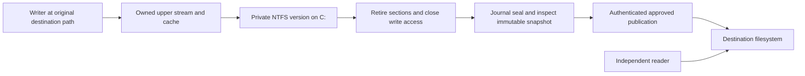
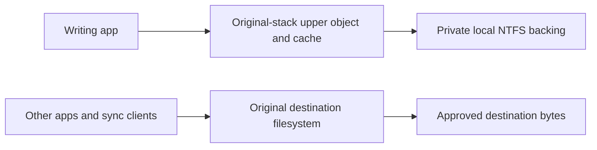

# Staged writes to protected destinations

## Remaining acceptance tracker (resumed 1 October 2026)

This is the active tracker for completing the broader feature. The integrated
milestone began at `26cab47`; Release validation was fixed in `93f890e`. Each item stays open
until its implementation and required evidence pass. Normal builds keep staging
disabled throughout this work. No ClickUp queries. Use only the isolated feature
branch and debugger checkout; preserve the original debuggee hash and restore it
after every experiment, including failures.

1. Filesystem and views
   - [x] Durable source tombstones and atomic replacement reservations; native
         replacement, reuse of physically absent temporary slots, held old handles
         and stale-approval regression. Moving/deleting a physical public source
         and reusing its occupied tombstone slot remain open.
   - [ ] Stable destination/view/version identity, aliases, short names, relative
         and file-ID opens, links, reparse handling and cross-process view rules.
   - [ ] Delete/disposition, metadata/security, byte locking/oplocks and private
         directory notifications, mutation/cancellation/concurrency coverage.
2. Approval flow
   - [ ] Real application notifications and pipe/UI exact-version justification.
   - [ ] Negative publication matrix: changed bytes/policy, unknown/parser/size/
         timeout cases, stale/replayed/expired/wrong-session/spoofed permits.
3. Recovery, security and storage
   - [ ] Service/request/reply failures and driver-loss/reboot namespace recovery,
         authenticated recovery/export without implicit approval.
   - [ ] Stage/journal reparse/ACL/race/corruption hardening, full disk and bounded
         reclamation preserving durable destination generations and user content.
4. Destination qualification
   - [ ] USB including surprise removal and supported filesystem guards.
   - [ ] UNC/mapped SMB redirector identity/paging/reconnect architecture and gates.
   - [ ] Actual sync client/destination byte observers; document qualified stacks.
5. Full functional matrix
   - [ ] Explorer CopyFile/MoveFile, Office replacement saves, PowerShell/.NET,
         concurrent/duplicate/inherited handles, mappings and independent readers.
   - [ ] Service/driver/system crashes, cancellation, resource and filesystem faults.
6. Release gates
   - [x] Current agent/application regressions, Debug and Release WDK validation;
         `aitstatic` 193 resolved without disabling validation. Repeat for later changes.
   - [ ] Applicable boot/runtime Verifier, stress, bounded latency and final
         independent original-driver restoration evidence.

Completed increment: durable rename tombstones and native replacement saves.
The source generation barrier is committed in the same manifest as the target
head; rename cycles and restart preserve it. Existing prepare/commit/abort
protocol 18 is unchanged. The seal condition is unchanged. The live checks
verified the debuggee hostname/UUID, original installed hash, unloaded filter,
zero Verifier flags and the `safeupload-owned-integration-20261001` snapshot.

All 234 service tests pass. The WPF application Release build and normal/feature
WDK Debug/Release builds have zero warnings/errors. The old Release failure was
an extractor-host mismatch: on the same optimized x64 SYS, x86 `aitstatic` returns
193 and x64 `aitstatic` validates Universal. The build script uses native x64
`Bin\amd64\MSBuild.exe`; PREfast, DriverRecommendedRules, API validation and
compiler optimizations remain enabled. [Paired reproduction](evidence/2026-10-01/owned-release-extractor-pair.txt).

The initial VM harness had two corrected probe errors (a PowerShell
switch/variable collision and a reader without write sharing). A repeated run
then exposed an intermittent approved public overwrite denial. The opt-in
[diagnostic patch](evidence/2026-10-01/owned-publication-trace.patch) separated
permit acceptance from filesystem completion: the exact permit was accepted and
NTFS returned `STATUS_ACCESS_DENIED` (`0xC0000022`) for information class 10.
[Trace](evidence/2026-10-01/owned-publication-race-trace.txt),
[failed gate](evidence/2026-10-01/owned-publication-race-before.txt),
[service error](evidence/2026-10-01/owned-publication-race-service.txt).

Small unfiltered reproduction, with SafeUpload unloaded: hold a destination
reader with Read|Delete or ReadWrite|Delete sharing; `MoveFileEx(REPLACE_EXISTING)`
fails with access denied. `SetFileInformationByHandle(FileRenameInfoEx,
REPLACE_IF_EXISTS|POSIX_SEMANTICS)` succeeds, the held reader keeps the old bytes,
and the destination name reads the new bytes. [Exact probe](evidence/2026-10-01/owned-publication-native-control.ps1)
and [results](evidence/2026-10-01/owned-publication-native-control.txt).
The new deterministic publisher regression failed with Retained before the fix
([result](evidence/2026-10-01/owned-publication-reader-test-before.txt)).
This corrects the assumption that adding delete sharing to the source inspector
alone resolved the overwrite race; the owned-stream architecture is unchanged.

The publisher now creates one exclusive temporary with WRITE and DELETE access,
copies the inspected snapshot, flushes, and performs the POSIX replacement on
that same held file object. No close/reopen gap, fallback copy or second permit.
Unsupported destination semantics fail closed. The diagnostic patch is removed
from normal source; its first exploratory run accidentally matched legacy CREATE
completion context value 1 and is excluded from qualification. The recorded trace
above comes from the corrected SET_INFORMATION-only diagnostic.

Final same-package gates passed after the journal fix: ordinary and volatile
Verifier each ran 24 approved overwrites plus replacement, concurrent/mapped I/O,
new private versions and service restart cases. The ordinary observer completed
748 full passes; Verifier completed 568. Directory and duplicated-handle
regressions passed separately with that same driver/package. See the current
result table below. Earlier interrupted runs are excluded from acceptance.

The journal now serializes its reads with mutation and opens manifests with
delete sharing. Its atomic replacement uses the same flushed-handle POSIX
operation as publication. A regression pins the old Allocated manifest while
sealing and checks that both pinned old state and current new state stay readable.
This removes the service race exposed by a harness reader without delete sharing.

The byte observer now counts/acknowledges only full passes; a failed read retries
the pass. Its small request/acknowledgement files use retryable complete-JSON /
exact-phase reads, avoiding classic replacement of an open coordination file.
Two coordination races (rename and an empty-ack `.Trim()` call) were fixed during
repeated-publication testing; their interrupted runs are not acceptance evidence.

### Follow-up: original requester and alias boundary

Rename authorization now uses `SeCaptureSubjectContextEx(Data->Thread,
FltGetRequestorProcess(Data), ...)`, including impersonation, instead of the
executing worker's subject. Missing requestor identity and unsupported IRQL fail
closed. Traverse privilege and DELETE/parent-add access use that same subject.
External rename/link requests now validate the complete name-buffer bounds before
passing them to the name resolver. The separate architecture probe uses the same
updated helper signature. [API contract](https://learn.microsoft.com/en-us/windows-hardware/drivers/ddi/ntifs/nf-ntifs-secapturesubjectcontextex).

`Test-StagedRenameSubject.ps1` passed with the ordinary feature and with the
[test-only worker patch](evidence/2026-10-01/requestor-worker-probe.patch). The
patch requires execution on a different thread in System PID 4 before calling
the real rename routine. Anonymous impersonation was denied; the authorized
caller on the same worker succeeded. The patch is not in production source.
[Ordinary](evidence/2026-10-01/requestor-standard-gate.txt),
[forced worker](evidence/2026-10-01/requestor-worker-gate.txt),
[probe build/hash](evidence/2026-10-01/requestor-worker-build.txt).
Reproduce by applying the patch only in the isolated debugger checkout, rebuilding
and signing Debug feature, copying the SYS to the debuggee and running the subject
test; restore the checkout source afterward and use the ordinary build for gates.

All four ordinary WDK configurations pass with zero warnings/errors and active
analysis/API validation: [normal Debug](evidence/2026-10-01/requestor-normal-debug.txt),
[feature Debug](evidence/2026-10-01/requestor-feature-debug.txt),
[normal Release](evidence/2026-10-01/requestor-normal-release.txt),
[feature Release](evidence/2026-10-01/requestor-feature-release.txt).
The service suite remains [234 passed](evidence/2026-10-01/requestor-agent-tests.txt).
The updated ordinary driver passed `Test-StagedOwnedStreams.ps1 -Verifier
-ReplacementCases -PublicationIterations 4`, including 322 full byte-observer
passes: [gate](evidence/2026-10-01/requestor-verifier-gate.txt),
[active Verifier](evidence/2026-10-01/requestor-verifier-query.txt).
Ordinary SYS SHA256: `1229268BF405BAE8D5AB175703CC7C7513F68BBD2586AC8B43E90F1A74E94347`.
Service package remains `B75112364877ACDAF78893B3C87A87813064AFFFF531C0BE05330092ED75F085`.
[Independent restoration](evidence/2026-10-01/requestor-final-state.txt) at
20:46:05 UTC confirms original hash, filter unloaded, Verifier zero/None, zero
temporary tasks/service and no S:/VHDX.

**Open failing acceptance: preexisting external hard-link aliases.**
`Test-StagedAliases.ps1 -ReproduceKnownGap` creates one disposable NTFS file with a
protected name and an outside hard link before load, verifies equal file IDs,
then uses a fresh process to write synthetic sensitive bytes through the outside
name. A physical reader opened before filter load sees those bytes at the
protected destination. [Exact result](evidence/2026-10-01/aliases-before.txt).
Opening the observer only afterward was an invalid probe: legacy source
inspection denied the sensitive read and concealed the physical change. The
recorded probe uses the already held physical object. It restores the original
driver and deletes both fixture links in `finally`.

This confirms why the path-only namespace is unqualified; it is not a publication
permit failure. Normal builds remain disabled and the experimental path must not
be deployed on aliased protected namespaces. Rejecting new FileLink operations
or writable file-ID opens alone does not resolve this case. The next identity
increment must classify existing objects by volume/file ID and serialize alias
and parent-name changes with admission; checking NumberOfLinks and then closing
a temporary query handle leaves a create/rename race. Publication must distinguish
editing a shared object from replacing one name slot. Until these gates pass,
alias support is incomplete and the broader acceptance tracker remains open.

## Current milestone (1 October 2026)

Branch: `feat/staged-kernel-prototype`. The owned-stream experiment is integrated
into the opt-in SafeUpload kernel data path. The bounded local-NTFS milestone
covers durable allocation, private cached/mapped I/O, immutable version retirement,
real inspection and authenticated approved publication. Normal builds compile
staging out; existing process-taint enforcement remains. Do not query ClickUp.

Bounded milestone and replacement increment complete: all four WDK builds,
234 Windows service tests, ordinary
and Verifier integration, cross-process duplication and directory regression passed.
The original debuggee driver is independently verified restored, with no feature
loaded, no test service/tasks, Verifier off and S: detached. See the result table
for exact evidence. Older dated sections are historical and do not supersede this
architecture or its remaining acceptance criteria.

### Implemented architecture

`Filter.c` registers a full operation dispatcher for feature builds. `StageStream.c`
owns the upper stream, namespace registry, cache, sections and retirement worker;
`StageProtocol.c` reuses the existing allocation, seal, namespace transaction and
publication-permit messages (wire protocol 18). `StageSecurity.c` retains original
caller access checks. `StageDirectory.c` merges private names and snapshots upper
metadata without opening the exclusively held backing. There is no reparse data
path or borrowed NTFS FCB in the integrated feature.



Admission uses existing destination policy plus the recorded bootstrap test
scope. A protected create succeeds only after original-token access checks and
a flushed service `Allocated` manifest. The service chooses the GUID basename,
sets private ACLs and seeds the file using aligned noncached, write-through I/O.
The kernel opens that backing noncached with exclusive data sharing while mutable;
any preexisting backing cache/section causes admission to fail. Only the owned
upper cache is writable. Later read-only backing handles permit service inspection.
A disconnected service cannot authorize new protected writes. The authenticated
service needs an exact publication permit to write at the protected destination.

The upper file object stays on the original destination volume, with SafeUpload's
own `FSRTL_ADVANCED_FCB_HEADER`, resources and `SECTION_OBJECT_POINTERS`. All its
operations are handled or rejected before legacy callbacks or the original
filesystem can interpret its contexts. Fast I/O is refused. Paging I/O and Cc's
`AdvanceOnly` EOF notification retain their MDL, flags and asynchronous completion
when directed to the backing instance; a postoperation releases rundown ownership.
The target stack must have at least the original stack's size. Neither foreign
cache state nor `DeviceObject`/`Vpb` is modified. See the Microsoft
[I/O parameter contract](https://learn.microsoft.com/en-us/windows-hardware/drivers/ddi/fltkernel/ns-fltkernel-_flt_io_parameter_block).

### Identity and namespace

| Identity | Implemented key and owner | Required extension |
| --- | --- | --- |
| Destination | Normalized original-volume path; durable monotonic `DestinationGeneration` per case-insensitive destination path | Stable volume identity plus file ID for existing objects; parent ID plus name slot for new/replacement objects; durable alias/tombstone records |
| Private view | Referenced `PEPROCESS` plus normalized destination name; PID is only existing protocol attribution | Durable view GUID bound to principal/session and driver boot epoch; explicit authenticated reattachment after recovery |
| Version | Service transfer GUID/private basename; one upper stream/cache/backing per version | Preserve this identity independently of all aliases and namespace moves |
| Open capability | `STAGE_HANDLE` on a specific `FILE_OBJECT`, pointing to its version | Keep duplicate/inherited handles bound to that version even when another version becomes current |

Independent opens by the same writer share the current mutable version and
`IoCheckShareAccess` state. Duplicated handles share a file object; its CLEANUP
arrives only after its last handle closes, including in another process. The
referenced process identity prevents PID reuse from inheriting a private view.
A duplicate grants access to that object, not the owner's entire directory view.
Unrelated processes see physical, approved destination content. Published private
views remain private views until unload; they do not silently switch held handles
to the public object.

After sealing, a writable reopen allocates a distinct service version. Nontruncating
opens copy the prior **private** backing, including a previously blocked edit;
CREATE/overwrite semantics select an empty new version where appropriate. A held
read handle to an older sealed version keeps its original bytes. The registry
retains old versions and process references until unload: at most 128 versions,
16 MiB each. Exhaustion fails closed; reclamation is a remaining requirement.

Supported native rename is a transaction over source and target slots on the
same original volume. It checks DELETE and target-parent access, durably prepares
both destination generations, changes the private mapping and source tombstone,
then commits using existing messages. A linked value record in the same manifest
retains source generation barriers (at most 16 moves per version). The service
will not inspect/publish an older source or displaced target after restart.
Lost replies reuse the transaction ID. Until acknowledgement, fresh opens,
mutations and sealing remain held; existing mapped writes remain private.

An ordinary replacement refuses an open private target. Native Ex
REPLACE_IF_EXISTS|POSIX_SEMANTICS can displace a target whose open handles share
DELETE; its old stream remains attached to those handles while its view leaves
name lookup. Image sections and unacknowledged seals are rejected. The source's
existing handles must all share DELETE. Directory overlays hide tombstones and
displaced views without duplicating a reused active name. Creating into a source
tombstone works when that physical slot is absent. Physical public-source removal
and reuse of physically occupied tombstones remain pending.

Hard links require alias entries for one destination identity, not independent
path-keyed publication rights. Short names, file-ID opens and reparse aliases
must resolve before policy/view lookup. Links, delete/disposition, alternate
streams, byte locks/oplocks and unsupported metadata operations fail explicitly;
writable file-ID admission is denied. This is not complete enforcement for
preexisting external links or case-sensitive directories: those namespaces are
unqualified. Private directory notifications and concurrent directory mutation
remain pending. Rename authorization captures the original request's thread/process subject,
including impersonation. A forced SYSTEM-worker probe verifies this boundary;
actual third-party filter stacks remain unqualified.

### Lifetime, synchronization and exact seal

Lock order is namespace resource, then upper stream resource. Ordinary reads,
writes and size changes serialize on the stream resource. Cache/modified-writer
callbacks use the separate paging resource; redirected I/O owns rundown until its
postoperation, including asynchronous completion. The registry spin lock only
locates owned objects; entries cannot disappear until unregister drains callbacks.
Name-provider callbacks use the namespace resource. The service is never called
from paging completion. Current admission/namespace/seal messages can wait under
the namespace resource; service self-I/O bypasses private-view lookup to avoid
reentering that lock. Per-view locking and cancellation latency are future work.

CLEANUP removes share participation and uninitializes that file object's cache
map; it never seals. CLOSE releases its handle context and object count. A 250 ms
worker attempts conservative retirement while holding namespace then stream locks.
**Every condition below must succeed, in this order:**

1. No open share participants; `MmCanFileBeTruncated(Sections, NULL)` says no user
   mappings, section references, images or relevant write probes remain.
2. Flush the owned cache and backing successfully. Purge the owned cache, then
   require all shared-cache/data/image-section pointers to be NULL and the upper
   file-object count to be zero. A remaining read-only section also delays sealing.
3. Drain all paging/AdvanceOnly rundown references; flush the backing again.
4. Close the last kernel backing write handle, irrevocably mark the version
   read-only, and reopen it read-only. A reopen failure keeps all new opens blocked
   and retries; it cannot leave a partially admitted backing or authorize a seal.
5. Obtain the durable service seal acknowledgement. Retry the same immutable
   version after disconnect/reply loss; idempotent acknowledgement never resets an
   existing inspection, block, approval or release. Only then mark `Sealed` locally.

The all-object condition deliberately favors correctness over save latency. It
must not be replaced by a writer-handle counter or section acquire/release counter.
Microsoft documents [cache uninitialization](https://learn.microsoft.com/en-us/windows-hardware/drivers/ddi/ntifs/nf-ntifs-ccuninitializecachemap),
[purge restrictions](https://learn.microsoft.com/en-us/windows-hardware/drivers/ddi/ntifs/nf-ntifs-ccpurgecachesection)
and [the NULL truncation check](https://learn.microsoft.com/en-us/windows-hardware/drivers/ddi/ntifs/nf-ntifs-mmcanfilebetruncated).

Initial CREATE cancellation is checked before allocation and before publishing an
upper object. A canceled/lost allocation may leave a durable unsealed orphan, never
an approved save. Ordinary synchronous operations complete their current action;
a prepared namespace transaction remains owned by the stream until commit/abort
acknowledgement. Full cancel-safe queued I/O and fault injection remain unqualified.

### Publication and recovery ordering

The existing service flow is `Allocated -> Sealed -> Inspecting -> Approved ->
Publishing -> Released`, with `Blocked`/`Retained` outcomes and recovery `Unsealed`.
`SealAsync` requires matching owner attribution and backing path and rejects a
pending rename. The publisher holds the sealed file without writer sharing, scans
its inspection snapshot, and rechecks the sealed digest and policy before copying
that inspected snapshot. `AllowedWithoutInspection` never grants publication.
The kernel's authenticated, expiring permit binds transfer ID, digest and exact
temporary/destination paths, admits one temporary create and consumes one native
rename. Approved Windows output uses one exclusive temporary opened with WRITE
and DELETE, flushed then replaced via FileRenameInfoEx (REPLACE|POSIX) on the same
held handle. Existing public readers/mappings retain old bytes. Read-only targets
are refused; unsupported stacks have no copy fallback. The kernel trusts the authenticated service's digest decision; it does not
re-hash the output in a paging callback. Bytes in the public temporary are already
approved; it is flushed before final rename and durable `Released` bookkeeping.

The journal now assigns increasing destination generations without changing wire
messages. Only the latest durably allocated generation may enter Inspecting, Approved or
Publishing. Even a subsequently canceled CREATE supersedes older approvals; restoring
an earlier version requires an explicit new save, not deleting its newer manifest. An older justification cannot replace a later edit. `Publishing`
reserves the destination against new allocation and prepared renames until the
outcome is durable. A pending rename reserves both names. All checks and manifest
replacement share the journal gate; generations survive service restart. Released
manifests must not be garbage-collected without a durable generation/tombstone
replacement. Legacy duplicate generation-zero histories fail closed.

Ordinary source inspection allows delete sharing while excluding ordinary writes.
Its read handle pins the file being read across an approved directory replacement;
hash and scan use the same resulting bytes. Together with POSIX destination replacement, this prevents the existing source
classifier from vetoing publication while it pins a prior public version.
The sealed version's own service handle still excludes writes and deletion.

| Failure | Implemented behavior | Remaining acceptance |
| --- | --- | --- |
| Service disappears | New allocations denied; existing owned/mapped writes stay private; restart changes Allocated to Unsealed; later kernel retirement can durably seal it | Fault injection at every request/reply boundary and bounded offline resource use |
| Seal reply lost | Backing stays read-only; idempotent durable seal retries | Systematic disconnect test at the exact lost-reply boundary |
| Voluntary driver unload | Refuses live upper objects/sections; stops worker and drains paging, drops instance references before unregister | Stress with concurrent unload/create and filter-stack changes |
| SCM service stop | Feature registration rejects mandatory service-stop unload | Boot/shutdown lifecycle qualification |
| Driver loss/reboot | Private ACLs and manifests survive; an unsealed version cannot become approved from a missing driver; interrupted inspection/approval retained; Publishing reconciles destination digest | Durable private namespace/view reattachment, user recovery/export and crash/power-loss matrix |
| Rename interrupted | Pending record retains bytes and blocks publication; live driver retries same commit/abort | Reconciliation after driver loss needs durable namespace/tombstone authority |

The feature uses the documented
[service-stop registration flag](https://learn.microsoft.com/en-us/windows-hardware/drivers/ddi/fltkernel/ns-fltkernel-_flt_registration).
A crash may lose dirty cache bytes; durable recovery promises no automatic approval,
not recovery of every unflushed application byte. File flush plus atomic same-volume
manifest replacement is the existing protocol durability model; sudden power loss
and directory-entry persistence have not been qualified. No automatic stage or
journal garbage collection is introduced.

### Destination contract and remaining acceptance

The admitted data path requires local NTFS at destination and backing, a power-of-two
backing sector size 512..65536, and the checked backing stack-size relation. Network
volumes are rejected. The VM proves C: backing with C: and disposable S: NTFS
destinations. ReFS/FAT/exFAT, physical USB surprise removal, SMB/UNC/redirectors,
cloud sync clients, and third-party filter stacks are not qualified. A redirector
needs its own demonstrated section, paging, identity and reconnect contracts; it
must not be enabled by removing the NTFS/stack guards.

Before deployment, complete destination/view/alias identities and physical-source
namespace transactions, delete/link/metadata/locking/notification semantics, driver-loss
recovery with user access to retained files, resource reclamation, disk-full and
corrupt-journal handling, permit replay/spoof/expiry kernel fault tests, real UI
exact-version justification, Explorer/Office saves, real destination stacks, and
boot-time DDI/filter Verifier plus stress. Keep staging opt-in and retain taint
until its remaining responsibilities are demonstrably replaced.

### Reproduction and evidence

- Workspace: `/home/victor/Work/safeupload-staging`; debugger SSH
  `vika@192.168.122.210`, isolated checkout
  `C:\Users\vika\Documents\safeupload-staging-test`. Never modify
  `C:\Users\vika\Documents\safeupload`.
- Debuggee: SSH `vika@192.168.122.51`, hostname `win10-debugged`, UUID
  `9D44EEE8-81CF-4CC1-9FBA-7670F11DEF4D`, libvirt domain `win10-debug`.
  Fresh disk snapshot: `safeupload-owned-integration-20261001`. The previous
  `safeupload-architecture-20261001` snapshot actually belongs to debugger domain
  `win10`; do not mistake it for a debuggee backup.
- Original installed driver SHA-256:
  `ADA9D05AB6AECDD2B6C521B0CE529FC06C732154ACB3EE85439FBDC8AA80DFCE`.
  Start each test with this hash and no loaded experimental filter. Restore and
  independently verify it afterward. The helper refuses silent cleanup if live
  objects require a reboot and restores installed bytes before reporting that case.
- Final signed integrated feature driver SHA-256:
  `3B55E67991748985191AD96E3415481D528246EB08BA7018002EF36735EFD49A`.
  Tested service ZIP SHA-256:
  `B75112364877ACDAF78893B3C87A87813064AFFFF531C0BE05330092ED75F085`.

From the debugger's isolated checkout:

```powershell
& .\driver\scripts\Build-StagedOwnedStreams.ps1 `
  -CertificateThumbprint 220DD82C37FCF36048D59E4F10113185D81D5DC7
```

This rebuilds normal and opt-in x64 Debug and Release with DriverRecommendedRules/PREfast and
API validation, runs the complete Windows service suite, and publishes a
self-contained win-x64 service. Copy `owned-milestone\SafeUpload-stage-prototype.sys`
and `owned-milestone\stage-service-publish.zip` to the debuggee's Documents. Copy
`Test-StagedOwnedStreams.ps1`, `Test-StagedDuplicatedHandle.ps1`,
`Test-StagedDirectory.ps1` and `StagedTestAgent.ps1` beside them. Then on the debuggee:

```powershell
& C:\Users\vika\Documents\Test-StagedOwnedStreams.ps1 -ReplacementCases -PublicationIterations 24
& C:\Users\vika\Documents\Test-StagedDuplicatedHandle.ps1
& C:\Users\vika\Documents\Test-StagedDirectory.ps1
$env:SAFEUPLOAD_STAGED_VERIFIER_LOG = 'C:\Users\vika\Documents\owned-verifier-query.txt'
& C:\Users\vika\Documents\Test-StagedOwnedStreams.ps1 -Verifier -ReplacementCases -PublicationIterations 24
```

The owned-stream harness creates/detaches its own S: NTFS VHDX, starts the actual
LocalSystem service, samples destination bytes from another process and restores
the original driver in `finally`. Verifier is volatile `0x13B`; it is a focused
runtime gate, not complete boot-time DDI certification. Release API validation
now passes with the native x64 extractor.

| Gate | Final result and evidence |
| --- | --- |
| WDK x64 Debug and Release, normal and feature | All four PASS; zero warnings/errors; PREfast/DriverRecommendedRules and API validation enabled. [Normal Debug](evidence/2026-10-01/namespace-normal-debug.txt), [feature Debug](evidence/2026-10-01/namespace-feature-debug.txt), [normal Release](evidence/2026-10-01/namespace-normal-release.txt), [feature Release](evidence/2026-10-01/namespace-feature-release.txt) |
| Windows service suite and WPF app | 234 passed, 0 failed/skipped; app Release zero warnings/errors. Source/destination held readers, mapped old public readers, readonly target refusal, rename generations/restart and pinned manifest regression included. [Tests](evidence/2026-10-01/namespace-agent-tests.txt), [publish](evidence/2026-10-01/namespace-service-build.txt), [app build](evidence/2026-10-01/namespace-application-build.txt) |
| Ordinary integrated gate | PASS; 748 full independent byte-observer passes; 24 approved overwrites, native private replacements/held old reader, name reuse, concurrent writers, later versions, mapping after handle close, unload refusal and restart. [Run](evidence/2026-10-01/namespace-ordinary-gate.txt), [observer](evidence/2026-10-01/namespace-ordinary-observer.txt) |
| Duplicated handle and directories | PASS; exiting owner leaves version Allocated until duplicate closes, then publishes exact basetail. Directory classes 1/2/3/12/37/38/60/63, pagination/restart/small buffers/private sizes; observer only sees approved entries. [Run](evidence/2026-10-01/namespace-directory-duplicate.txt) |
| Focused volatile Verifier | PASS; same replacement/24 overwrite gate, 568 full observer passes, SafeUpload.sys active under 0x13B; no bugcheck or Verifier report. [Run](evidence/2026-10-01/namespace-verifier-gate.txt), [active query](evidence/2026-10-01/namespace-verifier-query.txt), [observer](evidence/2026-10-01/namespace-verifier-observer.txt) |
| Independent final restoration | PASS at 2026-10-01T20:29:41 UTC; original hash matches, filter unloaded, Verifier zero/None, zero temporary tasks/service processes, S:/VHDX absent. [Evidence](evidence/2026-10-01/namespace-final-state.txt), [exact commands](evidence/2026-10-01/namespace-final-state-command.ps1) |

The first approved native-renamed file contains `alphabetatail`, SHA-256
`6784D571A4E44598EB09029A50928089BB7B3D4DD06E9ABD081CC3935DF9A8C9`.
The later sensitive version remained blocked/private while a held earlier reader
and the independent public reader retained the prior bytes. A third empty overwrite
published `clean replacement`. Parallel writes produced 4096 `A` + 4096 `B` bytes;
mapped retirement produced `ABC` followed by 4093 zero bytes. After unload the S:
fixture contained exactly the four approved final files, with no private temporary
names, and direct private-stage reads were denied by ACL.

The observer checks all relevant final names on each completed pass (nominal 20 ms
sleep, slower under source inspection); it allows only absence or explicitly
approved byte arrays. This is sampled evidence, not proof against arbitrarily
short leaks or qualification of a real sync client. Final physical inspection
and direct byte comparisons supplement it. All named final gates restore the
original binary and unload the feature before deleting their fixtures.

Captured text logs are normalized to UTF-8/LF with trailing whitespace removed.
Build products remain on the isolated VMs; their tested hashes are recorded above.

Focused findings retained for reproduction:

- A native rename test buffer lacking a terminating WCHAR produced garbage suffixes
  even with SafeUpload unloaded. The helper now allocates/zeros that WCHAR and the
  gate first verifies a real unfiltered rename; this was not a kernel-volume defect.
- Cached service allocation plus upper paging writes yielded a stale backing cache
  (old prefix and zero tail) on a later version. Noncached service seeding and the
  exclusive mutable backing/cache admission gate fixed this actual data-path bug.
  [Failure evidence](evidence/2026-10-01/owned-cached-backing-failure.txt).
- The first independent observer lacked delete sharing and interfered with rename;
  its reads now share Read/Write/Delete. A later run exposed the separate source
  inspector's non-delete-sharing reads. A deterministic Windows test reproduced
  that conflict before the fix; the final suite and observed overwrite gate cover it.
  [Pre-fix test](evidence/2026-10-01/owned-source-sharing-before.txt),
  [VM denial](evidence/2026-10-01/owned-source-sharing-vm-failure.txt).

## Historical: separate architecture experiment (before this integration)

- [x] Read this document and the native cross-volume failure evidence.
- [x] Trace the native handle-volume query and rename paths. Separate the
      documented Windows contract from assumptions in the previous diagnosis.
- [x] Identify the smallest supported data path that preserves destination
      identity and native save operations while storing unapproved data locally.
      Do not mutate `DeviceObject`/`Vpb` or another filesystem's contexts.
- [x] Implement a bounded feasibility test with native APIs and independent
      destination observers. Avoid copy/move fallbacks concealing rename failure.
- [x] Build both normal and experimental Debug configurations with the WDK. Run the
      focused VM gate with writable mappings, native identity and rename.
- [x] Record exact evidence, architectural decision, remaining limitations and
      reproduction commands. Update this tracker before stopping or compaction.
- [x] Verify the original debuggee driver is restored and temporary resources
      and Verifier settings are removed after each experiment.

The architecture gate requires a normal app opening its original protected
path to get the intended path and volume identity, perform native rename within
that destination, read/write and map its private version, while another process
sees only approved destination bytes. No unapproved destination placeholders
or app-specific hooks may be substituted for the original requirement.

Previous investigation: a separate `SafeUpload.ArchitectureProbe` project tests
same-stack isolation, with an owned upper FCB/cache/section on the original
volume and a private NTFS backing handle. It reuses original-caller access checks.
It has no publisher or service journal and is not integrated into the feature.
The bounded architecture gate now passes normally and with volatile Verifier
`0x13B`: original native path/volume, native rename and held-handle name updates,
unaligned growth, cached/mapped coherence, mapped writes after handle cleanup,
reopen, live-mapping unload refusal, exact backing bytes, and stage ACL denial
after unload. Independent observers synchronized with save phases took 19 and
17 samples; physical destination file count was zero after both unloads.
A name provider plus explicit cache invalidation fixes stale names after rename.
Cc's `AdvanceOnly` EOF notification no longer recreates a cache after cleanup.
Backing growth is materialized before increasing upper VDL. The normal and
staging-enabled Debug WDK builds and probe driver analysis/API validation pass.
Release API validation remains a separately recorded existing toolchain failure.
The separate architecture work completed this bounded NTFS gate. The current
user request now authorizes the integration tracked above.

The first failed run stalled during unload because backing/original instance
references were held until after `FltUnregisterFilter`. Teardown now drops those
references first. Cleanup/reopen and live-section unload refusal now pass. The harness
restores the installed original binary even if live objects require a reboot;
it retains the loaded image and test fixtures for diagnosis in that case.
The stalled run was recovered by renaming the loaded image, restoring and
verifying the original installed binary, rebooting, and cleaning its private
root and detached VHDX. The original hash was independently verified afterward.
The earlier notes recorded `safeupload-architecture-20261001`; see the VM
identity correction in the integration checkpoint above.
The probe SHA-256 for that first run is
`B0E3C588840938EC6429883B105C4422875EC3E49267FC90FA73ACE67E0643E7`.
The final tested signed probe SHA-256 is
`59D10C3386DDDB89FC28BFDE6E9D1F02393F1F04048E168E238229200FBA6D18`.

Focused run: explicitly build
`driver/SafeUpload.ArchitectureProbe/SafeUpload.ArchitectureProbe.vcxproj`, sign
its SYS as `C:\Users\vika\Documents\SafeUpload-architecture-probe.sys`, and run
`driver/scripts/Test-StagedArchitecture.ps1` on the debuggee. Add `-Verifier`
only after the ordinary gate passes. The harness always starts by checking the
original installed driver; it observes the real destination from another
process and also examines the physical directory after unload.

Build from the debugger's isolated checkout using its installed VS/WDK tools:

```powershell
$msbuild = 'C:\Program Files\Microsoft Visual Studio\18\Community\MSBuild\Current\Bin\MSBuild.exe'
& $msbuild driver\SafeUpload.ArchitectureProbe\SafeUpload.ArchitectureProbe.vcxproj `
    /t:Rebuild /p:Configuration=Debug /p:Platform=x64 /p:RunCodeAnalysis=true `
    /p:EnablePREfast=true `
    '/p:CodeAnalysisRuleSet=C:\Program Files (x86)\Windows Kits\10\CodeAnalysis\DriverRecommendedRules.ruleset'
```

Sign the resulting SYS with the VM's existing test certificate, transfer it to
the debuggee path above, and copy `Test-StagedArchitecture.ps1` plus
`StagedTestAgent.ps1` to the same directory. On the debuggee:

```powershell
& C:\Users\vika\Documents\Test-StagedArchitecture.ps1
& C:\Users\vika\Documents\Test-StagedArchitecture.ps1 -Verifier
```

Final evidence (all under `driver/evidence/2026-10-01`):

- [Ordinary native/mapped gate](evidence/2026-10-01/same-stack-architecture-gate.txt).
- [Focused Verifier gate](evidence/2026-10-01/same-stack-verifier-gate.txt) and
  [active Verifier query](evidence/2026-10-01/same-stack-verifier-query.txt).
- [Probe build/analysis](evidence/2026-10-01/same-stack-debug-build-native.txt) and
  [normal/staging Debug builds](evidence/2026-10-01/stage-driver-debug-builds-native.txt).
- [Release validation failure](evidence/2026-10-01/same-stack-release-validation-native.txt)
  and [normal Release failure](evidence/2026-10-01/stage-driver-release-validation-native.txt).
- [Final restoration and cleanup check](evidence/2026-10-01/same-stack-final-state.txt).

Architectural rationale: a reparse changes the file object's volume. The new
experiment completes a CREATE on the original stack using its own upper stream
and section objects, and uses a separate kernel backing handle for local data.
It does not modify `DeviceObject`, `Vpb`, another filesystem's FCB, or its cache.
All operations on an owned upper file object are handled or rejected before
they can reach the original filesystem. Paging requests preserve their flags,
MDLs and asynchronous completion when redirected to the local backing instance.
The backing stack-size requirement is checked before accepting the create.
See Microsoft's [I/O parameter-block contract](https://learn.microsoft.com/en-us/windows-hardware/drivers/ddi/fltkernel/ns-fltkernel-_flt_io_parameter_block),
[cache-map ownership contract](https://learn.microsoft.com/en-us/windows-hardware/drivers/ddi/ntifs/nf-ntifs-ccinitializecachemap),
and OSR's [same-stack isolation architecture](https://www.osr.com/nt-insider/2017-issue2/introduction-standard-isolation-minifilters/).

Baseline checkpoint: existing reparse path redirects an `S:` create to a private
`C:` backing file. Native volume identity is `C:` and native rename returns
Win32 error 17. Rewriting `FileVolumeNameInformation` in the minifilter did not
affect that query.
This failure belongs to the old reparse architecture; the separate isolation
experiment is the replacement under qualification.
Baseline: commit `9dbdb16`, 216 Windows agent tests, both WDK builds and limited
volatile Verifier tests passed. See the later dated sections for exact coverage.

## Architecture decision: preserve the original stack, own the private stream

The writing application's handle must stay on the destination's original stack.
Its stream data must have a separate local backing object. The driver owns the
upper FCB, share state, cache and section pointers from CREATE through final
CLOSE. It completes or rejects every operation on an upper object before a
foreign filesystem can interpret that FCB. It never borrows the backing NTFS
FCB or changes `DeviceObject`/`Vpb` to manufacture volume identity.



The separate probe has exercised this data path on two NTFS volumes. The normal
SafeUpload driver still uses its existing enforcement. The probe is explicitly
built and is absent from the normal solution and deployment. It handles new
top-level files in its disposable fixture, up to 16 streams and 16 MiB each;
overwrite/replacement, hard links, file IDs, directory overlays and UNC are not
implemented by it. Its private view belongs to a referenced process object,
so an independent process sees the physical destination.

### Contracts established by the architecture gate

- Native class-58 volume queries and `GetFinalPathNameByHandle` retain the
  original destination identity. Native same-volume rename needs no copy/move
  fallback. A name provider and explicit invalidation keep existing handles'
  current names consistent after virtual rename.
- Ordinary cached I/O and writable mappings share one upper cache. Paging
  requests go to the local backing with their MDL, paging and synchronous flags
  preserved. The documented backing-device stack-size requirement is checked
  before CREATE; unsupported stacks are rejected.
- The backing handle uses noncached I/O. Growth explicitly zeroes the extended
  range and preserves an old partial sector before increasing upper VDL. Cc's
  `AdvanceOnly` EOF notification updates backing VDL; it must not resize the
  upper stream or recreate a cache on a cleaned handle. See Microsoft's
  [EOF notification contract](https://learn.microsoft.com/en-us/windows-hardware/drivers/ifs/flt-parameters-for-irp-mj-set-information).
- CLEANUP removes a handle's share/cache participation; CLOSE retires its file
  object. A mapped view can still write after ordinary handles close. Unload
  refuses live file objects, mappings or cache/section state, then drains
  callbacks before freeing the stream. Instance references are released before
  unregister to avoid a reference-cycle wait.
- Root and backing-file SYSTEM-only ACLs protect retained bytes after unload.
  These ACLs supplement kernel admission; they do not supply a publication
  authorization or a complete protected-destination policy.

The integration plan recorded at this point has been implemented or explicitly
bounded by the current milestone above. The following build limitation remains.

### Architecture build limitation

Release compilation/linking and probe driver analysis succeeded, but Release
API validation failed with `aitstatic` error 193 for both the normal driver and
the new probe. This is the already documented toolchain failure in
[ARQUITETURA.md](ARQUITETURA.md#segunda-ocorrência-com-evidência).
API validation remains enabled. Debug normal, staging-enabled and probe builds
pass API validation; the probe's DriverRecommendedRules analysis is also clean.

## Target behavior beyond the bounded milestone

An ordinary Save or Copy to a protected USB drive, network share, or sync
folder keeps the application's write in private local storage. The tray shows
`Analyzing` after the version passes the complete retirement gate. A fully inspected clean version is
copied to the destination; sensitive or uninspectable versions stay local.
No sensitive byte may be created at the destination before approval. A timeout,
service disconnect, parser error, size limit, unknown format, or journal error
must retain the local version and report that it was not sent.

## Deployment invariants (broader than the qualified milestone)

1. Every writable open of a protected destination is redirected before the
   underlying filesystem handles the create. Direct writes, paging writes,
   truncation, rename, hard link, and file-ID opens cannot bypass this gate.
2. The private staging file is on a local fixed volume. Its path is never inside
   a protected sync folder. The service records the destination and originating
   user in a durable journal before returning the staging path to the driver.
3. The driver tracks all writable handles on a staged stream. CLEANUP never seals a version: all upper file objects and sections must
   retire, cached/paging I/O must drain, and backing write access must close. The service acquires a read handle that excludes
   writers for the entire scan and copy. A later open starts a new version.
4. The service releases only `Approved` after actual content inspection under
   the current policy. `AllowedWithoutInspection` is **not** approval for a
   staged transfer. A transfer also stays local if the destination is no longer
   in policy scope when publication is attempted.
5. The service writes an approved version to a temporary file at the target,
   flushes it, and renames it into place. Only the service's authenticated
   publication path may bypass the destination gate. The published bytes must
   be the same locked version that was inspected.
6. Stage creation, sealing, approval, publication, and retention have durable
   states. On restart, the service reconciles each state. It must not treat an
   interrupted inspection as an approval, and it must not lose a user file.
7. A user can justify a blocked transfer only against its exact transfer ID
   and inspected version. A justification may release that version; it must
   never grant a general process or destination bypass.

## Required Windows coverage before deployment

- Explorer `CopyFile` and `MoveFile`, PowerShell and .NET streams, Office
  save-via-temporary-file-and-rename, append, overwrite, multiple open handles,
  and memory-mapped writes.
- Short names, relative opens, reparse points, directory enumeration, metadata
  queries, open-by-ID, alternate data streams, rename and hard-link operations.
- USB, mapped and UNC network shares, and local cloud-sync folders.
- Service crash, driver unload/reload, machine restart, removal of a USB drive,
  full staging disk, timeout, changed policy, and concurrent writers.
- A negative test must watch the actual destination bytes and sync client during
  every blocked case. Checking only the final path after deletion is not enough.

The service-side `StagedTransferPublisher` and `StagedTransferJournal` now
implement sealed-file inspection, durable state transitions, digest-based
publication recovery, and outcome auditing. A classification result is not
audited as a successful send before the destination publication succeeds.
The publisher rechecks the policy version and destination scope before
publication; a policy change during analysis retains the file. The integrated opt-in owned-stream path is wired to the journal, conservative
retirement seal, and publisher. It remains disabled in ordinary builds and is not a complete
transparent namespace or private-storage implementation.

Microsoft's SimRep sample demonstrates pre-create reparsing, but explicitly
does not virtualize the namespace for higher filters. Its rename, name-provider,
and network-query handling are relevant starting points, not a drop-in DLP
solution: https://learn.microsoft.com/en-us/samples/microsoft/windows-driver-samples/simrep-file-system-minifilter-driver/

Memory-mapped writes require paging-I/O coverage in a filter that monitors
changes: https://learn.microsoft.com/en-us/windows-hardware/drivers/ifs/memory-mapped-files-in-a-file-system-filter-driver

## Reparse feasibility probe (debuggee VM)

An experimental pre-create callback on `feat/staged-kernel-prototype` used
`IoReplaceFileObjectName` and `STATUS_REPARSE` to map a single top-level test
file from `C:\SafeUpload\Escopo Monitorado` into `C:\SafeUpload\_staging`.
The WDK build succeeded. With the signed prototype loaded on the debuggee,
`File.WriteAllText` succeeded, the stage contained the bytes, and the original
destination path did not exist. The original driver was restored afterward
(SHA-256 `ADA9D05AB6AECDD2B6C521B0CE529FC06C732154ACB3EE85439FBDC8AA80DFCE`).

That first probe proved the write redirection primitive, not application
transparency. Immediately after its save, a metadata lookup of the original
path saw no file. An application that reopens its save or enumerates its
folder needs process-aware name virtualization. Cloud sync and other
processes must not see the staged bytes before approval. The prototype is
disabled by default with `SAFEUPLOAD_STAGING_PROTOTYPE=0` and must not ship.

The later test-only namespace map redirects subsequent opens by the writer's
process to its stage file. On the debuggee, the writer could reopen and read
the staged bytes; another process could not see the new destination path.
The map is dropped on process exit so PID reuse does not inherit visibility.
The earlier probe used driver load time and a sequence number in stage names.
The current probe instead obtains a unique GUID basename from the service,
which durably records the transfer before answering the kernel. A recycled
PID cannot claim a previous writer's in-memory view.
An explicit `SafeUploadStagingPrototype=true` WDK build property is required
to include this code; ordinary builds still compile it out.

The same test exposed two missing filesystem operations. The writer's folder
enumeration did not include its staged file. A rename from a staged temporary
file into the protected folder initially made bytes visible before approval.
The prototype now denies renames and hard links into that test folder; the
debuggee confirmed the destination stayed absent. This safety gate breaks
rename-based saves and must become transactional rename virtualization.
The original driver was restored after each test. The reproducible test is
`driver/scripts/Test-StagedNamespacePrototype.ps1`.

## Cross-volume, service-owned allocation probe (30 September 2026)

On the isolated debuggee VM, `Test-StagedCrossVolumePrototype.ps1` created a
disposable NTFS VHDX at `S:` and used the prototype build with protocol 12.
The driver now resolves the local `C:` volume independently, asks the agent
for a unique stage basename, and only reparses the create after the agent
has flushed an `Allocated` journal manifest. With no agent connected, the
protected create returned access denied and left no destination file. With
the self-contained agent running, the writer reopened `S:\SafeUpload\Escopo
Monitorado\...txt`, read its staged bytes from `C:\SafeUpload\_staging`, and
another process saw no file at the destination. The journal contained one
matching transfer, and the stage held the expected bytes. The test unloaded
the prototype, restored the original installed driver, and detached `S:`.
It also stopped and restarted the agent while the driver remained loaded:
the unsealed `Allocated` entry was held locally, with no destination file.
The rename and hard-link safety gates still denied both operations.

The current probe attaches a kernel-created ECP to each redirected create.
The same app can reopen the original name, but a direct open of the private
stage filename without that marker is denied while the filter is loaded.
The VM test confirmed `DirectStageReadDenied=True`. Microsoft documents that
ECPs added during a create survive reparse retries:
https://learn.microsoft.com/en-us/windows-hardware/drivers/ddi/fltkernel/nf-fltkernel-fltallocateextracreateparameter

The agent also holds interrupted `Allocated` entries unsealed and retains
interrupted `Inspecting` and `Approved` entries on restart, then reconciles
`Publishing` entries against the actual
destination digest. The staged-transfer tests pass. This is a feasibility
probe only: unloading the filter exposes the stage to the same user (also
confirmed by the test).
Other aliases need independent coverage. Only the two hardcoded test
directories are handled. Protocol 14 requires
the matching agent; the ordinary installed driver remains the previous
protocol 11 binary. The prototype is compiled out by default and must not
be placed in a production package.

## Recovery and journal hardening (30 September 2026)

Recovery now puts an interrupted `Allocated` transfer in a distinct `Unsealed`
state. It cannot enter inspection or publication. The journal records whether
the transfer was ever sealed, so an older `Retained` manifest without seal
provenance also cannot be published. This closes a recovery path where an
unfinished writer's bytes could otherwise become eligible for inspection.

The prototype journal moved to `%ProgramData%\SafeUpload\staging-journal`.
On Windows, its directory and manifests get explicit service, SYSTEM, and
Administrators ACLs. Prototype startup rejects a parent that grants ordinary
users child-deletion rights; a LocalSystem service also rejects existing
journal objects owned by other identities. The debugger VM passed 22 focused
tests and the complete 192-test agent suite. The cross-volume debuggee test
passed after the move, including `Unsealed` recovery and restoration of the
original driver hash.

This does not secure the stage file. The debuggee test still reads its exact
unapproved bytes as the writer after the prototype filter unloads. The
current reparse opens that file using the writer's token, so the file's NTFS
ACL must grant that user access. That same access remains after driver unload
or crash. An ACL on the journal cannot close this gap. A protected stage
requires a different data path that gives the app a usable handle without
granting it independent access to the stored file. The probe still denies
rename-based saves and omits folder-listing virtualization. Staging remains
disabled in ordinary builds.

## Final writer and later version probe (30 September 2026)

Protocol 14 uses a kernel-issued `STAGE_SEAL` message after the last writable
handle cleans up. The driver counts staged writers and blocks another writer
while a seal request is in flight. A writable memory-mapped view delays sealing
after its file handle closes; a prototype worker checks the section's writable
references and seals after the view disappears. The agent journals `Sealed`,
notifies `Analyzing`, inspects that version, and publishes a clean version with
its connected-port process identity. A blocked or uninspectable version remains
local. A service restart changes interrupted `Allocated` to `Unsealed` and
requires the real driver seal signal before inspection.

After a sealed version, the same writer's next writable open allocates a new
transfer ID. `FILE_OPEN` and `FILE_OPEN_IF` copy the prior stage into the new
local stage; truncating dispositions start empty. A sensitive append did not
change the already published `alphabeta` destination bytes, and a later clean
overwrite published only `clean replacement`. The debuggee test also passed
two concurrent handles, a mapped write without an extra file reopen, and a
service crash with a handle held open. The WDK prototype build passed; 25
focused and 195 full Windows agent tests passed. A separate
`Test-StagedFileIdAlias.ps1` probe read a fixture by file ID before filter load
and received access denied while the prototype filter was loaded. Each test
restored the installed original driver; its independent SHA-256 check remained
`ADA9D05AB6AECDD2B6C521B0CE529FC06C732154ACB3EE85439FBDC8AA80DFCE`.

This path is still a test-specific prototype. It does not synthesize the
writer's directory listing or virtualize rename-based saves, so Explorer and
Office save workflows are incomplete. The stage is readable by its writer
after driver unload. Other aliases, USB hardware, UNC shares, sync clients,
and Driver Verifier have not passed the required matrix. The worker and
version handoff have only the disposable-VHDX test coverage described above.

## Private backing storage and exact-version approval (30 September 2026)

The protocol-15 feature build now stores backing files in
`C:\ProgramData\SafeUpload\staging` under a protected, SYSTEM-owned DACL.
The runtime allocator requires LocalSystem. Before redirecting a create, the
driver checks the original user's access against the destination descriptor
or the parent and inherited descriptor for a new file. Its kernel-only ECP
carries those granted rights into the redirected access state. It never
substitutes the user's token and never grants permission to change the private
backing ACL. This replaces the earlier unload exposure described above.

`Test-StagedPrivateStorage.ps1` and the cross-volume harness confirmed that
the writer could read its virtual destination while direct backing reads
remained denied **after filter unload**. The cross-volume harness also passed
concurrent handles, append and overwrite versions, mapped-view final closure,
service restart with an open writer, and clean publication after final close.
The agent now authenticates its filter-port identity before recovering existing
private files. Every experiment restored the original installed driver, with
the expected SHA-256 independently checked afterward.

The publisher inspects a separate service-only snapshot and copies that same
snapshot to the destination. It checks the backing digest before publication.
A blocked version's justification is bound to its transfer ID, digest, policy
version, originating session and a one-use time-limited callback. Changed bytes,
policy changes, other sessions and replay do not authorize that version.
The callback reinspects and rechecks policy; it never creates a process grant.
The application now displays staged findings and submits this transfer ID.
The 199-test Windows agent suite and application build passed at this point;
the later UNC translation suite brought the total to 206 passing tests.

The feature build also uses configured destination prefixes and volume kinds
for allocation, resolves normalized names, and supports nested file paths.
The disposable `S:` test classification and bootstrap test-folder gate remain.
Unresolved writable names and writable file-ID opens fail closed in this
experimental build. Ordinary builds continue to compile staging out.

Protocol 16 adds a journaled virtual rename transaction, query-open fallback
into virtual creates, and final-extension inspection of temporary files.
Its 31 focused agent tests and WDK build pass. The VM rename test passed an
ordinary `.NET File.Move` from a private `.tmp` stage to the final `.txt`
name: a clean version was inspected and released, a sensitive version remained
private, the writer read the renamed bytes and the old virtual name disappeared.
The failure found and fixed in that test was redirecting a rename's
`SL_OPEN_TARGET_DIRECTORY` parent open as though it were a file write.
Protocol 17 now verifies native final-path names on the local destination,
writer-only directory entries and sizes, old-name removal after rename, and
ordinary clean and sensitive saves. Directory handles keep a private union
snapshot with wildcard matching and a cursor; eight standard information
classes, restart and single-entry queries are implemented, with unsafe-context
queries deferred to PASSIVE_LEVEL. Small-buffer and cancellation probes still
need dedicated VM coverage.

The authenticated LocalSystem port owner now needs a per-transfer publication
permit: an exact pending path and final destination, transfer ID, inspected
digest, one create, one rename and a 30-second expiry. Disconnect revokes all
permits. There is no blanket service write/rename bypass in protected scope.
The VM passed both local rename and cross-volume clean publication through
these permits. A dedicated completion event for each overlapped receive fixes
a discovered shared-port wakeup that previously canceled publication when a
control message was sent alongside the receive.

The full Windows agent suite now passes 212 tests. That includes a new
regression for changed content with identical size and timestamp: inspection
cache reuse now hashes the same in-memory bytes that are scanned. The staged
publisher continues to avoid the legacy inspection cache entirely.

`Test-StagedDuplicatedHandle.ps1` also passed an owner process exit with its
writable file object duplicated into another process: the transfer stayed
unsealed while the duplicate remained open, and final cleanup in the second
process published the exact `basetail` bytes. Both normal (staging disabled)
and experimental WDK builds passed at this checkpoint.

The cross-volume VM test passed writer-only listings, virtual rename,
concurrent writers, append/overwrite versions, mapped-view final closure,
service restart, and destination-byte observers. Each harness restored the
known original driver and detached its disposable VHDX. Rename replacement of
an existing staged target, hard-link aliases, full USB, UNC and sync-client
coverage, crash/reboot recovery and Driver Verifier remain required before
claiming the full design complete.

## Implementation sequence

### Pause checkpoint (1 October 2026)

The latest experimental WDK build and signed VM rename test passed. Each
staged handle now retains a reference to its version's virtual name, independent
of the mutable namespace mapping. A held read handle followed a temporary-file
rename and kept the final virtual path after a later version was allocated;
its original bytes remained unchanged. Native `FileAllInformation` also returned
the virtual path. Backing DOS aliases are not returned as destination aliases.
Directory snapshots now record the requestor identity and rebuild when a shared
directory handle is queried by another process. Allocation failure cleanup no
longer walks an uninitialized directory-entry list.

Private-stage file-ID probes after unload passed with and without backup
semantics under a token with elevated privileges removed. The initial elevated
SSH test could read by ID because its `SeBackupPrivilege` was enabled, which
Windows deliberately allows to override read ACLs. This is a trusted host-admin
boundary, not protection against a privileged backup operator. Backing files
now also receive explicit protected service/SYSTEM ACLs before their paths are
issued; recovery replaces extra file grants. The ACL regression brought the
full Windows agent suite to 213 passing tests. A nullable warning in that test
was corrected locally after this run; no additional test run was started at
the user's pause request.

Latest signed experimental driver SHA-256:
`3751294725B4B677C00CCFFFDB39DAE18D5F680D14691B154E2C7019D9D23D38`.
The final VM test restored the original installed driver. Staging remains
disabled in normal builds and process taint remains in place. The feature is
not complete. Resume with the latest private-storage and cross-volume harnesses,
then native directory pagination/cancellation, transactional replacement and
hard-link/alias support. Per-process destination version ordering, directory
notifications, cross-volume native volume identity, actual Explorer/Office,
USB/UNC/sync, user justification UI/pipe, crash/reboot and Verifier coverage
remain unverified or unfinished. The current rename journal retarget is still
single phase and needs timeout/crash-safe commit handling.

### Resumed implementation and native compatibility blocker (1 October 2026)

Protocol 18 replaces the single-phase retarget with durable prepare and
commit/abort. Preparation records both the original transfer and pending
destination without authorizing either for publication. Journal transitions
and the publisher reject a pending rename. The driver changes its virtual
namespace, then commits that exact request ID and destination; it holds the
mapping against later writes and sealing until commit acknowledgement. Its
worker retries a lost commit or abort after reconnection. Completion is
idempotent, rejects a different owner, transaction or destination, and never
invents a prepare. Recovery preserves an unresolved rename instead of assuming
it completed. After driver loss, that unresolved version stays local pending
an explicit recovery path; automatic namespace reconstruction is unfinished.

The full Windows agent suite passed 216 tests, including pending-rename
restart, replay, abort, wrong-owner/destination, and publication-before-commit
cases. Both WDK build modes passed; the application build had zero warnings
and errors. The native local rename/version tests passed. The publisher loop
also keeps running if a rename races its attempt to mark a failed seal retained.

`Test-StagedDirectory.ps1` passed native classes 1, 2, 3, 12, 37, 38, 60 and 63:
single-entry pagination, restart with the original wildcard captured, initial
overflow, later too-small buffers without consuming an entry, metadata sizes,
and an observer seeing only the two approved fixtures. Windows rejects buffers
smaller than the fixed structure before the filter, so overflow tests use a
valid fixed structure plus a partial filename. Cancellation still needs a
dedicated asynchronous probe.

`Test-StagedVerifier.ps1` passed local rename, native directory, and private
storage tests with volatile flags `0x13B`: Special Pool, Force IRQL, Pool
Tracking, I/O Verification, Deadlock Detection and Security Checks. It saved
live statistics with `SafeUpload.sys` loaded, then removed/reset the volatile
settings. These are limited Verifier runs, not full boot-time DDI/filter
verification. The statistics are in `driver/evidence/2026-10-01/`.

**The full cross-volume transparency gate now fails, despite the byte-isolation
and publication cases passing.** An `S:` staged handle returns a `C:` final
path and backing volume from native queries. `SetFileInformationByHandle`
rename to another name on the same original `S:` volume returns Win32 error
17 (`ERROR_NOT_SAME_DEVICE`), even after inspection finishes. A PowerShell
move succeeding does not establish native rename support; its fallback can
allocate and copy another staged version.

Original-volume storage plus `FileVolumeNameInformation` virtualization did
not change the native result. A separate diagnostic build made every class-58
query seen by the minifilter return `STATUS_INVALID_DEVICE_REQUEST`; the native
query still succeeded and returned the backing volume. That path bypasses this
callback. Merely rewriting file-name query buffers cannot preserve the file
object's original volume identity across reparsing.

Reproduce with `Test-StagedCrossVolumePrototype.ps1 -NativeIdentityOnly`.
Selected exact output, driver hashes and attempted fixes are recorded in
`driver/evidence/2026-10-01/native-cross-volume-identity.txt`. The optional
`SafeUploadStageVolumeProbe=true` WDK property enables only the diagnostic
sentinel and must not be enabled in ordinary feature tests. The normal feature
driver for these results is
`F5E777D7DB9E7DF9470240D58CE05BB041F03D64DC613CCD2E1DBE2F394C001A`.

This is a compatibility blocker in the current cross-volume reparse data path.
Completing the intended transparent design requires preserving the original
volume identity through a different file-object/data path, rather than relying
on backing-file handles for native operations. Existing-target replacement,
hard-link/alias virtualization, destination-version ordering, notifications,
real USB/UNC/sync/Explorer/Office workflows and full crash/reboot coverage also
remain unfinished. Process taint is still required; staging remains disabled
in normal builds. Every experiment restored the original installed driver and
detached its disposable VHDX.

1. Add a service-owned transfer journal and per-user staging directory. The
   driver requests a stage mapping for a specific destination, process, and
   create disposition. A missing service or stage allocation error denies the
   protected create before it reaches the destination.
2. Track all handles for a staged version in kernel. Seal only after the final
   writable cleanup, including mapped writes and rename-based saves. The
   journal survives a service restart and retains an unapproved file.
3. Virtualize names for the writing app: open, query, enumeration, rename,
   hard link, and change notification. Do not expose staged content to the
   sync client or another process. Apply the same rule to USB and UNC paths.
4. Integrate the publisher with the journal. Audit the actual publication
   outcome separately from content classification, and bind justification to
   the exact staged version. Reconcile incomplete publication after restart.
5. Run the coverage matrix above on the debuggee with a byte-level observer
   on each destination, Driver Verifier, and measured save latency. Only then
   replace the process-taint rule and enable the feature in policy.
