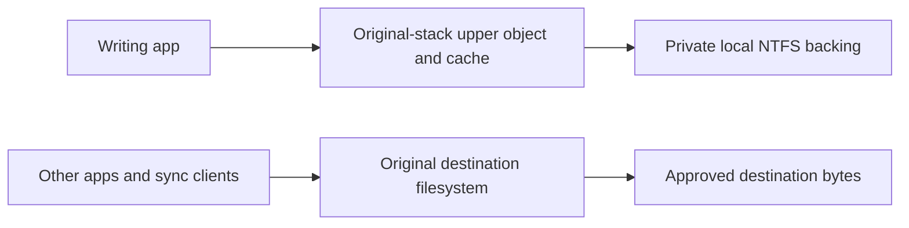

# Staged writes to protected destinations

## Active task tracker (resume here)

Updated: 1 October 2026. Branch: `feat/staged-kernel-prototype`.
The user narrowed the current work to **the cross-volume architecture problem**.
The remaining feature tasks below are recorded for continuity and deferred from
the current investigation. Do not query ClickUp.

### Current architecture task

- [x] Read this document and the native cross-volume failure evidence.
- [x] Trace the native handle-volume query and rename paths. Separate the
      documented Windows contract from assumptions in the previous diagnosis.
- [x] Identify the smallest supported data path that preserves destination
      identity and native save operations while storing unapproved data locally.
      Do not mutate `DeviceObject`/`Vpb` or another filesystem's contexts.
- [x] Implement a bounded feasibility test with native APIs and independent
      destination observers. Avoid copy/move fallbacks concealing rename failure.
- [x] Build both normal and experimental Debug configurations with the WDK. Run the
      focused VM gate with writable mappings, native identity and rename.
- [x] Record exact evidence, architectural decision, remaining limitations and
      reproduction commands. Update this tracker before stopping or compaction.
- [x] Verify the original debuggee driver is restored and temporary resources
      and Verifier settings are removed after each experiment.

The architecture gate requires a normal app opening its original protected
path to get the intended path and volume identity, perform native rename within
that destination, read/write and map its private version, while another process
sees only approved destination bytes. No unapproved destination placeholders
or app-specific hooks may be substituted for the original requirement.

Current investigation: a separate `SafeUpload.ArchitectureProbe` project tests
same-stack isolation, with an owned upper FCB/cache/section on the original
volume and a private NTFS backing handle. It reuses original-caller access checks.
It has no publisher or service journal and is not integrated into the feature.
The bounded architecture gate now passes normally and with volatile Verifier
`0x13B`: original native path/volume, native rename and held-handle name updates,
unaligned growth, cached/mapped coherence, mapped writes after handle cleanup,
reopen, live-mapping unload refusal, exact backing bytes, and stage ACL denial
after unload. Independent observers synchronized with save phases took 19 and
17 samples; physical destination file count was zero after both unloads.
A name provider plus explicit cache invalidation fixes stale names after rename.
Cc's `AdvanceOnly` EOF notification no longer recreates a cache after cleanup.
Backing growth is materialized before increasing upper VDL. The normal and
staging-enabled Debug WDK builds and probe driver analysis/API validation pass.
Release API validation remains a separately recorded existing toolchain failure.
Current architecture work is complete for this bounded NTFS gate. Resume the
integration tasks only when the user broadens the current architecture scope.

The first failed run stalled during unload because backing/original instance
references were held until after `FltUnregisterFilter`. Teardown now drops those
references first. Cleanup/reopen and live-section unload refusal now pass. The harness
restores the installed original binary even if live objects require a reboot;
it retains the loaded image and test fixtures for diagnosis in that case.
The stalled run was recovered by renaming the loaded image, restoring and
verifying the original installed binary, rebooting, and cleaning its private
root and detached VHDX. The original hash was independently verified afterward.
The original debuggee disk was snapshotted as
`safeupload-architecture-20261001` before loading the separately signed probe.
The probe SHA-256 for that first run is
`B0E3C588840938EC6429883B105C4422875EC3E49267FC90FA73ACE67E0643E7`.
The final tested signed probe SHA-256 is
`59D10C3386DDDB89FC28BFDE6E9D1F02393F1F04048E168E238229200FBA6D18`.

Focused run: explicitly build
`driver/SafeUpload.ArchitectureProbe/SafeUpload.ArchitectureProbe.vcxproj`, sign
its SYS as `C:\Users\vika\Documents\SafeUpload-architecture-probe.sys`, and run
`driver/scripts/Test-StagedArchitecture.ps1` on the debuggee. Add `-Verifier`
only after the ordinary gate passes. The harness always starts by checking the
original installed driver; it observes the real destination from another
process and also examines the physical directory after unload.

Build from the debugger's isolated checkout using its installed VS/WDK tools:

```powershell
$msbuild = 'C:\Program Files\Microsoft Visual Studio\18\Community\MSBuild\Current\Bin\MSBuild.exe'
& $msbuild driver\SafeUpload.ArchitectureProbe\SafeUpload.ArchitectureProbe.vcxproj `
    /t:Rebuild /p:Configuration=Debug /p:Platform=x64 /p:RunCodeAnalysis=true `
    /p:EnablePREfast=true `
    '/p:CodeAnalysisRuleSet=C:\Program Files (x86)\Windows Kits\10\CodeAnalysis\DriverRecommendedRules.ruleset'
```

Sign the resulting SYS with the VM's existing test certificate, transfer it to
the debuggee path above, and copy `Test-StagedArchitecture.ps1` plus
`StagedTestAgent.ps1` to the same directory. On the debuggee:

```powershell
& C:\Users\vika\Documents\Test-StagedArchitecture.ps1
& C:\Users\vika\Documents\Test-StagedArchitecture.ps1 -Verifier
```

Final evidence (all under `driver/evidence/2026-10-01`):

- [Ordinary native/mapped gate](evidence/2026-10-01/same-stack-architecture-gate.txt).
- [Focused Verifier gate](evidence/2026-10-01/same-stack-verifier-gate.txt) and
  [active Verifier query](evidence/2026-10-01/same-stack-verifier-query.txt).
- [Probe build/analysis](evidence/2026-10-01/same-stack-debug-build-native.txt) and
  [normal/staging Debug builds](evidence/2026-10-01/stage-driver-debug-builds-native.txt).
- [Release validation failure](evidence/2026-10-01/same-stack-release-validation-native.txt)
  and [normal Release failure](evidence/2026-10-01/stage-driver-release-validation-native.txt).
- [Final restoration and cleanup check](evidence/2026-10-01/same-stack-final-state.txt).

Architectural rationale: a reparse changes the file object's volume. The new
experiment completes a CREATE on the original stack using its own upper stream
and section objects, and uses a separate kernel backing handle for local data.
It does not modify `DeviceObject`, `Vpb`, another filesystem's FCB, or its cache.
All operations on an owned upper file object are handled or rejected before
they can reach the original filesystem. Paging requests preserve their flags,
MDLs and asynchronous completion when redirected to the local backing instance.
The backing stack-size requirement is checked before accepting the create.
See Microsoft's [I/O parameter-block contract](https://learn.microsoft.com/en-us/windows-hardware/drivers/ddi/fltkernel/ns-fltkernel-_flt_io_parameter_block),
[cache-map ownership contract](https://learn.microsoft.com/en-us/windows-hardware/drivers/ddi/ntifs/nf-ntifs-ccinitializecachemap),
and OSR's [same-stack isolation architecture](https://www.osr.com/nt-insider/2017-issue2/introduction-standard-isolation-minifilters/).

Baseline checkpoint: existing reparse path redirects an `S:` create to a private
`C:` backing file. Native volume identity is `C:` and native rename returns
Win32 error 17. Rewriting `FileVolumeNameInformation` in the minifilter did not
affect that query.
This failure belongs to the old reparse architecture; the separate isolation
experiment is the replacement under qualification.
Baseline: commit `9dbdb16`, 216 Windows agent tests, both WDK builds and limited
volatile Verifier tests passed. See the later dated sections for exact coverage.

### Deferred completion tasks

- [ ] Complete shared file/version identity across processes, aliases, handles
      and writable mappings; preserve sharing/locking and publication ordering.
- [ ] Complete replacement, hard links, delete/disposition, aliases, file IDs,
      reparse paths, streams, metadata, directory notifications and cancellation.
- [ ] Complete driver-loss/reload/reboot recovery and user access to retained
      versions; resolve interrupted allocation, rename and publication safely.
- [ ] Complete private-stage/journal access coverage, disk-full handling,
      retention limits, corruption handling and safe orphan cleanup.
- [ ] Verify actual analysis notifications and exact-version justification;
      test real kernel permit spoofing, replay, expiry, changed bytes and paths.
- [ ] Verify Explorer/Office, physical USB, UNC/mapped SMB and real sync clients
      with independent destination-byte observers and concurrent/crash cases.
- [ ] Qualify with full agent tests, WDK builds, applicable boot-time DDI/filter
      Verifier, stress and save latency; finish configuration/install/recovery.
- [ ] Retire process taint only for responsibilities demonstrably replaced by
      the completed flow. Enable staging only after the required gates pass.

### Workspace and VM safety checkpoint

- Linux workspace: `/home/victor/Work/safeupload-staging`.
- Debugger: `vika@192.168.122.210`; isolated checkout:
  `C:\Users\vika\Documents\safeupload-staging-test`.
- Do not modify `C:\Users\vika\Documents\safeupload`.
- Debuggee: `vika@192.168.122.51`; SSH key:
  `/home/victor/.ssh/id_ed25519`.
- Restore and independently verify original installed `SafeUpload.sys` SHA-256:
  `ADA9D05AB6AECDD2B6C521B0CE529FC06C732154ACB3EE85439FBDC8AA80DFCE`.
- At this checkpoint the original driver is restored, no probe is loaded,
  Verifier is off, and the disposable `S:` VHDX and private root were removed.
  Verify again before reuse and after every experiment.
- Normal builds compile staging out. Keep experimental builds isolated.

## Architecture decision: preserve the original stack, own the private stream

The writing application's handle must stay on the destination's original stack.
Its stream data must have a separate local backing object. The driver owns the
upper FCB, share state, cache and section pointers from CREATE through final
CLOSE. It completes or rejects every operation on an upper object before a
foreign filesystem can interpret that FCB. It never borrows the backing NTFS
FCB or changes `DeviceObject`/`Vpb` to manufacture volume identity.



The separate probe has exercised this data path on two NTFS volumes. The normal
SafeUpload driver still uses its existing enforcement. The probe is explicitly
built and is absent from the normal solution and deployment. It handles new
top-level files in its disposable fixture, up to 16 streams and 16 MiB each;
overwrite/replacement, hard links, file IDs, directory overlays and UNC are not
implemented by it. Its private view belongs to a referenced process object,
so an independent process sees the physical destination.

### Contracts established by the architecture gate

- Native class-58 volume queries and `GetFinalPathNameByHandle` retain the
  original destination identity. Native same-volume rename needs no copy/move
  fallback. A name provider and explicit invalidation keep existing handles'
  current names consistent after virtual rename.
- Ordinary cached I/O and writable mappings share one upper cache. Paging
  requests go to the local backing with their MDL, paging and synchronous flags
  preserved. The documented backing-device stack-size requirement is checked
  before CREATE; unsupported stacks are rejected.
- The backing handle uses noncached I/O. Growth explicitly zeroes the extended
  range and preserves an old partial sector before increasing upper VDL. Cc's
  `AdvanceOnly` EOF notification updates backing VDL; it must not resize the
  upper stream or recreate a cache on a cleaned handle. See Microsoft's
  [EOF notification contract](https://learn.microsoft.com/en-us/windows-hardware/drivers/ifs/flt-parameters-for-irp-mj-set-information).
- CLEANUP removes a handle's share/cache participation; CLOSE retires its file
  object. A mapped view can still write after ordinary handles close. Unload
  refuses live file objects, mappings or cache/section state, then drains
  callbacks before freeing the stream. Instance references are released before
  unregister to avoid a reference-cycle wait.
- Root and backing-file SYSTEM-only ACLs protect retained bytes after unload.
  These ACLs supplement kernel admission; they do not supply a publication
  authorization or a complete protected-destination policy.

### Integration work recorded for resumption

Keep these concerns separate. Do not expand the probe into an unstructured
filesystem implementation inside `Filter.c`.

| Component | Responsibility | Required gate |
| --- | --- | --- |
| Namespace | Destination identity, private-view membership, names/aliases and directory overlays | Native saves and queries agree; sync readers see approved state |
| Upper stream | Owned FCB/cache, sharing, locks, handles and section lifetime | No foreign FCB access; no sealing while bytes remain writable |
| Local store | Durable version allocation, original ACL checks, private backing identity and recovery | Journal before successful CREATE; driver/service loss preserves private bytes |
| Inspection/publication service | Immutable read handle, inspection, notification, exact-version justification and authenticated publish | The published handle supplies exactly the inspected bytes |

1. Replace the reparse admission path with an owned upper stream only after
   the service durably allocates a version. Keep the service's allocation,
   security and publication protocols; a writable reparse ECP cannot be the
   writer's data path. Represent destination, private view and immutable
   version identity separately. Preserve process-reference and access checks.
2. Implement namespace operations against that registry. Merge the private
   writer's directory view, implement temporary-file replacement/delete/link
   semantics and aliases, and preserve the original public view for unrelated
   processes. Reopen must use the latest private content as a new version when
   the prior version is sealed. Do not key durable identity by path or PID alone.
3. Make stream retirement a service-visible sealing gate. CLEANUP and section
   synchronization acquire/release callbacks are not final-writer signals.
   Start with conservative retirement of all upper file objects and sections,
   flush/drain the upper cache, and close backing write access before handing
   the version to the service. A pending retirement must be notified and
   retried without losing its private data. Narrowing retirement to writable
   sections requires separate evidence, not a guessed handle counter.
4. Let inspection and publication retain the same immutable version. Bind UI
   justification and publication permits to its version identity and digest.
   A new edit allocates a distinct version; no approval follows it automatically.
5. Qualify the same architecture on redirector/UNC and removable filesystems
   before admitting those stacks. The current paging route is bounded by the
   documented stack-size rule; reject an unsupported stack rather than alter
   foreign ownership fields. Directory/oplock/cancellation behavior also needs
   the full app and crash matrix listed above before integration is enabled.

Retain the existing taint mechanism for its current duties until the complete
version flow demonstrably replaces them. This architecture result does not
authorize enabling staging or retiring existing enforcement.

### Architecture build limitation

Release compilation/linking and probe driver analysis succeeded, but Release
API validation failed with `aitstatic` error 193 for both the normal driver and
the new probe. This is the already documented toolchain failure in
[ARQUITETURA.md](ARQUITETURA.md#segunda-ocorrência-com-evidência).
API validation remains enabled. Debug normal, staging-enabled and probe builds
pass API validation; the probe's DriverRecommendedRules analysis is also clean.

## User-visible behavior

An ordinary Save or Copy to a protected USB drive, network share, or sync
folder keeps the application's write in private local storage. The tray shows
`Analyzing` after the final writer closes. A fully inspected clean version is
copied to the destination; sensitive or uninspectable versions stay local.
No sensitive byte may be created at the destination before approval. A timeout,
service disconnect, parser error, size limit, unknown format, or journal error
must retain the local version and report that it was not sent.

## Enforcement invariants

1. Every writable open of a protected destination is redirected before the
   underlying filesystem handles the create. Direct writes, paging writes,
   truncation, rename, hard link, and file-ID opens cannot bypass this gate.
2. The private staging file is on a local fixed volume. Its path is never inside
   a protected sync folder. The service records the destination and originating
   user in a durable journal before returning the staging path to the driver.
3. The driver tracks all writable handles on a staged stream. Only the final
   cleanup seals the version. The service acquires a read handle that excludes
   writers for the entire scan and copy. A later open starts a new version.
4. The service releases only `Approved` after actual content inspection under
   the current policy. `AllowedWithoutInspection` is **not** approval for a
   staged transfer. A transfer also stays local if the destination is no longer
   in policy scope when publication is attempted.
5. The service writes an approved version to a temporary file at the target,
   flushes it, and renames it into place. Only the service's authenticated
   publication path may bypass the destination gate. The published bytes must
   be the same locked version that was inspected.
6. Stage creation, sealing, approval, publication, and retention have durable
   states. On restart, the service reconciles each state. It must not treat an
   interrupted inspection as an approval, and it must not lose a user file.
7. A user can justify a blocked transfer only against its exact transfer ID
   and inspected version. A justification may release that version; it must
   never grant a general process or destination bypass.

## Required Windows coverage before deployment

- Explorer `CopyFile` and `MoveFile`, PowerShell and .NET streams, Office
  save-via-temporary-file-and-rename, append, overwrite, multiple open handles,
  and memory-mapped writes.
- Short names, relative opens, reparse points, directory enumeration, metadata
  queries, open-by-ID, alternate data streams, rename and hard-link operations.
- USB, mapped and UNC network shares, and local cloud-sync folders.
- Service crash, driver unload/reload, machine restart, removal of a USB drive,
  full staging disk, timeout, changed policy, and concurrent writers.
- A negative test must watch the actual destination bytes and sync client during
  every blocked case. Checking only the final path after deletion is not enough.

The service-side `StagedTransferPublisher` and `StagedTransferJournal` now
implement sealed-file inspection, durable state transitions, digest-based
publication recovery, and outcome auditing. A classification result is not
audited as a successful send before the destination publication succeeds.
The publisher rechecks the policy version and destination scope before
publication; a policy change during analysis retains the file. The test-only
cross-volume minifilter path is wired to the journal, final-writer seal signal,
and publisher. It remains disabled in ordinary builds and is not a complete
transparent namespace or private-storage implementation.

Microsoft's SimRep sample demonstrates pre-create reparsing, but explicitly
does not virtualize the namespace for higher filters. Its rename, name-provider,
and network-query handling are relevant starting points, not a drop-in DLP
solution: https://learn.microsoft.com/en-us/samples/microsoft/windows-driver-samples/simrep-file-system-minifilter-driver/

Memory-mapped writes require paging-I/O coverage in a filter that monitors
changes: https://learn.microsoft.com/en-us/windows-hardware/drivers/ifs/memory-mapped-files-in-a-file-system-filter-driver

## Reparse feasibility probe (debuggee VM)

An experimental pre-create callback on `feat/staged-kernel-prototype` used
`IoReplaceFileObjectName` and `STATUS_REPARSE` to map a single top-level test
file from `C:\SafeUpload\Escopo Monitorado` into `C:\SafeUpload\_staging`.
The WDK build succeeded. With the signed prototype loaded on the debuggee,
`File.WriteAllText` succeeded, the stage contained the bytes, and the original
destination path did not exist. The original driver was restored afterward
(SHA-256 `ADA9D05AB6AECDD2B6C521B0CE529FC06C732154ACB3EE85439FBDC8AA80DFCE`).

That first probe proved the write redirection primitive, not application
transparency. Immediately after its save, a metadata lookup of the original
path saw no file. An application that reopens its save or enumerates its
folder needs process-aware name virtualization. Cloud sync and other
processes must not see the staged bytes before approval. The prototype is
disabled by default with `SAFEUPLOAD_STAGING_PROTOTYPE=0` and must not ship.

The later test-only namespace map redirects subsequent opens by the writer's
process to its stage file. On the debuggee, the writer could reopen and read
the staged bytes; another process could not see the new destination path.
The map is dropped on process exit so PID reuse does not inherit visibility.
The earlier probe used driver load time and a sequence number in stage names.
The current probe instead obtains a unique GUID basename from the service,
which durably records the transfer before answering the kernel. A recycled
PID cannot claim a previous writer's in-memory view.
An explicit `SafeUploadStagingPrototype=true` WDK build property is required
to include this code; ordinary builds still compile it out.

The same test exposed two missing filesystem operations. The writer's folder
enumeration did not include its staged file. A rename from a staged temporary
file into the protected folder initially made bytes visible before approval.
The prototype now denies renames and hard links into that test folder; the
debuggee confirmed the destination stayed absent. This safety gate breaks
rename-based saves and must become transactional rename virtualization.
The original driver was restored after each test. The reproducible test is
`driver/scripts/Test-StagedNamespacePrototype.ps1`.

## Cross-volume, service-owned allocation probe (30 September 2026)

On the isolated debuggee VM, `Test-StagedCrossVolumePrototype.ps1` created a
disposable NTFS VHDX at `S:` and used the prototype build with protocol 12.
The driver now resolves the local `C:` volume independently, asks the agent
for a unique stage basename, and only reparses the create after the agent
has flushed an `Allocated` journal manifest. With no agent connected, the
protected create returned access denied and left no destination file. With
the self-contained agent running, the writer reopened `S:\SafeUpload\Escopo
Monitorado\...txt`, read its staged bytes from `C:\SafeUpload\_staging`, and
another process saw no file at the destination. The journal contained one
matching transfer, and the stage held the expected bytes. The test unloaded
the prototype, restored the original installed driver, and detached `S:`.
It also stopped and restarted the agent while the driver remained loaded:
the unsealed `Allocated` entry was held locally, with no destination file.
The rename and hard-link safety gates still denied both operations.

The current probe attaches a kernel-created ECP to each redirected create.
The same app can reopen the original name, but a direct open of the private
stage filename without that marker is denied while the filter is loaded.
The VM test confirmed `DirectStageReadDenied=True`. Microsoft documents that
ECPs added during a create survive reparse retries:
https://learn.microsoft.com/en-us/windows-hardware/drivers/ddi/fltkernel/nf-fltkernel-fltallocateextracreateparameter

The agent also holds interrupted `Allocated` entries unsealed and retains
interrupted `Inspecting` and `Approved` entries on restart, then reconciles
`Publishing` entries against the actual
destination digest. The staged-transfer tests pass. This is a feasibility
probe only: unloading the filter exposes the stage to the same user (also
confirmed by the test).
Other aliases need independent coverage. Only the two hardcoded test
directories are handled. Protocol 14 requires
the matching agent; the ordinary installed driver remains the previous
protocol 11 binary. The prototype is compiled out by default and must not
be placed in a production package.

## Recovery and journal hardening (30 September 2026)

Recovery now puts an interrupted `Allocated` transfer in a distinct `Unsealed`
state. It cannot enter inspection or publication. The journal records whether
the transfer was ever sealed, so an older `Retained` manifest without seal
provenance also cannot be published. This closes a recovery path where an
unfinished writer's bytes could otherwise become eligible for inspection.

The prototype journal moved to `%ProgramData%\SafeUpload\staging-journal`.
On Windows, its directory and manifests get explicit service, SYSTEM, and
Administrators ACLs. Prototype startup rejects a parent that grants ordinary
users child-deletion rights; a LocalSystem service also rejects existing
journal objects owned by other identities. The debugger VM passed 22 focused
tests and the complete 192-test agent suite. The cross-volume debuggee test
passed after the move, including `Unsealed` recovery and restoration of the
original driver hash.

This does not secure the stage file. The debuggee test still reads its exact
unapproved bytes as the writer after the prototype filter unloads. The
current reparse opens that file using the writer's token, so the file's NTFS
ACL must grant that user access. That same access remains after driver unload
or crash. An ACL on the journal cannot close this gap. A protected stage
requires a different data path that gives the app a usable handle without
granting it independent access to the stored file. The probe still denies
rename-based saves and omits folder-listing virtualization. Staging remains
disabled in ordinary builds.

## Final writer and later version probe (30 September 2026)

Protocol 14 uses a kernel-issued `STAGE_SEAL` message after the last writable
handle cleans up. The driver counts staged writers and blocks another writer
while a seal request is in flight. A writable memory-mapped view delays sealing
after its file handle closes; a prototype worker checks the section's writable
references and seals after the view disappears. The agent journals `Sealed`,
notifies `Analyzing`, inspects that version, and publishes a clean version with
its connected-port process identity. A blocked or uninspectable version remains
local. A service restart changes interrupted `Allocated` to `Unsealed` and
requires the real driver seal signal before inspection.

After a sealed version, the same writer's next writable open allocates a new
transfer ID. `FILE_OPEN` and `FILE_OPEN_IF` copy the prior stage into the new
local stage; truncating dispositions start empty. A sensitive append did not
change the already published `alphabeta` destination bytes, and a later clean
overwrite published only `clean replacement`. The debuggee test also passed
two concurrent handles, a mapped write without an extra file reopen, and a
service crash with a handle held open. The WDK prototype build passed; 25
focused and 195 full Windows agent tests passed. A separate
`Test-StagedFileIdAlias.ps1` probe read a fixture by file ID before filter load
and received access denied while the prototype filter was loaded. Each test
restored the installed original driver; its independent SHA-256 check remained
`ADA9D05AB6AECDD2B6C521B0CE529FC06C732154ACB3EE85439FBDC8AA80DFCE`.

This path is still a test-specific prototype. It does not synthesize the
writer's directory listing or virtualize rename-based saves, so Explorer and
Office save workflows are incomplete. The stage is readable by its writer
after driver unload. Other aliases, USB hardware, UNC shares, sync clients,
and Driver Verifier have not passed the required matrix. The worker and
version handoff have only the disposable-VHDX test coverage described above.

## Private backing storage and exact-version approval (30 September 2026)

The protocol-15 feature build now stores backing files in
`C:\ProgramData\SafeUpload\staging` under a protected, SYSTEM-owned DACL.
The runtime allocator requires LocalSystem. Before redirecting a create, the
driver checks the original user's access against the destination descriptor
or the parent and inherited descriptor for a new file. Its kernel-only ECP
carries those granted rights into the redirected access state. It never
substitutes the user's token and never grants permission to change the private
backing ACL. This replaces the earlier unload exposure described above.

`Test-StagedPrivateStorage.ps1` and the cross-volume harness confirmed that
the writer could read its virtual destination while direct backing reads
remained denied **after filter unload**. The cross-volume harness also passed
concurrent handles, append and overwrite versions, mapped-view final closure,
service restart with an open writer, and clean publication after final close.
The agent now authenticates its filter-port identity before recovering existing
private files. Every experiment restored the original installed driver, with
the expected SHA-256 independently checked afterward.

The publisher inspects a separate service-only snapshot and copies that same
snapshot to the destination. It checks the backing digest before publication.
A blocked version's justification is bound to its transfer ID, digest, policy
version, originating session and a one-use time-limited callback. Changed bytes,
policy changes, other sessions and replay do not authorize that version.
The callback reinspects and rechecks policy; it never creates a process grant.
The application now displays staged findings and submits this transfer ID.
The 199-test Windows agent suite and application build passed at this point;
the later UNC translation suite brought the total to 206 passing tests.

The feature build also uses configured destination prefixes and volume kinds
for allocation, resolves normalized names, and supports nested file paths.
The disposable `S:` test classification and bootstrap test-folder gate remain.
Unresolved writable names and writable file-ID opens fail closed in this
experimental build. Ordinary builds continue to compile staging out.

Protocol 16 adds a journaled virtual rename transaction, query-open fallback
into virtual creates, and final-extension inspection of temporary files.
Its 31 focused agent tests and WDK build pass. The VM rename test passed an
ordinary `.NET File.Move` from a private `.tmp` stage to the final `.txt`
name: a clean version was inspected and released, a sensitive version remained
private, the writer read the renamed bytes and the old virtual name disappeared.
The failure found and fixed in that test was redirecting a rename's
`SL_OPEN_TARGET_DIRECTORY` parent open as though it were a file write.
Protocol 17 now verifies native final-path names on the local destination,
writer-only directory entries and sizes, old-name removal after rename, and
ordinary clean and sensitive saves. Directory handles keep a private union
snapshot with wildcard matching and a cursor; eight standard information
classes, restart and single-entry queries are implemented, with unsafe-context
queries deferred to PASSIVE_LEVEL. Small-buffer and cancellation probes still
need dedicated VM coverage.

The authenticated LocalSystem port owner now needs a per-transfer publication
permit: an exact pending path and final destination, transfer ID, inspected
digest, one create, one rename and a 30-second expiry. Disconnect revokes all
permits. There is no blanket service write/rename bypass in protected scope.
The VM passed both local rename and cross-volume clean publication through
these permits. A dedicated completion event for each overlapped receive fixes
a discovered shared-port wakeup that previously canceled publication when a
control message was sent alongside the receive.

The full Windows agent suite now passes 212 tests. That includes a new
regression for changed content with identical size and timestamp: inspection
cache reuse now hashes the same in-memory bytes that are scanned. The staged
publisher continues to avoid the legacy inspection cache entirely.

`Test-StagedDuplicatedHandle.ps1` also passed an owner process exit with its
writable file object duplicated into another process: the transfer stayed
unsealed while the duplicate remained open, and final cleanup in the second
process published the exact `basetail` bytes. Both normal (staging disabled)
and experimental WDK builds passed at this checkpoint.

The cross-volume VM test passed writer-only listings, virtual rename,
concurrent writers, append/overwrite versions, mapped-view final closure,
service restart, and destination-byte observers. Each harness restored the
known original driver and detached its disposable VHDX. Rename replacement of
an existing staged target, hard-link aliases, full USB, UNC and sync-client
coverage, crash/reboot recovery and Driver Verifier remain required before
claiming the full design complete.

## Implementation sequence

### Pause checkpoint (1 October 2026)

The latest experimental WDK build and signed VM rename test passed. Each
staged handle now retains a reference to its version's virtual name, independent
of the mutable namespace mapping. A held read handle followed a temporary-file
rename and kept the final virtual path after a later version was allocated;
its original bytes remained unchanged. Native `FileAllInformation` also returned
the virtual path. Backing DOS aliases are not returned as destination aliases.
Directory snapshots now record the requestor identity and rebuild when a shared
directory handle is queried by another process. Allocation failure cleanup no
longer walks an uninitialized directory-entry list.

Private-stage file-ID probes after unload passed with and without backup
semantics under a token with elevated privileges removed. The initial elevated
SSH test could read by ID because its `SeBackupPrivilege` was enabled, which
Windows deliberately allows to override read ACLs. This is a trusted host-admin
boundary, not protection against a privileged backup operator. Backing files
now also receive explicit protected service/SYSTEM ACLs before their paths are
issued; recovery replaces extra file grants. The ACL regression brought the
full Windows agent suite to 213 passing tests. A nullable warning in that test
was corrected locally after this run; no additional test run was started at
the user's pause request.

Latest signed experimental driver SHA-256:
`3751294725B4B677C00CCFFFDB39DAE18D5F680D14691B154E2C7019D9D23D38`.
The final VM test restored the original installed driver. Staging remains
disabled in normal builds and process taint remains in place. The feature is
not complete. Resume with the latest private-storage and cross-volume harnesses,
then native directory pagination/cancellation, transactional replacement and
hard-link/alias support. Per-process destination version ordering, directory
notifications, cross-volume native volume identity, actual Explorer/Office,
USB/UNC/sync, user justification UI/pipe, crash/reboot and Verifier coverage
remain unverified or unfinished. The current rename journal retarget is still
single phase and needs timeout/crash-safe commit handling.

### Resumed implementation and native compatibility blocker (1 October 2026)

Protocol 18 replaces the single-phase retarget with durable prepare and
commit/abort. Preparation records both the original transfer and pending
destination without authorizing either for publication. Journal transitions
and the publisher reject a pending rename. The driver changes its virtual
namespace, then commits that exact request ID and destination; it holds the
mapping against later writes and sealing until commit acknowledgement. Its
worker retries a lost commit or abort after reconnection. Completion is
idempotent, rejects a different owner, transaction or destination, and never
invents a prepare. Recovery preserves an unresolved rename instead of assuming
it completed. After driver loss, that unresolved version stays local pending
an explicit recovery path; automatic namespace reconstruction is unfinished.

The full Windows agent suite passed 216 tests, including pending-rename
restart, replay, abort, wrong-owner/destination, and publication-before-commit
cases. Both WDK build modes passed; the application build had zero warnings
and errors. The native local rename/version tests passed. The publisher loop
also keeps running if a rename races its attempt to mark a failed seal retained.

`Test-StagedDirectory.ps1` passed native classes 1, 2, 3, 12, 37, 38, 60 and 63:
single-entry pagination, restart with the original wildcard captured, initial
overflow, later too-small buffers without consuming an entry, metadata sizes,
and an observer seeing only the two approved fixtures. Windows rejects buffers
smaller than the fixed structure before the filter, so overflow tests use a
valid fixed structure plus a partial filename. Cancellation still needs a
dedicated asynchronous probe.

`Test-StagedVerifier.ps1` passed local rename, native directory, and private
storage tests with volatile flags `0x13B`: Special Pool, Force IRQL, Pool
Tracking, I/O Verification, Deadlock Detection and Security Checks. It saved
live statistics with `SafeUpload.sys` loaded, then removed/reset the volatile
settings. These are limited Verifier runs, not full boot-time DDI/filter
verification. The statistics are in `driver/evidence/2026-10-01/`.

**The full cross-volume transparency gate now fails, despite the byte-isolation
and publication cases passing.** An `S:` staged handle returns a `C:` final
path and backing volume from native queries. `SetFileInformationByHandle`
rename to another name on the same original `S:` volume returns Win32 error
17 (`ERROR_NOT_SAME_DEVICE`), even after inspection finishes. A PowerShell
move succeeding does not establish native rename support; its fallback can
allocate and copy another staged version.

Original-volume storage plus `FileVolumeNameInformation` virtualization did
not change the native result. A separate diagnostic build made every class-58
query seen by the minifilter return `STATUS_INVALID_DEVICE_REQUEST`; the native
query still succeeded and returned the backing volume. That path bypasses this
callback. Merely rewriting file-name query buffers cannot preserve the file
object's original volume identity across reparsing.

Reproduce with `Test-StagedCrossVolumePrototype.ps1 -NativeIdentityOnly`.
Selected exact output, driver hashes and attempted fixes are recorded in
`driver/evidence/2026-10-01/native-cross-volume-identity.txt`. The optional
`SafeUploadStageVolumeProbe=true` WDK property enables only the diagnostic
sentinel and must not be enabled in ordinary feature tests. The normal feature
driver for these results is
`F5E777D7DB9E7DF9470240D58CE05BB041F03D64DC613CCD2E1DBE2F394C001A`.

This is a compatibility blocker in the current cross-volume reparse data path.
Completing the intended transparent design requires preserving the original
volume identity through a different file-object/data path, rather than relying
on backing-file handles for native operations. Existing-target replacement,
hard-link/alias virtualization, destination-version ordering, notifications,
real USB/UNC/sync/Explorer/Office workflows and full crash/reboot coverage also
remain unfinished. Process taint is still required; staging remains disabled
in normal builds. Every experiment restored the original installed driver and
detached its disposable VHDX.

1. Add a service-owned transfer journal and per-user staging directory. The
   driver requests a stage mapping for a specific destination, process, and
   create disposition. A missing service or stage allocation error denies the
   protected create before it reaches the destination.
2. Track all handles for a staged version in kernel. Seal only after the final
   writable cleanup, including mapped writes and rename-based saves. The
   journal survives a service restart and retains an unapproved file.
3. Virtualize names for the writing app: open, query, enumeration, rename,
   hard link, and change notification. Do not expose staged content to the
   sync client or another process. Apply the same rule to USB and UNC paths.
4. Integrate the publisher with the journal. Audit the actual publication
   outcome separately from content classification, and bind justification to
   the exact staged version. Reconcile incomplete publication after restart.
5. Run the coverage matrix above on the debuggee with a byte-level observer
   on each destination, Driver Verifier, and measured save latency. Only then
   replace the process-taint rule and enable the feature in policy.
