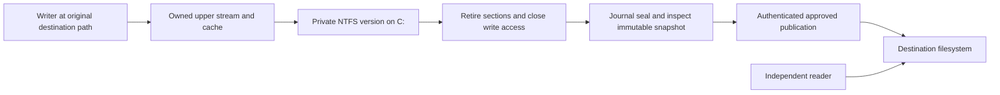
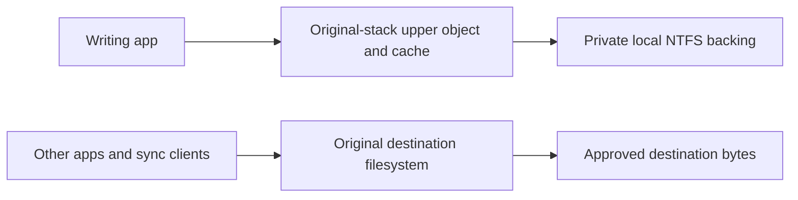

# Staged writes to protected destinations

## Current milestone: destination admission gate for staged writes (3 October 2026)

Journal milestone is committed as `85bf31f`. The physical-alias increment below
passes its focused and integrated runtime gates at the documented scope.
**Complete alias admission is still unqualified.** The active work is to prove
race-safe admission and privacy across the full approved policy scope, including
whole-drive policy scopes, removable USB, UNC/SMB, and sync-client destinations.
Normal staging stays compiled out and taint enforcement remains.

- [x] Reproduce the existing external-hard-link physical-byte leak with qualified
      4B60… SYS and D887… service; [exact result](evidence/2026-10-02/aliases-current-before.txt).
- [x] Independent original/off/policy baseline and clean frozen checkpoint
      `safeupload-pre-alias-guard-20261002`, with a verified original boot.
      [Baseline](evidence/2026-10-02/aliases-checkpoint-baseline.txt).
      Active disk is now `/var/lib/libvirt/images/win10-debug.safeupload-pre-alias-guard-20261002`;
      preserve the pre-journal and all earlier disks/snapshots.
- [x] Four WDK/static/API-validation builds and **275/275** agent regressions.
- [x] Protected external aliases and pre-attachment physical handles refuse
      writes/size/rename/link mutations; unrelated linked-file controls succeed.
- [x] Runtime Verifier and integrated save regression: **24 approved overwrites**,
      **546 independent destination-byte samples**, no leak and exit 0.
- [x] Exact 64-link control admitted; 65-link write refused with existing bytes
      preserved. Final independent original-driver/policy/Verifier restoration.
- [x] Reproduce the pre-attachment writable-section leak on the current feature
      SYS after closing the source file handle before attachment. A fresh
      post-attach file object reads the unapproved mapped write; [gate](evidence/2026-10-02/physical-mapping-handle-closed-gate.txt),
      [independent restoration](evidence/2026-10-02/physical-mapping-handle-closed-final-restored-state.txt).
- [x] Reproduce a writable section that predates the agent's first policy push
      and a later real-agent scope expansion: the old view changes the protected
      destination after expansion; [gate](evidence/2026-10-02/policy-transition-eof-map-gate.txt),
      [independent restoration](evidence/2026-10-02/policy-transition-eof-map-final-restored-state.txt).
      Earlier harness failures are excluded (see the follow-up below).
- [x] Observe-only admission diagnostic implemented, reviewed, built clean and run on the
      debuggee (feature only, default off; see "Slice 1" below). It answers the four
      unknowns; **no leak is blocked by it**.
- [x] Mapped-writable stream fence (feature build only): both existing repro scripts
      **BLOCKED** (Verifier on and off), fixture E closed at section creation, the
      dirty-page lifecycle leak found and fixed, 15-cycle race test and soak under the
      Verifier with independent restorations; see "Slice 2" below. **The residual limits
      listed there remain open.**
- [x] Physical mutation gates for old handles (feature build only): mutating FSCTLs and
      `FILE_DELETE_ON_CLOSE` on protected names, proven by an A/B test (five bypasses
      REPRODUCED without the gate, all BLOCKED with it); see "Slice 3" below.
      **Its review and the FSCTL classes it does not cover remain open.**
- [ ] Complete namespace/policy/attachment admission, remaining mutation classes and
      the broader acceptance tracker.
  - [x] Review the section-create status contract and document the remaining
        existing-writable-view lifetime blocker.
  - [x] Rebuild the unload-helper annotation fix in the four normal/feature
        Debug/Release configurations; pass 275/275 agent tests.
  - [x] Parse and review the policy-shrink diagnostic that brackets section
        creation with hash-pinned SYSTEM Inspector snapshots; retain its
        temporal-correlation limitation.
  - [x] Attempt the reviewed policy-shrink diagnostic on the isolated Windows
        VM under a clean checkpoint. It stopped before baseline policy
        acceptance because the approved policy enables removable and network
        scopes that this feature gate cannot yet cover.
    - [x] Verify run22 signed-driver PE sections, guest signer, Inspector hash,
          and the extracted D887 service directory against its pinned ZIP.
    - [x] Independently verify original driver/policy/Verifier state, filter
          unload, task/fixture cleanup, and restoration of the prior guest
          feature input.
    - [ ] Reach policy transition and section-denial measurement after
          scope-correct candidate coverage is implemented.
  - [ ] Close the in-flight mapping, attachment, policy-transition and partial-
        coverage privacy gaps without relying on process taint.
    - [x] Extend the policy-transition harness with a second fixture that keeps
          a writable section handle, but no view, across policy expansion; its
          first writable view is mapped after candidate acceptance and measured
          against a separate full raw-volume baseline. Failed writes, flushes,
          disposal, or raw observation remain inconclusive. [Harness](scripts/Test-StagedPolicyTransitionMapping.ps1).
    - [x] Parse the retained-section harness revision and compile its embedded
          native interop declarations with the local PowerShell 7 runtime
          (zero parse errors; declaration compilation succeeded).
    - [x] Receive Luna source review of the retained-section case; no blocking
          finding. Apply named-object collision detection with a cleared-error
          wrapper and clarify supplemental observer semantics.
    - [x] Complete targeted Luna rereview, including cleared-error handling
          and initialized `[ref]` storage; no remaining source blocker.
          [Review record](evidence/2026-10-03/policy-transition-retained-section-source-review.txt).
    - [x] Add `-PolicyRejectionOnly` mode for the unchanged full approved
          policy: require no ready signal, stable pre/post fence generation and
          entry count, and rejected-scan telemetry. The protocol does not expose
          policy generation; the mode explicitly does not claim runtime readback.
    - [x] Bind the service process to the SHA-256-pinned archive by hashing and
          parsing one held read-only stream, then extracting under
          CommonApplicationData with protected Administrators/SYSTEM ACLs.
          Check member paths, ancestor/tree reparse points, and ACLs before
          launch and recursive cleanup; require the exact `FilterPort.SetPolicy`
          exception and policy-push stack frames. This is source-only until rerun.
    - [x] Complete Luna's final source rereview of the package-bound
          rejection-only harness; no source-level blocker. The ACL check is
          conservative allow-ACE screening, not effective-token evaluation.
          [Review record](evidence/2026-10-03/policy-transition-rejection-package-source-review.txt).
    - [ ] Parse the updated harness with Windows PowerShell 5.1 and compile its
          embedded native interop declarations.
    - [ ] Build the exact current driver source in WDK Debug and Release.
    - [ ] Verify the rejection-only branch on the clean VM, including baseline
          policy identity and complete machine restoration.
    - [ ] Execute this case only after scope-correct removable and network
          coverage permits the unchanged approved policy; record independent
          byte observation and full VM restoration.
    - [ ] Verify and qualify transactional policy acceptance: the feature
          path now keeps the previous policy current and the candidate pending
          through two checked old-and-candidate union scans before publication;
          scan failure leaves the old policy current and the last successfully
          installed fence table intact. This removes the unchecked post-swap refresh but
          does not close the mapping race. A proposed pre/post-operation rundown
          was removed: the minifilter post-op completes before Memory Manager
          creates the section. The later release callback carries no parameters
          and may not be observed if instance teardown begins, so a correctly
          paired, teardown-safe lease tracker is unresolved. A proposed provisional
          registry also lacks a retirement proof: `MmDoesFileHaveUserWritableReferences`
          reports currently user-mapped sections, while `CcPurgeCacheSection`
          purges system cache data and explicitly does not purge mapped files.
          An application can retain a writable file-mapping section handle
          without a mapped view, then map a writable view after policy commit;
          the documented section-create callback does not establish a later
          view-map barrier. `SECTION_OBJECT_POINTERS.DataSectionObject` is not
          a documented retirement signal: filter drivers must treat its
          members as opaque, and the value can change at any time. See Microsoft's
          [MmDoesFileHaveUserWritableReferences contract](https://learn.microsoft.com/en-us/windows-hardware/drivers/ddi/ntifs/nf-ntifs-mmdoesfilehaveuserwritablereferences),
          [CcPurgeCacheSection contract](https://learn.microsoft.com/en-us/windows-hardware/drivers/ddi/ntifs/nf-ntifs-ccpurgecachesection),
          [SECTION_OBJECT_POINTERS contract](https://learn.microsoft.com/en-us/windows-hardware/drivers/ddi/wdm/ns-wdm-_section_object_pointers),
          and [section-object/view lifecycle](https://learn.microsoft.com/en-us/windows-hardware/drivers/kernel/managing-memory-sections).
          Any future registry must be visible to the paging-write gate before
          an acquire proceeds, preserve successful records until a documented
          proof rules out later writable views, and fail closed on capacity
          exhaustion or unmatched teardown. Sticky records avoid premature
          retirement but accumulate denials, and cannot protect writes after
          mandatory detach, dismount or unload. The reviewed minifilter APIs
          provide no such end-to-end lifetime guarantee.
          Luna separately assessed a sticky `FLT_STREAM_CONTEXT` marker as a
          bounded implementation candidate: install it on every stream in a
          qualified protected scope and check it in paging-write pre-operation
          before any owned-stream early return. This is not implemented or
          qualified. Context support is filesystem-specific, and the
          documentation does not promise that a live file-backed section keeps
          its stream context attached after user handles close. A namespace
          scan also races create, link, rename, and paging writes; an
          unenumerated stream with a retained section handle is a counterexample
          unless a volume-wide fallback covers it. Any trial therefore needs
          gated scope changes, drained paging writes during installation,
          fail-closed handling for missing/unsupported contexts and incomplete
          enumeration, plus target-stack lifetime tests. See Microsoft's
          [FltSetStreamContext contract](https://learn.microsoft.com/en-us/windows-hardware/drivers/ddi/fltkernel/nf-fltkernel-fltsetstreamcontext),
          [context cleanup](https://learn.microsoft.com/en-us/windows-hardware/drivers/ifs/managing-contexts),
          [stream-context support](https://learn.microsoft.com/en-us/windows-hardware/drivers/ddi/fltkernel/nf-fltkernel-fltsupportsstreamcontexts),
          and [pre-operation IRQL contract](https://learn.microsoft.com/en-us/windows-hardware/drivers/ifs/writing-preoperation-callback-routines).
          Keep this checkbox and DoD open pending a safe design, independent
          review, build and target-stack/runtime qualification. The current
          `FenceTryRelease` path also calls `FsRtlAcquireFileExclusive`, which
          Microsoft reserves for system use; `CcPurgeCacheSection` requires
          exclusive file ownership, so this is not a supported retirement
          proof. See the [reserved DDI notice](https://learn.microsoft.com/en-us/windows-hardware/drivers/ddi/ntifs/nf-ntifs-_fsrtl_advanced_fcb_header-fsrtlacquirefileexclusive)
          and [CcPurgeCacheSection requirements](https://learn.microsoft.com/en-us/windows-hardware/drivers/ddi/ntifs/nf-ntifs-ccpurgecachesection).
    - [x] Complete Luna's full-scope next-slice source review. Keep the checked
          policy transaction hardening; no additional C-only change safely
          enables removable, SMB/UNC, or sync-client scope. Preserve fail-closed
          policy rejection pending per-stack admission barriers and qualification.
          [Review record](evidence/2026-10-03/full-scope-next-slice-review.txt).
    - [ ] Rebuild the current `Policy.c` and `StageFence.c` source revision in
          all four normal/feature Debug/Release WDK configurations, then rerun
          the required agent tests. Run 22 predates these uncommitted source
          edits and does not qualify them.
  - [ ] Qualify removable USB, SMB/UNC and real sync-client destinations with
        independent byte observers and scope-correct admission.
  - [ ] Pass functional, crash/recovery, Verifier, stress and latency gates,
        restoring the original VM state independently after each run.
  - [ ] Obtain user signoff before preparing the taint-removal plan.

The bounded helper uses documented NTFS `FileHardLinkInformation`, opens its
parent directory IDs below the original instance, and reconstructs names using
the existing destination predicate. Object operations reopen the actual source
by its NTFS ID with READ_ATTRIBUTES; they do not query an opened path that could
now name a replacement. Outside mutable creates classify the existing base file
before overwrite, including an ADS spelling. Physical nonpaging writes and
metadata mutations check before legacy taint callbacks. Protected aliases are
refused, not given independent publication rights. Native link/rename admission
checks both names and the source's physical aliases. Partial enumeration, excess
links (>64), oversized data (>64 KiB) and unresolved parents fail closed. Path
buffers stay off the kernel stack; no private APIs or internal offsets are used.

Contracts: [hard-link query](https://learn.microsoft.com/en-us/windows-hardware/drivers/ddi/ntifs/ns-ntifs-_file_links_information),
[entry parent ID and WCHAR length](https://learn.microsoft.com/en-us/windows-hardware/drivers/ddi/ntifs/ns-ntifs-_file_link_entry_information),
[documented binary ID opens](https://learn.microsoft.com/en-us/windows-hardware/drivers/ddi/wdm/nf-wdm-zwcreatefile),
[lower query IRQL/top-level constraints](https://learn.microsoft.com/en-us/windows-hardware/drivers/ddi/fltkernel/nf-fltkernel-fltqueryinformationfile).
These are classification snapshots. No retained read/delete-sharing handle is
advertised as a namespace fence. The existing protected root/ancestor veto and
link/rename target veto remain. Pending operations at attachment or policy change,
already-created physical mappings, alias virtualization/durable identity and
unknown mutation classes still need explicit admission/recovery qualification.
Physical fast writes are retried as IRPs; unavailable safe query context refuses
the mutation. Compatibility, cancellation and latency need their recorded gates.
Do not infer complete alias admission or taint-independent production acceptance
from this focused increment.

| Gate | Exact evidence and scope |
| --- | --- |
| Builds | [Normal Debug](evidence/2026-10-02/aliases-normal-wdk.txt), [feature Debug](evidence/2026-10-02/aliases-owned-feature-wdk.txt), [normal Release](evidence/2026-10-02/aliases-normal-release-wdk.txt), [feature Release](evidence/2026-10-02/aliases-owned-feature-release-wdk.txt): zero warnings/errors, PREfast/DriverRecommendedRules and Universal API validation. Native x64 extractor fix retained. [275 agent tests](evidence/2026-10-02/aliases-agent-tests.txt) and [service Release publish](evidence/2026-10-02/aliases-service-build.txt). |
| Focused alias gate | [Runtime result](evidence/2026-10-02/aliases-runtime-out.txt), [active Verifier](evidence/2026-10-02/aliases-runtime-verifier.txt). Held physical observer predates attachment. Fresh outside writer denied; pre-attachment ordinary write/EOF/allocation/rename denied; access-zero link classes 11/72 denied from direct and external names. Unrelated linked objects and links with different parents work. |
| Bounds | [64/65 result](evidence/2026-10-02/aliases-boundary-out.txt), [Verifier](evidence/2026-10-02/aliases-boundary-verifier.txt). Exact 64-link write/close measured **10.659 ms** once under Verifier; this is an observation, not a latency distribution/gate. 65 links refuse before overwrite and preserve original bytes. |
| Integrated data path | [Result](evidence/2026-10-02/aliases-integrated-out.txt), [raw independent observer](evidence/2026-10-02/aliases-integrated-observer.txt), [Verifier](evidence/2026-10-02/aliases-integrated-verifier.txt). Native rename/replacement, held old reader, concurrent exact 8192 bytes, private new-version content, dirty mapped writes after handle closure, live-map unload refusal, restart/reseal/publication and 24 approved overwrites. |
| Restoration | [After integrated](evidence/2026-10-02/aliases-final-restored-state.txt), [after bounds](evidence/2026-10-02/aliases-boundary-final-state.txt), [builder](evidence/2026-10-02/aliases-builder-final-state.txt): original SYS/unloaded/Manual/Stopped; active/configured Verifier off; original policy/false override; no tasks/service/app/S:/VHDX/alias fixtures; nine legacy manifests. No new crash event or debugger retargeting in this campaign. |

Tested signed Debug feature SYS SHA256:
**ACED8226913E062E5D3EE6FD0CF96963C3FD2C1FB2242EDBEDBB00768CCD44F8**,
guest `C:\Users\vika\Documents\SafeUpload-stage-prototype.sys`, builder
`C:\Users\vika\Documents\alias-milestone\SafeUpload-stage-prototype.sys`.
Previous 4B60… package is preserved as `SafeUpload-stage-pre-alias.sys` on the guest.
Service used by every VM gate remains qualified **D887E0D7…**; the new unchanged-
source build publish is evidence, not a substituted VM package. Windows/build
contracts remain 19045.2965/NTFS/FltMgr 10.0.19041.1. Original installed SYS remains
ADA9…; test package location is distinct from the restored installed driver.

The first builds caught [signed comparison warnings](evidence/2026-10-02/aliases-wdk-first-failure.txt),
[SAL/paged annotations](evidence/2026-10-02/aliases-wdk-annotation-failure.txt), and
[matching definition annotations](evidence/2026-10-02/aliases-wdk-sal-failure.txt).
They were corrected with validation enabled before any feature installation.
The first integrated launcher set an unused optional checkpoint variable; that
run has actual stdout/stderr/Verifier and retained observer evidence, but **no
durable phase-checkpoint file is claimed**. Use the correct variable below.
No further boot Filter/DDI/MDL, stress, complete latency, concurrent classification,
policy-change or destination-stack gate is claimed for this new kernel yet.

Reproduce with the packages above and shared helpers beside the scripts, using
the redirected outer child/retained Handle described in the journal milestone:

```powershell
& .\Test-StagedAliases.ps1 -Verifier -LinkLimitCases
$env:SAFEUPLOAD_STAGED_CHECKPOINT = 'C:\Users\vika\Documents\alias-checkpoint.txt'
$env:SAFEUPLOAD_STAGED_VERIFIER_LOG = 'C:\Users\vika\Documents\alias-verifier.txt'
& .\Test-StagedOwnedStreams.ps1 -Verifier -ReplacementCases -PublicationIterations 24
# The integrated script prints the retained raw observer path; archive that file.
```

Next: execute the accepted admission plan (see "Decision: design v2 accepted"):
observe-only diagnostic first, then enforcement slices. Prove concurrent
open/map/attachment and policy-change behavior before claiming existing-section
safety. All other tracker items remain open, and unsupported capabilities
remain disabled.

### Follow-up: writable mapping predating filter attachment (2 October 2026)

This is a confirmed physical-destination leak on the latest qualified alias
feature SYS, `ACED8226913E062E5D3EE6FD0CF96963C3FD2C1FB2242EDBEDBB00768CCD44F8`.
On the isolated Windows 10 debuggee, the harness creates one GUID-named synthetic
file under the existing protected test prefix, opens it, and creates a writable
memory-mapped section while SafeUpload is unloaded. It closes the original file
handle while retaining the section and writable view, then loads that exact
feature SYS. A write and flush through the old view changes the bytes; a newly
opened file object reads `MAPPED AFTER FILTER ATTACH <GUID>` from the protected
destination. No agent/service or publication permit runs. The same run restores
the original driver and checks policy and Verifier; an independent following SSH
check confirms the original driver hash, filter unloaded, Manual/Stopped service,
original policy, Verifier off, zero agent processes/test tasks and removed
fixture. The earlier [open-handle run](evidence/2026-10-02/physical-mapping-gate.txt)
is retained as the initial reproduction; the closed-handle run is the stronger
current result.

The baseline was independently checked before creating the disk-only checkpoint
`safeupload-pre-physical-mapping-closed-handle-20261002`. Its active external
overlay remains `/var/lib/libvirt/images/win10-debug.safeupload-pre-physical-mapping-closed-handle-20261002`
after the run. The prior physical-mapping checkpoint and earlier disks remain
preserved. The creation command was:

```bash
virsh -c qemu:///system snapshot-create-as --domain win10-debug \
  --name safeupload-pre-physical-mapping-closed-handle-20261002 \
  --description 'Clean original driver and policy before pre-attachment mapping with source handle closed' \
  --disk-only --no-metadata \
  --diskspec vda,snapshot=external,file=/var/lib/libvirt/images/win10-debug.safeupload-pre-physical-mapping-closed-handle-20261002 \
  --atomic
```

[Checkpoint command and independent post-test active disk check](evidence/2026-10-02/physical-mapping-handle-closed-checkpoint.txt).

From `/home/victor/Work/safeupload-staging`, copy and run the harness:

```bash
scp -F /dev/null -i /home/victor/.ssh/id_ed25519 \
  -o BatchMode=yes -o ConnectTimeout=10 -o LogLevel=ERROR \
  -o StrictHostKeyChecking=accept-new \
  driver/scripts/Test-StagedPreAttachmentMapping.ps1 \
  vika@192.168.122.51:'C:/Users/vika/Documents/Test-StagedPreAttachmentMapping.ps1'
set -o pipefail
python3 driver/scripts/remote_ps.py 192.168.122.51 <<'PS' 2>&1 | \
  tee driver/evidence/2026-10-02/physical-mapping-handle-closed-gate.txt
$ErrorActionPreference='Stop'
& 'C:\Users\vika\Documents\Test-StagedPreAttachmentMapping.ps1'
PS
```

The [closed-handle gate output](evidence/2026-10-02/physical-mapping-handle-closed-gate.txt)
records the VM UUID, driver/service/policy hashes, closed source handle,
retained writable section and fresh-file-object bytes. Its scope is one local
NTFS file on Windows 10 19045.2965 and this specific attach ordering; it is a
counterexample, not a complete concurrent admission matrix. The first
encoded-command launcher exceeded Windows' command-line limit. Two subsequent
harness attempts exposed PowerShell/.NET `MemoryMappedFile` overload binding
errors ([first](evidence/2026-10-02/physical-mapping-initial-failure.txt),
[second](evidence/2026-10-02/physical-mapping-second-failure.txt)); each stopped
before driver installation, and each `finally` block verified baseline and
removed its fixture. The final version uses a GUID-scoped mapping name and closes
the source file handle before filter attachment. Independent final state for
this run is in
[physical-mapping-handle-closed-final-restored-state.txt](evidence/2026-10-02/physical-mapping-handle-closed-final-restored-state.txt).

This invalidates any claim that callback admission alone isolates all writes
after filter load. An existing writable section has no newly admitted protected
stream object for the feature path to seal or redirect, even after its source
file handle closes. Before production can activate staging on an attached
volume, the design must establish a race-safe admission epoch covering
outstanding file objects/sections and concurrent new opens, or safely refuse
protection/activation until that boundary is met. Prove the barrier against
mapped writes after handle close, attachment races and policy changes before
changing the architecture. Taint and disabled normal staging remain in force.

The documented callback contracts constrain candidate fixes. Filter Manager's
[`InstanceSetupCallback`](https://learn.microsoft.com/en-us/windows-hardware/drivers/ddi/fltkernel/nc-fltkernel-pflt_instance_setup_callback)
distinguishes automatic attachment to existing volumes, newly mounted volumes,
manual attachment and detached volumes; it runs at PASSIVE_LEVEL and must not
perform thread synchronization or interprocess communication. A
[`SyncTypeCreateSection` callback](https://learn.microsoft.com/en-us/windows-hardware/drivers/ifs/flt-parameters-for-irp-mj-acquire-for-section-synchronization)
cannot be pended as a policy wait. Its section-specific page says
`SyncTypeOther` cannot fail and documents `STATUS_INSUFFICIENT_RESOURCES` when
memory is insufficient; it does not state that as the only possible failure.
The generic [minifilter completion](https://learn.microsoft.com/en-us/windows-hardware/drivers/ddi/fltkernel/nc-fltkernel-pflt_pre_operation_callback)
and [FS_FILTER callback](https://learn.microsoft.com/en-us/windows-hardware/drivers/ddi/ntifs/ns-ntifs-fs_filter_callbacks)
contracts permit an accurate non-success status, so `STATUS_ACCESS_DENIED` for
a policy-denied `SyncTypeCreateSection` appears contract-consistent, though the
section-specific page does not name that status. Validate it on each target
OS/filesystem stack; never fake memory exhaustion. The hard blocker is that
these callbacks do not drain writable views created before a gate: user code
can still store through a live view and modified pages can be written lazily
after handles close. This mapped-view lifetime gap remains a cutover blocker.
The documented
[`FltGetFileNameInformationUnsafe` constraints](https://learn.microsoft.com/en-us/windows-hardware/drivers/ddi/fltkernel/nf-fltkernel-fltgetfilenameinformationunsafe)
warn that filesystem name queries are unsafe in paging I/O and acquire/release
modified-page-writer callbacks; cache-only lookup avoids that query but can miss.
These contracts do not yet identify a qualified writeback callback solution.
No change to attachment or section admission is claimed by this evidence.

### Follow-up: writable mapping predating a policy scope expansion (2 October 2026)

Second confirmed physical-destination leak, same feature SYS `ACED8226…44F8`,
service `D887E0D7…`, original policy `29DC8A34…`. The filter is already attached
when the writable section is created, so this is not the attachment-order case;
it is a section that predates **the agent's first policy push and a later scope
expansion**. [Gate](evidence/2026-10-02/policy-transition-eof-map-gate.txt),
[baseline](evidence/2026-10-02/policy-transition-eof-map-baseline.txt),
[independent restoration](evidence/2026-10-02/policy-transition-eof-map-final-restored-state.txt).

Harness: [`Test-StagedPolicyTransitionMapping.ps1`](scripts/Test-StagedPolicyTransitionMapping.ps1).
Order of events, from the script and the gate: install and load the feature SYS
with **no agent and no policy pushed**; create a GUID `synthetic.maptest` fixture
(outside the baseline destination prefix and baseline source extensions) pre-sized
to 4096 bytes; open it, create a writable mapping whose capacity equals the file
EOF, close the file handle and retain the section/view; start the real agent,
which pushes the baseline policy (accepted by agent and driver; fixture still out
of scope); stop it; extend the policy file (`80694A0B…`) with the fixture directory;
start the real agent again, which pushes the expanded policy (accepted). A write
and flush through the old view then changes the file, and a fresh file object
reads `MAPPED AFTER POLICY CHANGE <GUID>`. No approval permit ran, so the bytes
are unapproved: `UnauthenticatedMappedWriteAfterPolicyExpansion=REPRODUCED`.
The independent check ([Get-StagedBaseline.ps1](scripts/Get-StagedBaseline.ps1),
a new read-only checker for every future baseline/restoration call) confirms
original SYS, filter unloaded, Verifier off and unconfigured, Manual/Stopped,
original policy, zero agent processes/tasks and no fixture or VHDX.
Checkpoint overlay: `/var/lib/libvirt/images/win10-debug.safeupload-pre-policy-transition-mapping-eof-20261002`.
(The script's header comment described an earlier ordering and was corrected to the
above after the run; no executable line changed.)

**Not claimed.** This is one NTFS file, one volume, Windows 10 19045.2965 and
one ordering with no concurrent race. The section was created **before any policy
existed**, not after the baseline policy was live: creating it with the agent and
baseline policy active was attempted and ended in the excluded access-denied runs
below, so "section created under an active policy, then scope expanded" is not
demonstrated. The run also cannot separate "predates the first policy" from
"predates the scope expansion"; the closing design must block both. It does not
show that an approved public overwrite or the agent's own publication is affected,
does not test a file that was already in scope when its section was created, and
does not measure latency.

**Excluded harness failures** (not driver results, not acceptance evidence). Each
`finally` restored the original driver/policy; independent state files exist for
four of them.
- Log lock: the harness read the live redirected agent log while the child held
  it ([note](evidence/2026-10-02/policy-transition-mapping-log-lock-failure.txt),
  [raw](evidence/2026-10-02/policy-transition-mapping-log-lock-failure-raw.txt),
  [state](evidence/2026-10-02/policy-transition-final-after-first-attempt.txt)).
  Fixed by waiting on `Global\SafeUploadServiceReady`.
- Mapping create access denied with a `.txt` fixture, where the agent's
  source-inspection logged a `parse_error:IOException` taint mark ([note](evidence/2026-10-02/policy-transition-mapping-create-access-denied.txt),
  [raw](evidence/2026-10-02/policy-transition-mapping-create-access-denied-raw.txt),
  [state](evidence/2026-10-02/policy-transition-final-after-mapping-create-failure.txt)).
- Same denial with a `.maptest` fixture and the agent connected; no inspection
  or taint was logged ([note](evidence/2026-10-02/policy-transition-mapping-agent-connected-access-denied.txt),
  [raw](evidence/2026-10-02/policy-transition-mapping-agent-connected-access-denied-raw.txt),
  [state](evidence/2026-10-02/policy-transition-final-after-maptest-attempt.txt)).
- Same denial with the filter loaded and no agent/policy, mapping a 4096-byte
  capacity over a short file ([note](evidence/2026-10-02/policy-transition-mapping-before-policy-access-denied.txt),
  [raw](evidence/2026-10-02/policy-transition-mapping-before-policy-access-denied-raw.txt),
  [state](evidence/2026-10-02/policy-transition-final-after-prepolicy-failure.txt)).
- Five PowerShell parse checks (`policy-transition-powershell-parse*.txt`,
  zero errors) and the per-attempt `*-baseline.txt` files are preparation records.

**Open question.** The access-denied results ended only in the run that
pre-sized the fixture to the mapping capacity *and* created the section before any
policy was pushed; two variables changed together. That is consistent with "section
creation needed an implicit file extension" but the denying component (driver or
NTFS) was never identified. Do not treat it as explained. If the feature driver is
refusing the extension or the section while an agent/policy is active, that is
separate behavior and also determines whether "section under active policy" can
be reproduced; it needs its own gate.

The volume admission design must turn both this and the pre-attachment case into
blocked results with the same repro scripts, not merely one of them.

### Decision: admission barrier design review (2 October 2026)

Worker analysis: [admission-epoch-design.txt](evidence/2026-10-02/admission-epoch-design.txt)
(brief: [admission-epoch-design-brief.md](evidence/2026-10-02/worker-briefs/admission-epoch-design-brief.md)).
It proposes (1) per-file first-open admission with promotion, (2) volume quiesce
and clean epoch, (3) epoch tags plus a fail-closed raw paging-write fence, and
recommends 3. Orchestrator review **rejects option 3 as written**; nothing is
implemented and both leaks remain open.

- **Observer gap.** Both repro observers read the destination with a default
  buffered `FileStream` ([policy-transition](scripts/Test-StagedPolicyTransitionMapping.ps1),
  [pre-attachment](scripts/Test-StagedPreAttachmentMapping.ps1)). A buffered read
  goes through the file's shared cache, so a dirty mapped page is visible even if
  every paging write to disk were refused. Option 3's expected "fresh file
  object reads baseline bytes" therefore does not follow from its fence. It is
  also **unverified whether the recorded REPRODUCED results reflect the cache, the
  disk or both**. A blocked result needs both a cached reader and an uncached
  (no-buffering, write-through) reader of the physical bytes.
- **Blast radius.** The fence denies every unowned paging write whose file
  object has no current tag. Paging I/O cannot resolve scope by name, so
  pre-attachment objects of any process or file on the volume are refused:
  stuck dirty pages and possible system-file/registry effects. The design calls
  this "disruptive"; it is not acceptable as a production barrier.
- **Missed API, now verified.** [`MmDoesFileHaveUserWritableReferences`](https://learn.microsoft.com/en-us/windows-hardware/drivers/ddi/ntifs/nf-ntifs-mmdoesfilehaveuserwritablereferences)
  (ntifs.h, Vista and later, IRQL <= APC_LEVEL, takes `PSECTION_OBJECT_POINTERS`,
  returns 1 when the file has user-mapped sections) is documented, and states it
  "can be used to detect if there are writable views for a file object even when
  all file handles and section handles for the file object have been closed".
  This is the closed-handle case of both leaks. Documented in a transactional
  file-system context; **unverified here**: whether read-only mappings also return
  1, and whether an attribute-only physical open on NTFS exposes the same
  section pointers as the mapping's file object. [`MmCanFileBeTruncated`](https://learn.microsoft.com/en-us/windows-hardware/drivers/ddi/ntifs/nf-ntifs-mmcanfilebetruncated)
  (< DISPATCH_LEVEL) is already used on owned streams (StageStream.c:615,1296).

**Decision (direction, not yet a design).** Take option 1 as the base: per-stream
admission records and a documented per-file proof, refusing the protected open
(fail closed) when user-mapped sections exist, instead of a blanket paging-write
fence. Distinguish mount-time attach (no pre-attachment sections can exist for a
newly mounted volume; FltMgr reports this in the InstanceSetup flags, which are
cheap to read without synchronization) from late/manual attach, where staging
stays unavailable for that volume until its in-scope files are proven clean.
Any write fence must be scoped to identified protected streams, never volume-wide.
The recommended minimal slice is an **observe-only diagnostic** (no denials) to
settle the unknowns below on the VM before any enforcement code. Next worker
task: design v2 with exact data structures, call sites, lock order and test plan.

Unknowns to settle empirically before enforcement: (1) does a pre-attachment
section's writeback reach this instance's paging `IRP_MJ_WRITE`, with which file
object and section pointers; (2) does `MmDoesFileHaveUserWritableReferences`
return 1 for writable and for read-only views while all handles are closed, using
section pointers from a READ_ATTRIBUTES physical open; (3) are those section
pointers identical to the mapping's file object; (4) what an uncached reader sees
after the old view writes and flushes, with and without a paging-write refusal.

### Decision: design v2 accepted as the plan of record (2 October 2026)

[admission-design-v2.txt](evidence/2026-10-02/admission-design-v2.txt) (brief:
[admission-design-v2-brief.md](evidence/2026-10-02/worker-briefs/admission-design-v2-brief.md)).
Core: one admission record per NTFS stream keyed by (instance, `SectionObjectPointer`),
anchored on `FLT_STREAM_CONTEXT` (not the stream-handle context, which dies when the
source handle closes in both repros); a documented per-file proof with
`MmDoesFileHaveUserWritableReferences`; a fence only for identified protected
streams; policy updates fail with `STATUS_DEVICE_BUSY` instead of waiting, with a
documented lock order that never holds `SafeUploadPolicyLock` over file or IPC work.
Existing `Flags` in InstanceSetup are currently ignored and need to be classified.

Limits the worker found and I accept as the stated scope:
- **Leak (a) is not closed by per-file proofs.** A pre-attachment view can write
  before any protected open or policy scan identifies its stream, and paging I/O
  cannot resolve a name. Until a tested attach boundary exists, late/manual attach
  stays *Quarantined* and staging is **unavailable** for that volume (taint stays).
  "Newly mounted volume has no earlier sections" is a hypothesis to falsify
  (mount while loaded, remount, later stack attach), not a premise. Whether
  unavailability on late attach is acceptable for the product, and what the
  agent should do in that state, is a **cutover decision for the user**.
- 17 self-attacks: one OPEN (above), 16 need experiments; none validated.
- No enforcement is justified yet. Nine external contracts remain UNVERIFIED
  (see the v2 list), including section-pointer identity across opens, whether a
  pre-attachment writeback reaches this instance, and read-only mapping behavior.

**Plan.** Slice 1 is an observe-only diagnostic: feature build only, **default off**
(enabled by a control message), no denials ever, a bounded 256-entry nonpaged ring
read through the existing filter port and `SafeUpload.Inspector`, plus new
repro variants that read with both a buffered and an uncached/write-through
reader. Run both orderings and the closed-handle writable/read-only probe to
answer unknowns 1-4 above. Only then design enforcement slices. Each kernel change gets a
fresh adversarial reviewer worker, four builds and the 275 agent tests, and a
disk-checkpointed VM run with an independent restoration check. A diagnostic result
is recorded as an observation, not as a blocked leak.

### Slice 1: observe-only admission diagnostic (2 October 2026)

**Status: built, reviewed (OK-TO-RUN-ON-DISPOSABLE-VM), run on the debuggee; results below.** No leak is
closed or blocked by this slice. It adds no enforcement. It exists to answer the four unknowns
above before any enforcement code is written.

What exists (feature build only, `SafeUploadStagingPrototype=true`; default OFF):
- A 256-entry nonpaged ring plus counters, enabled and read through the existing filter port.
  Hooks record unowned paging/nonpaging writes (target file object, `SectionObjectPointer`
  value, IRP flags, IRQL, PID), unowned acquire/release-for-section-synchronization, and
  InstanceSetup flags. Hooks do no context lookup, take no blocking lock and never change a
  status or completion path. `AdmissionRecordState` is the constant `not_tracked`: slice 1 has no
  admission-record table (revised slice contract).
- An **explicit probe** control (`SafeUpload.Inspector --admission-probe X:\dir\file`). It runs
  entirely in the Inspector's own message thread at PASSIVE_LEVEL: resolves this filter's
  instance on the volume, requires a fixed local NTFS volume, opens the file below that
  instance with `FILE_READ_ATTRIBUTES` only, records the file object, its `SectionObjectPointer`
  and the `MmDoesFileHaveUserWritableReferences` result, and releases every reference.
  `StageAdmit` and `StageCreate` are byte-identical to HEAD (function-body comparison).
- Inspector commands `--admission-trace-enable|-disable|-clear`, `--admission-trace` (JSON
  lines), `--admission-probe`. The Inspector compiles them only with the same feature define.
- Port rules that shape every test: the port accepts only a **LocalSystem** token and allows
  **one** client, so the Inspector cannot run while the real agent is connected and must be
  launched as SYSTEM. A disconnect clears only the client port and publication permits; the
  **policy stays** in the driver (Communication.c:127, :254-263, :281-313).

Review history (all by fresh Luna reviewers; reports kept as evidence):
1. [Review 1](evidence/2026-10-02/admission-diagnostic-review.txt): BUILD-AFTER-FIXES, 1 blocker,
   6 majors, 1 minor (inline create probe could stall the original I/O; context lookups in
   paging hooks; Inspector forced the feature define; ring cursor race).
2. [Review 2](evidence/2026-10-02/admission-diagnostic-review2.txt): BLOCKED-DO-NOT-RUN on the
   inline probe: during its wait an unload can set `StageStopping` and the resumed original create
   fails with `STATUS_DEVICE_NOT_READY`. **I first kept the inline probe over review 1's blocker
   (reasoning: attribute-only opens do not break oplocks per MS-FSA 2.1.5.1.1). Two independent
   reviews disagreed with that and review 2 gave a concrete failure mechanism, so I reversed the
   decision and removed the inline probe.**
3. [Review 3](evidence/2026-10-02/admission-diagnostic-review3.txt): BUILD-AFTER-FIXES, 0 blockers,
   2 majors, 1 minor against the explicit probe. Decisions: (a) the blocking lower open in the
   message callback can pin the callback and delay a mandatory unload — **accepted as a
   documented risk for the disposable debuggee only**, no production-safety claim (explicit,
   user-triggered, harness uses per-call timeouts, a timeout fails the run); (b) reparse
   components can make the probe describe a different object — handled as a **harness
   precondition** (no reparse component in fixture paths, checked before the driver loads), the
   driver does not defend against it; (c) `:` (alternate streams) now rejected in the kernel
   handler and the Inspector.
4. [Review 4](evidence/2026-10-02/admission-diagnostic-review4.txt): delta review of (c): verdict
   OK-TO-RUN-ON-DISPOSABLE-VM, 0 blockers, 0 minors, one accepted major (the unbounded lower open). Exactly
   two files differed from the reviewed manifest. It adds that an Inspector-side timeout **does not
   cancel the kernel open**: a timed-out probe is a failed run and the checkpoint is reverted if the
   independent restoration check does not pass.

Build evidence for the final source (run 6; every claim re-checked from the builder's own logs and
files, not from the script exit code, which was 0 even for a failed build):
[normal Debug](evidence/2026-10-02/admission-diagnostic-run6-normal-wdk.txt),
[feature Debug](evidence/2026-10-02/admission-diagnostic-run6-owned-feature-wdk.txt),
[normal Release](evidence/2026-10-02/admission-diagnostic-run6-normal-release-wdk.txt),
[feature Release](evidence/2026-10-02/admission-diagnostic-run6-owned-feature-release-wdk.txt):
0 warnings, 0 errors, PREfast/DriverRecommendedRules/API validation on.
[275 agent tests](evidence/2026-10-02/admission-diagnostic-run6-agent-tests.txt) pass;
[service Release publish](evidence/2026-10-02/admission-diagnostic-run6-service-build.txt);
[builder verification and Inspector builds](evidence/2026-10-02/admission-diagnostic-run6-builder-verification.txt)
(all four Inspector builds 0/0; admission strings present only in the feature builds).
**Normal-build identity**: `Test-NormalBuildIdentity.ps1` builds the committed HEAD normal driver at a
same-length path and compares every PE section with the working-tree normal build:
`NormalBuildIdentity=PASS`, only 22 `.rdata` bytes (PDB path/GUID/timestamp) differ in Debug and
Release ([result](evidence/2026-10-02/normal-identity-final-run5.txt), preliminary
[head sections](evidence/2026-10-02/normal-identity-head-samepath-sections.txt) and
[`.rdata` diff](evidence/2026-10-02/normal-identity-rdata-diff.txt)).
Candidate test-signed (`CN=SafeUpload Test Signing`, `220DD82C…`) Debug feature SYS SHA-256
`5C4D04F50F37CA477110B5D496F8698C791842030E7D14AC3834704F70EEC516`.
Failed attempts kept as **non-acceptance** records: [run 1](evidence/2026-10-02/admission-diagnostic-build-run.txt)
(wrong WDK identifier `FLTFL_INSTANCE_SETUP_NEWLY_MOUNTED`; the real name is
`FLTFL_INSTANCE_SETUP_NEWLY_MOUNTED_VOLUME`), [run 2](evidence/2026-10-02/admission-diagnostic-build-run2.txt)
(PREfast C6262, a 1104-byte reply on the kernel stack in `Communication.c`; moved to the existing
pool scratch buffer with a size assertion).

**Section events are now opt-in** (review 5, [OK-TO-RUN-ON-DISPOSABLE-VM](evidence/2026-10-02/admission-diagnostic-review5.txt), one accepted minor:
live option changes are best-effort, a strict boundary needs Disable then Enable). The first VM runs showed the section hook
records every unowned section acquire/release system-wide (11,383 events in ~5 s, almost all process-launch noise), which
overwrote the 256-entry ring and lost the probe entry. `--admission-trace-enable` now records writes, probes and setup;
`--admission-trace-enable-sections` adds section events. Build evidence for the final source is
`admission-diagnostic-run7-*` (4 of 4 driver and 4 of 4 Inspector builds 0/0, 275 tests, `NormalBuildIdentity=PASS`,
test-signed Debug feature SYS `FA83DA8A447B008107B5384233824E767EE863953B6F4CC08A2A00D77E540A39`,
feature Release Inspector `F657B976557222E3EFA194BA7A4894761B78B0679D43F2962B91833780D9423D`;
[verification](evidence/2026-10-02/admission-diagnostic-run7-builder-verification.txt)).

### Slice 1 VM results (2 October 2026)

Every run: `Get-StagedBaseline.ps1` baseline check, a disk-only checkpoint overlay (`safeupload-pre-admission-diag-*`),
the run, then a **separate** restoration check with `BaselineClean=True` (original SYS/policy, filter unloaded, Verifier off,
no agents/tasks/fixtures). Harness: [`Test-StagedAdmissionDiagnostic.ps1`](scripts/Test-StagedAdmissionDiagnostic.ps1)
(parse check 0 errors on the guest; it observes only and never labels a result blocked or reproduced). Wrapper:
[`Invoke-DebuggeeExperiment.sh`](scripts/Invoke-DebuggeeExperiment.sh). Section-pointer analysis is reproduced from the raw
traces by [`Analyze-AdmissionTrace.py`](scripts/Analyze-AdmissionTrace.py): [output](evidence/2026-10-02/admission-diag-sop-analysis.txt).

| Run | Variant | Evidence | Status |
| --- | --- | --- | --- |
| v1 | preattach-immediate | [gate](evidence/2026-10-02/admission-diag-v1-gate.txt) | **Non-acceptance**: section-event noise overwrote the ring (11,127 lost) and the harness discarded the probe command's output |
| v1b | preattach-immediate | [gate](evidence/2026-10-02/admission-diag-v1b-gate.txt) | **Non-acceptance**: harness now prints the probe (exit 0, status 0) but the ring still overflowed (11,326 lost); this isolated the cause |
| v1c | preattach-immediate | [gate](evidence/2026-10-02/admission-diag-v1c-gate.txt), [trace](evidence/2026-10-02/admission-diag-v1c-trace-raw.jsonl) | Accepted observation |
| v3 | mmdoes-matrix | [gate](evidence/2026-10-02/admission-diag-v3-gate.txt), [pre-write](evidence/2026-10-02/admission-diag-v3-trace-prewrite.jsonl), [after A](evidence/2026-10-02/admission-diag-v3-trace-after-A.jsonl), [final](evidence/2026-10-02/admission-diag-v3-trace-final.jsonl) | Accepted observation |
| v4 | policy-transition | [gate](evidence/2026-10-02/admission-diag-v4-gate.txt), [trace](evidence/2026-10-02/admission-diag-v4-trace-final.jsonl) | Accepted observation |
| v2 | preattach-protected-open | [gate](evidence/2026-10-02/admission-diag-v2-gate.txt) | Accepted observation |

The four unknowns, as observed on Windows 10 19045.2965, NTFS, FltMgr 10.0.19041.1, one local volume, one fixture type:
1. **A pre-attachment writable mapping's writeback reaches this instance's `IRP_MJ_WRITE` hook: YES.** Unowned paging writes
   (`irpFlags 0x00060043`) carry the old view's section pointer (v1c seq 12, v3 seq 209 and 353, v4 seq 195).
2. **`MmDoesFileHaveUserWritableReferences` through an attribute-only open made after attachment:** writable mapping with the handle
   closed **yes**; writable mapping with the handle still open **yes**; **read-only mapping, handle closed: no**; no mapping: no (v3).
   The same `yes` under a live expanded policy (v4) and after a protected open (v2). The API therefore detects writable views only.
3. **Section-pointer identity: the probe's `SectionObjectPointer` equals the one on the old view's paging write, from a different
   `FILE_OBJECT`** (v1c, v3 A and D, v4; `sameFileObjectAsProbe=False` in every match), so a per-stream registry keyed by the section
   pointer can identify the writing stream with no name lookup. B and C (no writable view) had no matching write.
4. **Cached versus uncached: all three observers saw the written bytes** (buffered reader and uncached write-through reader opened
   before attachment, and a fresh buffered reader) in v1c, v2 and v4, so the change is visible to an uncached reader, not only
   through the cache. The behavior when a paging write is refused is **not** observed.

Further observations, all baseline behavior of the unmodified admission logic:
- **v2:** with the real agent and a policy covering the file, a protected open of the file **succeeds while the old writable mapping
  exists**, and the old view's write still changes the bytes at all three readers. Admission does not consult mapping state today.
- The guest issues about 25 to 30 unowned paging writes per second (v3: 109 in the pre-write window), so any paging fence must be per
  stream, never volume-wide, which supports the design-v2 decision.
- v4 reproduces leak (b) under the diagnostic driver with the real agent: expanded policy accepted, then the old view's write is
  visible to all three readers.

**Not claimed:** latency or cost of any probe; Verifier cleanliness; non-NTFS or network volumes; hard-link, alternate-stream or
reparse spellings of one stream; concurrent open/map/attach and policy-change races; that the probe is safe outside the disposable
debuggee (its lower open can block the Inspector's message callback); any behavior under a refused paging write. No leak is blocked:
this slice enforces nothing. Next: the enforcement slice built on these facts.


### Slice 2: mapped-writable stream fence (2 October 2026)

**Status: implemented (feature build only), historically exercised on the debuggee, and still BLOCKED by later independent
review. Normal builds were previously verified unchanged (`NormalBuildIdentity=PASS`); taint stays until the user approves the
cutover. The later review found that fence retirement calls a DDI reserved for system use and that policy transition does not
cover a retained unmapped section handle that creates a view later. Residual limits are listed below and are NOT claimed fixed.**

Goal: close the two confirmed leaks (a writable mapping that predates filter attachment, or that predates a policy scope
expansion) without private APIs or internal offsets, and prove that unapproved mapped bytes never reach the protected file.

What exists (`StageFence.c`, hooks in `StageStream.c`, `Policy.c`, `Filter.c`, `Communication.c`, Inspector):
- **Scan and registry.** A scan of the bootstrap scope (`\SafeUpload\Escopo Monitorado` on every fixed NTFS volume) plus the
  prefixes of the current and candidate policy (union) registers streams whose section pointer reports a user-writable mapping
  (`MmDoesFileHaveUserWritableReferences` through an attribute-only open below the instance, or through the volume stack before
  attachment). This scan is not an atomic barrier: concurrent callbacks and retained section handles without views can escape
  its snapshot. Caps: 64 streams, 64 names.
- **Enforcement.** An unowned `IRP_PAGING_IO` write to a registered section pointer is refused (`STATUS_MEDIA_WRITE_PROTECTED`);
  a protected open of a registered name, and the service's WRITE open of it, is refused (`STATUS_SHARING_VIOLATION`); opens by
  file ID are refused only on a volume that holds an entry. All checks are in memory; no I/O in the create or write path.
- **Fixture E closed.** A writable data section created after the scan through a handle that predates attachment is refused at
  creation (`IRP_MJ_ACQUIRE_FOR_SECTION_SYNCHRONIZATION`, pre-operation name query, documented as allowed there). If no name
  can be resolved the feature build now refuses the section and increments `sectionNameUnresolved`.
- **Lifecycle (unresolved).** The current `FenceTryRelease` calls `FsRtlAcquireFileExclusive` before
  `CcPurgeCacheSection`, but Microsoft reserves `FsRtlAcquireFileExclusive` for system use and the cache purge does not
  purge mapped files. This is not a supported retirement proof. Independently, `MmDoesFileHaveUserWritableReferences`
  reports current mappings only: an existing writable section handle can still create a view later, and
  `SECTION_OBJECT_POINTERS.DataSectionObject` is opaque to filters and can change at any time. The unload guard refuses
  while any entry remains.
  A simple sticky-entry fallback was reviewed and rejected with the current fixed table: its 64-stream/name limits would
  become cumulative; after capacity exhaustion, the failed scan preserves the old table and quarantines covered names,
  while paging writes are still gated only by section-table membership. A newly encountered, unregistered section could
  therefore page out, and sticky references would also cause indefinite unload refusals. A safe replacement must address
  capacity and unknown-stream paging writes together.
- **Policy transition (unresolved).** `SetPolicy` holds the fence refresh mutex, keeps the old policy current and the
  candidate pending, then performs two checked pre-publication refreshes of the old-and-candidate union. A failed scan
  leaves the old policy current and preserves the last successfully installed fence table. This removes the former
  unchecked post-swap refresh, but the scans do not stop section callbacks or prevent a future view from an existing
  section handle. A minifilter post-op for `IRP_MJ_ACQUIRE_FOR_SECTION_SYNCHRONIZATION`
  runs before Memory Manager finishes creating the section, so it cannot serve as the scan barrier. The later release
  callback is the relevant endpoint, but its minifilter operation has no parameters and Microsoft warns that teardown can
  prevent a filter from observing the second operation. See Microsoft's
  [FS_FILTER_CALLBACKS contract](https://learn.microsoft.com/en-us/windows-hardware/drivers/ddi/ntifs/ns-ntifs-fs_filter_callbacks),
  [release parameters](https://learn.microsoft.com/en-us/windows-hardware/drivers/ifs/flt-parameters-for-irp-mj-release-for-section-synchronization),
  and [minifilter operation notes](https://learn.microsoft.com/en-us/windows-hardware/drivers/ddi/fltkernel/ns-fltkernel-_flt_parameters).
  No safe tracker currently pairs overlapping CreateSection and SyncTypeOther operations or handles an unmatched release.
  A provisional registry keyed to active section acquisitions also cannot retire safely on a zero
  `MmDoesFileHaveUserWritableReferences` result plus cache purge: an application may retain the writable section object
  without a mapped view, then map a view after policy commit. The documented APIs provide no view-map callback or proof that
  such a section object is gone. Do not claim the transition closed. Broader create/write/rename
  admission races, removable/network coverage, failed-scan omissions and already-live views remain open. The load still
  scans before `FltStartFiltering` and fails closed.
- Inspector: `--admission-fence-status` (JSON, exit 4 after a failed scan) and `--admission-fence-refresh`.

Review history (fresh Luna reviewers; reports kept as evidence):
1. [Review 1](evidence/2026-10-02/fence-review.txt) of the first implementation: BLOCKED, 7 blockers, 10 majors, 2 minors.
   Real defects fixed in the v2 rewrite (uninitialized name, scan zeroing, `FAST_MUTEX` held across file I/O, non-atomic table,
   union scope, pre-start fail-closed scan, file prefixes, deduplication, unload guard). One blocker was a false positive.
2. [Review 2](evidence/2026-10-02/fence-review2.txt) of v2: BLOCKED, 8 blockers, 4 majors, 1 minor. **Fixed:** a volume-root
   prefix scanned nothing; a trailing separator produced doubled-separator names; a full 260-character prefix was silently
   dropped; policy and fence generations could diverge (the transition now holds the refresh mutex end to end); opens by file ID
   were refused system-wide (now per volume); a read-only open whose name query fails for lack of resources; the service's
   write open of a quarantined name; the status JSON and exit code after a failed scan. **Not defects, or accepted limits**
   (see Residual limits): the zero-count fast path (it linearizes at install), reparse points (opens through them resolve to
   the target's name), mandatory unload, a hard link created into a candidate scope mid-scan, unbounded lower I/O in the scan.
   **A fix I tried and reverted:** refusing every read-only open whose name query fails turned each probe of a non-existent file
   into a sharing violation and broke PowerShell module loading under the fence; only resource-exhaustion failures are refused.
3. [Review 3](evidence/2026-10-02/fence-review3.txt) of the lifecycle purge and the writable-section refusal: BLOCKED, 1 blocker,
   1 major, 1 minor (brief: [fence-review3-brief.md](evidence/2026-10-02/worker-briefs/fence-review3-brief.md)). The purge mechanics, carry-over
   and reference counting, the transition mutex and its lock order, the volume-scoped refusals and the 128-byte status were confirmed.
   **Fixed (run 13/14):** (blocker) the writable-section refusal consulted only the CURRENT policy, so a mapping created on a file that was
   about to come into scope, after its pre-swap scan and before the swap, was allowed: the candidate policy is now published as pending
   (`SafeUploadPolicySetPending`, guarded by the policy lock, cleared before the snapshot is freed and at the swap) before the scan and the
   section refusal matches it too; (major) the volume-root scan produced names with doubled separators (separator only when needed now);
   (minor) `complete` is defined as "last scan succeeded and no removable/network scope skipped" and `reparseSkipped` is reported separately.
   **Not demonstrated by an experiment:** the transition race test (`Test-StagedPolicyTransitionRace.ps1`, a worker creating the first
   writable mapping at a random moment around the real agent's first policy push, over a fixture with 6,000 filler files so the scan is long)
   did **not** reproduce the unfixed behaviour on a control build of the pre-fix source (32 iterations, 0 writes succeeded,
   [calibration](evidence/2026-10-02/fence10-policyrace2-runA-verifier-gate.txt), [control](evidence/2026-10-02/fence10-policyrace3-runA-verifier-gate.txt)):
   the agent signals policy acceptance only about 1.4 to 1.8 s after launch and a leak needs a successful flush in the short interval
   between the swap and the post-swap registration, which the worker cannot observe without driver-side timestamps. The fix therefore rests
   on the review's code analysis plus the regression runs below, **not on a failing-then-passing test**. The test is kept as a regression
   check only. Review 3's conclusion that the purge path had no issue is superseded by the later DDI audit: VM runs showed the
   intended behavior on that specific build, but `FsRtlAcquireFileExclusive` is reserved for system use and cannot establish a
   documented supported lock contract for this minifilter. The historical runs therefore do not qualify the retirement path.

**A leak the reviews did not find, found by experiment.** The first complete fence only refused writeback while an entry
existed, and a refresh pruned an entry once no user-writable mapping remained. [fence5-lifecycle-verifier](evidence/2026-10-02/fence5-lifecycle-verifier-gate.txt)
(run 9, Verifier on) reads the raw volume cluster of the fixture: after the old view was closed and one refresh, the Memory
Manager flushed the dirty pages and **the unapproved marker reached the disk with the driver still loaded**
(`Verdict_UnapprovedBytesReachedDisk=True`). The entry lifecycle was changed so that a stream is released only after
`CcPurgeCacheSection` discarded its dirty pages (see "Lifecycle" above). The same experiment on the final build:
[run 11](evidence/2026-10-02/fence7-lifecycle-verifier-gate.txt) and [run 12](evidence/2026-10-02/fence8-lifecycle-verifier-gate.txt)
keep the disk at the baseline bytes at every sample, 15 to 60 s after the refresh and after the unload and a fresh-handle
flush; the cached view also reads the baseline (the pages were discarded, not delayed); `streamsReleased=1`, the unload guard then
allows the unload, and refused paging writes stay at 9 (no retry storm, flat CPU). `CcPurgeCacheSection` is documented only for
file systems and says it will not purge mapped files; that it discards dirty pages of a section with no views is **observed on
Windows 10 19045.2965 NTFS, not documented**. The later audit also found the code's `FsRtlAcquireFileExclusive` call is
reserved for system use; this experiment is historical behavior on one build, not a supported retirement contract.

**Two guest "hangs" were one bug in my code, not Verifier instability.** Both memory images (captured with QEMU, converted with
`elf2dmp`, read with `cdb` on the builder) show bugcheck `0xD1` at IRQL 2 inside the fence's table install, which read a PAGED scan
structure while holding a spin lock; the Verifier's forced IRQL checking trims pageable pool, and the guest, being a kernel-debug
target with no debugger attached, then waits forever in the kdnet wait. [Root cause](evidence/2026-10-02/fence-verifier-hangs-root-cause.txt),
[hang 1](evidence/2026-10-02/fence1-hang-cdb.txt), [hang 2](evidence/2026-10-02/fence2-hang-cdb3.txt). Fixed by copying everything out
of the scan before taking the locks; review 2 found no other new paged access on the paging-write path.

**The later "agent did not launch" failures were a damaged guest, not the driver.** After the first recovery 232 of 238 files in
the guest's agent publish folder were zero-filled (sizes intact, zip intact): `CreateProcess` failed with `STATUS_FILE_CORRUPT_ERROR`
before any driver was loaded ([assessment](evidence/2026-10-02/fence3-guest-publish-damage-assessment.txt), [launch probe](evidence/2026-10-02/fence3-launchprobe-verifier-gate.txt)).
Repaired from the pinned package and verified 238 of 238 ([repair](evidence/2026-10-02/fence3-publish-repair-gate.txt)); how the zero-fill arose
is **not established** (the checkpoint was taken from a running guest without flushing; the wrapper now flushes first). Commit `286c211`.

Build evidence for the final source (run 12, feature SYS SHA-256 `F366358A5D6501EA50EF0C46FE3F19C58230B2F62D47D09D94660581D6712CED`,
test-signed `220DD82C…`; every claim re-checked from the builder's own files): [normal Debug](evidence/2026-10-02/admission-fence-run12-normal-wdk.txt),
[feature Debug](evidence/2026-10-02/admission-fence-run12-owned-feature-wdk.txt), [normal Release](evidence/2026-10-02/admission-fence-run12-normal-release-wdk.txt),
[feature Release](evidence/2026-10-02/admission-fence-run12-owned-feature-release-wdk.txt): 0 warnings, 0 errors, PREfast, DriverRecommendedRules and API
validation on. [275 agent tests](evidence/2026-10-02/admission-fence-run12-agent-tests.txt) pass; [service Release publish](evidence/2026-10-02/admission-fence-run12-service-build.txt);
[builder verification and Inspector builds](evidence/2026-10-02/admission-fence-run12-builder-verification.txt) (all four Inspector builds 0/0).
`NormalBuildIdentity=PASS`: the normal driver is byte-equivalent to HEAD apart from the debug-metadata bytes. Earlier build runs 1 to 11 are kept as
records; the failed ones (wrong identifiers, PREfast C6262/C6387/C6385/C28172/C28112/C28150, SAL on a reduced length) are non-acceptance.

VM results on run 12. Every row: baseline check, disk-only checkpoint, the run, then a **separate** restoration check with all eight lines true.

| Run | What it shows | Evidence | Result |
| --- | --- | --- | --- |
| `Test-StagedPreAttachmentMapping.ps1` | leak (a), no agent, Verifier on | [gate](evidence/2026-10-02/fence8-repro-a-verifier-gate.txt) | **BLOCKED** (flush refused, both fresh observers refused) |
| same, Verifier off | | [gate](evidence/2026-10-02/fence8-repro-a-gate.txt) | **BLOCKED** |
| `Test-StagedPolicyTransitionMapping.ps1` | leak (b), real agent, policy expansion, Verifier on | [gate](evidence/2026-10-02/fence8-repro-b-verifier-gate.txt) | **BLOCKED** |
| same, Verifier off | | [gate](evidence/2026-10-02/fence8-repro-b-gate.txt) | **BLOCKED** |
| `Test-StagedFenceControls.ps1`, both modes | A and D fenced; B (read-only map) and C (no map) open; F out of scope not fenced; **E (mapping created after attach through an old handle) refused at creation** | [Verifier](evidence/2026-10-02/fence8-controls-verifier-gate.txt), [plain](evidence/2026-10-02/fence8-controls-gate.txt) | as designed |
| `Test-StagedFenceLifecycle.ps1`, Verifier | does unapproved data reach the disk after release or unload | [gate](evidence/2026-10-02/fence8-lifecycle-verifier-gate.txt) | **No** (`Verdict_UnapprovedBytesReachedDisk=False`) |
| `Test-StagedFenceRaces.ps1`, Verifier | 15 load/unload cycles, mappings created at random moments around the load | [gate](evidence/2026-10-02/fence9-races-verifier-gate.txt) | 167 pre-load views all refused a write and flush, 0 views created after load, 4,054 creations refused, **0 writes succeeded**, 0 load failures, 0 unload refusals |
| `Test-StagedFenceSoak.ps1`, Verifier | 5 load/unload cycles with a registered stream | [gate](evidence/2026-10-02/fence8-soak-verifier-gate.txt) | 5/5 |

Non-acceptance and superseded runs (kept, never counted): the first fence runs with the damaged toolbox (`fence2-*`, `fence3-debug-*`,
`fence3-agent-hold-*`, `fence3-launch*`), the two Verifier hangs (`fence-verifier-hang-*`), `fence4-controls-verifier` (my usage error: a required
parameter omitted, nothing ran), `fence6-lifecycle-verifier` (usage error: stale driver on the guest, hash check refused to run) and
`fence6-lifecycle-verifier2/3` (the harness died when `ScheduledTasks` failed to load, caused by the over-broad unresolved-name rule
removed afterwards), `fence5-lifecycle-verifier` (run 9: accepted as the leak finding, not as a pass).

Final runs after the review 3 fixes and after slice 3 (below): the same ten runs, each with a separately verified 8/8 restoration.

| Build | Evidence | Result |
| --- | --- | --- |
| run 14 (review 3 fixes), source of the slice 2 claims | `fence11-*`: [controls V](evidence/2026-10-02/fence11-controls-verifier-gate.txt), [leak a V](evidence/2026-10-02/fence11-repro-a-verifier-gate.txt), [leak b V](evidence/2026-10-02/fence11-repro-b-verifier-gate.txt), [lifecycle V](evidence/2026-10-02/fence11-lifecycle-verifier-gate.txt), [soak V](evidence/2026-10-02/fence11-soak-verifier-gate.txt), [races V](evidence/2026-10-02/fence11-races-verifier-gate.txt), [policy race V](evidence/2026-10-02/fence11-policyrace-verifier-gate.txt), plain [controls](evidence/2026-10-02/fence11-controls-gate.txt), [leak a](evidence/2026-10-02/fence11-repro-a-gate.txt), [leak b](evidence/2026-10-02/fence11-repro-b-gate.txt) | leak a and b BLOCKED (both modes), E refused, lifecycle `Verdict_UnapprovedBytesReachedDisk=False`, soak 5/5, races 166 pre-load views refused / 3,990 creations refused / 0 writes succeeded, policy race 0 writes succeeded |
| run 15 (slice 3 included) | `fence13-*` (same ten) | identical results: leak a and b BLOCKED, E refused, lifecycle False, soak 5/5, races 179 / 3,918 / 0, policy race 0 |
| run 16 (slice 3 review fixes, current) | `fence15-*` (same ten) | identical results: leak a and b BLOCKED, E refused, lifecycle False, soak 5/5, races 179 / 4,006 / 0, policy race 0; gates test all BLOCKED with controls allowed (`fence14-gates-run16*`) |

**Residual limits (documented, NOT claimed fixed):**
- Removable and network scopes are not scanned (`volumeScopesSkipped`, `complete:false`); item 4 owns them.
- A writable mapping of an **alternate data stream**, hard-link aliases readers outside the scope prefix, and volumes attached after
  load are covered only after the refresh that `InstanceSetup` queues (see Slice 3). Reparse points inside a scope are not followed.
- A writable section whose name cannot be resolved is now denied and counted. This does not close the independent mapping
  admission-to-scan window described below. At the run-16 source snapshot, mutating FSCTLs had a trusted Inspector/service
  bypass and allowed unresolved names; Round 5 removes that bypass and fails closed for unresolved or unsupported FSCTL scope.
  Those Round 5 changes are source-only and await review/build.
- **Release happens only at a refresh trigger** (load, policy push, the unload guard, `--admission-fence-refresh`); until then a
  quarantined name stays refused. There is no periodic retry yet.
- Historical runs observed `CcPurgeCacheSection` discard the tested stream's dirty pages on Windows 10 19045.2965 NTFS, but the
  current release path cannot treat that as a supported guarantee: it calls `FsRtlAcquireFileExclusive`, which is reserved for
  system use. The service's READ open is not refused and may read dirty bytes while the stream remains fenced.
- Mandatory unload cannot be vetoed; a hard link created into a candidate scope while it is scanned; scans do synchronous lower I/O
  with no timeout and hold the refresh mutex (accepted on the disposable debuggee only, as with the slice 1 probe).
- The scan caps (64 streams, 64 names, 512 directories, 8192 files) fail closed.
- The review 3 fix (candidate policy visible to the section refusal) is not backed by a discriminating test (see review 3 above).
- Latency, USB, UNC/SMB, a real sync client, crash and recovery, and stress are **not measured here** (items 2 to 6).

Next: slice 3 (below), then the remaining tracker items in order.


### Slice 3: physical mutation gates for handles that never pass admission (2 October 2026)

**Status: implemented (feature build only), proven by a discriminating A/B test on the debuggee, regression matrix green; its
adversarial review is recorded below.** Normal builds are unchanged (`NormalBuildIdentity=PASS` on every build).

Source: a fresh Luna analysis of the item 1 leftovers ([brief](evidence/2026-10-02/worker-briefs/item1-gap-analysis-brief.md),
[ranked gap analysis](evidence/2026-10-02/item1-gap-analysis.txt), source inspection only, nothing run). **Triage by the orchestrator:**
acted on: mutating FSCTLs through an old handle (`SET_ZERO_DATA`, `DUPLICATE_EXTENTS_TO_FILE`, `SET_REPARSE_POINT`, sparse, compression,
object ID, integrity, trim, offload write), and `FILE_DELETE_ON_CLOSE` on a protected file by a DELETE-only open (a non-writer, so it fell
through to NTFS and deleted the file at cleanup with no `SET_INFORMATION`). Not acted on, with reasons: ordinary writes during a policy
transition were triaged as pre-policy writes; this does not establish safety for writes through pre-existing handles after the transition.
The separately documented section-creation and future-view race remains open. Reparse points inside a scope are skipped by the scan because an open through one resolves to the target's own normalized
name; an unresolved section name and a hard link created into a candidate scope while it is scanned are documented limits. Late attachment
(`InstanceSetup` does not trigger a refresh) and alternate-stream mappings stay open, see below.

At the run-16 source snapshot, `StageMutatingFsctl` / `StageUnownedMutatingFsctl` ran for selected unowned
`IRP_MJ_FILE_SYSTEM_CONTROL` (`IRP_MN_USER_FS_REQUEST`) codes and applied physical name/alias checks, with an Inspector/service bypass and
allow-on-unresolved behavior. The Round 5 source removes that bypass, denies an installed fenced SOP before name resolution, retains safe
PASSIVE-level NTFS name/alias checks, and denies/counts unresolved, unsafe, or unsupported-filesystem cases. Fast I/O is disallowed so the
request retries as an IRP. Oplock, query and lock FSCTLs and other device-control mutations remain outside this selected list. In `StageAdmit`,
a non-service create of a protected name with `FILE_DELETE_ON_CLOSE` is refused. Codes the WDK header lacks are built with `CTL_CODE` from
winioctl.h function numbers. The Round 5 source has not been built or reviewed.

**A/B proof** ([`Test-StagedMutationGates.ps1`](scripts/Test-StagedMutationGates.ps1): fixtures are opened BEFORE the driver loads, so their file
objects are unowned; the mutation is attempted AFTER the load; every probe has an out-of-scope or non-mutating control):

| Probe (old handle on a protected file or directory) | run 14 (no gate) | run 15 (gate), Verifier on and off |
| --- | --- | --- |
| `FSCTL_SET_ZERO_DATA` over bytes 0 to 4095 | **REPRODUCED** (the file head reads empty) | **BLOCKED**, head intact (`BASELINE-DATA`) |
| `FSCTL_SET_SPARSE` | **REPRODUCED** (sparse attribute set) | **BLOCKED** |
| `FSCTL_SET_COMPRESSION` | **REPRODUCED** (compressed attribute set) | **BLOCKED** |
| `FSCTL_SET_REPARSE_POINT` on a protected directory | **REPRODUCED** (it became a mount point) | **BLOCKED** |
| `DELETE`-only open with `FILE_FLAG_DELETE_ON_CLOSE` | **REPRODUCED** (the file is gone) | **BLOCKED** (`ACCESS_DENIED`), file present |
| `FSCTL_DUPLICATE_EXTENTS_TO_FILE` | unsupported on NTFS (error 1): no evidence either way | **BLOCKED** (the gate fires before NTFS answers) |
| controls: sparse and reparse outside every scope, `GET_COMPRESSION` and `QUERY_ALLOCATED_RANGES` on the protected file, delete-on-close outside every scope | ALLOWED | ALLOWED |

Evidence: baseline [`fence12-gates2-run14`](evidence/2026-10-02/fence12-gates2-run14-gate.txt) (the reparse row comes from this run; the first
rows are identical in the earlier [baseline5](evidence/2026-10-02/fence12-gates-run14-baseline5-gate.txt)), gate
[Verifier](evidence/2026-10-02/fence12-gates2-run15-verifier-gate.txt) and [plain](evidence/2026-10-02/fence12-gates2-run15-gate.txt), each with a
separately verified 8/8 restoration. **Non-acceptance**, harness defects of mine that stopped a probe before it ran (each restoration clean):
`fence12-gates-run14-baseline`, `-baseline2`, `-baseline3`, `-baseline4` (an unsigned literal, a variable name that collided with `$backup`
because PowerShell is case-insensitive, the automatic variable `$Input` used as a parameter, a hex tag literal), `fence12-gates-run14`
and `fence12-gates-run15` (the reparse buffer failed with error 87 even outside the scope because an unused output buffer was passed; fixed
and re-run).

Build: run 15, feature SYS SHA-256 `7973D211309A4396C7EBC6BD9C4CA8D979A2FC7104BE4324AD3079E74851D6DE`
([builder verification](evidence/2026-10-02/admission-fence-run15-builder-verification.txt), all four builds 0 warnings and 0 errors,
275 agent tests, `NormalBuildIdentity=PASS`). Regression: the ten-run fence matrix passes unchanged on run 15 (`fence13-*`, table above).

**Residual limits (NOT claimed fixed):**
- FSCTL classes outside the deny list are not gated (the list is explicit so that oplocks and queries keep working); `IRP_MJ_DEVICE_CONTROL`
  on a file handle, `IRP_MJ_MDL_WRITE`/`PREPARE_MDL_WRITE` pass-through on an old physical handle (not shown to be reachable on this NTFS), and
  SMB `COPYCHUNK` on network scopes are unverified.
- A mutating FSCTL whose name cannot be queried safely is allowed (counted in `fsctlUnresolved`).
- A writable mapping of an **alternate data stream** is still not fenced (the scan enumerates default streams).
- **Late attachment (run 17):** `InstanceSetup` queues one coalesced fence refresh (a generic work item, so the scan runs at PASSIVE_LEVEL). A/B proof
  with [`Test-StagedLateAttach.ps1`](scripts/Test-StagedLateAttach.ps1) (detach the filter from `C:`, create a writable mapping while no filter is attached,
  re-attach, wait 2.5 s, write and flush): run 16 [REPRODUCED](evidence/2026-10-02/fence16-late-run16-gate.txt) (the write succeeded, `entries=0`), run 17
  [BLOCKED](evidence/2026-10-02/fence16-late-run17-gate.txt) (`entries=1`, flush refused). The window between the attachment and the refresh is **documented, not
  closed**; the ten-run matrix passes on run 17 ([`fence17-*`](evidence/2026-10-02/fence17-controls-verifier-gate.txt)). Removable media are item 4.
- Physical `QUERY_SECURITY`/`QUERY_EA`/directory change notifications expose existing physical metadata only; not a byte-isolation issue.

**Review of slice 3** ([slice3-review.txt](evidence/2026-10-02/slice3-review.txt), [brief](evidence/2026-10-02/worker-briefs/slice3-review-brief.md)):
BLOCKED, 3 blockers, 5 majors, 1 minor. **Fixed in run 16** (feature SYS `56103382D9860AA76772992C819326686068C73548DC25DE3A336F8F40CB83B9`, four builds
0/0, 275 tests, `NormalBuildIdentity=PASS`, [verification](evidence/2026-10-02/admission-fence-run16-builder-verification.txt)):
- the fallback `CTL_CODE` function numbers were wrong for five codes (`ENCRYPTION_FSCTL_IO` 54, `DELETE_OBJECT_ID` 40, `WRITE_RAW_ENCRYPTED` 55,
  `OFFLOAD_WRITE` 154, `DUPLICATE_EXTENTS_TO_FILE_EX` 250; checked against the builder's winioctl.h); every deny-list code now has a compile-time
  assertion on its documented numeric value; `SET_ZERO_ON_DEALLOCATION` and `DELETE_EXTERNAL_BACKING` joined the list;
- reparse-changing FSCTLs use the ancestor-aware predicate (a parent directory turned into a junction redirects the protected namespace);
- an alternate stream is matched through its base file name, so an exact-file prefix covers its streams (`StageProtocol.c`);
- delete-on-close is also refused for protected directories and for opens by file ID (no name to judge);
- in an unsafe context (not PASSIVE, or a top-level IRP) the FSCTL gate consults the name cache before allowing, instead of allowing outright;
- the writable-section check now matches the pending policy first, then the current one (race-free across the swap).
**Declined, with reasons:** (blocker) "policy expansion invisible to the mutation gate": writes before the swap are pre-policy by definition and a
pre-existing handle writing after it is name-checked; (blocker) protected non-NTFS scopes pass through: removable and network destinations are item 4 and
are not qualified; (minor) the protocol version bump would change the normal driver and the agent, and mixed versions already fail safely on the exact
size check; `IRP_MJ_DEVICE_CONTROL` and `MARK_HANDLE`/USN/purge-failure-mode FSCTLs do not change protected bytes (justification, not verification).
**Not proven by experiment:** the ADS base-name match, the ancestor-reparse rule and the by-ID delete-on-close refusal (the no-agent harness cannot create
an exact-file prefix or an empty ancestor); the directory delete-on-close refusal is **not discriminating** either: that probe is already BLOCKED on
run 15 by an existing check, so the run 16 addition is defense-in-depth ([run 15](evidence/2026-10-02/fence14-gates-run15-gate.txt),
[run 16 Verifier](evidence/2026-10-02/fence14-gates-run16-verifier-gate.txt), [run 16](evidence/2026-10-02/fence14-gates-run16-gate.txt)).

### Follow-up: synthetic fence latency measurement (2 October 2026)

- [x] Separate sampling-process smoke test on the builder: 62 samples, no errors;
      [validation](evidence/2026-10-02/fence-latency-harness-validation.txt).
- [x] Fresh local-NTFS measurements on the unchanged run 17 packages: five loads
      and five explicit refreshes per variant, 6,500 synthetic 4-KiB files
      (6,509 files reported scanned). Limits declared before each run: scan max
      10,000 ms, foreground max 1,000 ms and nearest-rank p95 250 ms, zero errors.
- [x] Both variants pass those provisional limits, with separately collected
      original-driver/policy/off-Verifier restoration checks.
- [ ] Production save latency, real policy-update workflow, lower-I/O stall/fault
      injection and an enforced scan deadline remain unqualified.

| Variant | Load p50 / p95 / max (ms) | Explicit refresh p50 / p95 / max (ms) | Foreground scope-read p95 / max (ms) | Outside create/read/delete p95 / max (ms) |
| --- | --- | --- | --- | --- |
| [Plain](evidence/2026-10-02/fence18-latency-plain-gate.txt) | 526.31 / 1028.31 / 1028.31 | 199.65 / 274.64 / 274.64 | 0.25 / 0.89 | 0.95 / 2.68 |
| [Volatile Verifier 0x13B](evidence/2026-10-02/fence18-latency-verifier-gate.txt) | 803.49 / 845.75 / 845.75 | 522.76 / 596.31 / 596.31 | 9.05 / 12.02 | 1.78 / 13.91 |

Foreground figures include only samples overlapping measured load/refresh calls:
268 of each operation without Verifier, 321 of each with Verifier, zero failures.
With five scan samples, nearest-rank p95 is the maximum. A separate child records
raw timestamps and durations; an independent CSV recomputation matches these
figures. Explicit refresh timing runs inside the SYSTEM task, excluding scheduled
task startup/polling. This invokes the routine used by policy updates but does not
exercise a real policy push. No live stage/journal content was cleaned.

[Provenance and artifact hashes](evidence/2026-10-02/fence18-latency-provenance.txt)
pin driver source `5b233d5`, harness `349e8ea`, feature SYS `034A0B44…` and
Inspector `8F4D97B3…`; the packages matched fresh guest hash checks. Raw
[plain CSV](evidence/2026-10-02/fence18-latency-plain-samples.csv) and
[Verifier CSV](evidence/2026-10-02/fence18-latency-verifier-samples.csv) are archived.
Independent [plain restoration](evidence/2026-10-02/fence18-latency-plain-final-restored-state.txt)
and [Verifier restoration](evidence/2026-10-02/fence18-latency-verifier-final-restored-state.txt)
both report `BaselineClean=True`. Host and guest clocks differ; overlap uses only
guest timestamps. A passing synthetic measurement does not prove a hard time
bound: scan lower I/O remains synchronous without a timeout.

Next: address the late-attachment unload-race review, then the remaining tracker items.

## Previous milestone: journal recovery/security qualified (2 October 2026)

Continue on `feat/staged-kernel-prototype`. The updated goal requires replacing
taint-dependent enforcement for every supported protected destination only after
all replacement responsibilities pass. **Normal staging remains compiled out;
no taint enforcement is retired by this increment.** Further timer/watchdog work
was explicitly canceled by the user. Do not resume it or overlap VM experiments.

- [x] Journal source hardening from `3872681`: 275 agent regressions and changed
      service/application Release builds pass.
- [x] Exact production journal assembly under LocalSystem: **28/28 cases**, native
      object/ACL/schema checks and unchanged private/public bytes.
- [x] Real minifilter service startup rejects a Publishing record with an exact
      public digest but no seal, keeps its corrupt bytes, and refuses writable
      admission. Independent post-unload destination bytes remain unchanged.
- [x] Changed service + unchanged kernel integrated gate with runtime Verifier,
      native replacement, concurrent writers, mapped writes after cleanup,
      reopening/private content, service restart and **24 approved overwrites**.
      **614** continuous independent destination-byte samples; no leak.
- [x] Independent final driver/Verifier/policy/fixture and builder debugger checks.
- [ ] Remaining acceptance tracker below, starting with the demonstrated external
      hard-link bypass, pre-attachment section leak and explicit
      object/namespace admission synchronization.

| Gate | Evidence and limits |
| --- | --- |
| LocalSystem component | [28 cases](evidence/2026-10-02/journal-local-system-cases.txt), [wrapper success](evidence/2026-10-02/journal-local-system-passed.txt). Fresh SYSTEM/Administrators-only GUID fixture roots; real production service DLL, not a reimplementation. Matching Publishing digest recognizes existing approved output; it does not copy bytes. |
| Actual service failure | [Service exception](evidence/2026-10-02/journal-real-startup-service.txt), [denial/unchanged bytes/restoration](evidence/2026-10-02/journal-real-startup-negative.txt). One synthetic manifest is inserted then removed; the nine original manifests remain. |
| Integrated kernel data path | [Gate](evidence/2026-10-02/journal-integrated-owned.txt), [observer](evidence/2026-10-02/journal-integrated-observer.txt), [active 0x13b Verifier](evidence/2026-10-02/journal-integrated-verifier.txt), [durable checkpoints](evidence/2026-10-02/journal-integrated-checkpoint.txt). Actual approved publication, exact 8192-byte parallel result and dirty mapped-page drainage. |
| Restoration | [After integrated run](evidence/2026-10-02/journal-final-restored-state.txt), [after startup negative](evidence/2026-10-02/journal-final-after-negative-state.txt), [builder](evidence/2026-10-02/journal-builder-final-state.txt). Original ADA9… installed SYS, filter unloaded, Manual/Stopped, configured/active Verifier off, original policy hash/false override, no temporary tasks/service/app/S:/VHDX, debugger task/rule/listener absent. No debugger retargeting performed. |

Windows **19045.2965**, kernel 10.0.19041.2965, NTFS/FltMgr 10.0.19041.1;
the independent state file records exact versions. Clocks initially differed
after starting both powered-off VMs and later synchronized; use recorded times.
Fresh checkpoint `safeupload-pre-journal-recovery-20261002` was taken after a
verified original/off baseline and clean shutdown. At that increment the active disk was
`/var/lib/libvirt/images/win10-debug.safeupload-pre-journal-recovery-20261002`.
Preserve it and every earlier snapshot/forensic disk; no base commits/deletions.

Qualified SYS at that increment was **4B60DFA21CC9800DAEA7363208A13C783E59CA37BFC288D91918803E83F19E20**.
Qualified service ZIP is now **D887E0D7F38AD64AD40CEE18B841C6D38AD2BED4D6F760B1BDE4464927381997**,
guest `C:\Users\vika\Documents\stage-service-publish.zip`; previous qualified
4EB6… is preserved as `stage-service-publish-pre-journal.zip`. Probe ZIP is
**A93484B15555BEE7312E93C40935FADC50CBF57ED4D4AFD5EA6E61E706DCB3CE**;
probe/service DLL both **182D711170CD7A659AD28F35DDECC8E57EC8D6C26519D001B81982945D201216**.
[Probe Release publish](evidence/2026-10-02/journal-probe-build.txt) passes. Kernel
source was unchanged during those journal gates. The alias increment above
repeats the four WDK gates for its new source. This journal evidence does not
claim new boot/stress/latency or destination qualification.

Failures were inspected before rerunning: the initial probe incorrectly expected
IOException for an illegal state transition ([persisted failure](evidence/2026-10-02/journal-probe-initial-failure.json));
the production contract is InvalidOperationException. All 28 then completed but
the wrapper observed null exit status for a PID-attached Process; the
[unfiltered nonzero control](evidence/2026-10-02/journal-process-exit-repro.txt)
proves retaining its public Handle before releasing the probe gives the correct
status. The wrapper now checks both actual exit status and durable case result.
[PowerShell transcription caused tar's console-buffer failure](evidence/2026-10-02/journal-integrated-console-failure.txt)
before feature installation; rerunning the unchanged gate in a child with both
outputs redirected passes. The new startup-negative script initially used
Join-Path before S: existed ([failure](evidence/2026-10-02/journal-startup-path-before.txt));
IO.Path.Combine fixes preparation. No production architecture was changed to
accommodate these harness failures. Original/off state was checked after them.

Reproduce on the guarded, snapshotted VM with the packages above and
`StagedTestAgent.ps1`, `StagedIdentityProbe.cs` beside the scripts:

```powershell
& .\Test-StagedJournalRecovery.ps1 -ProbeDir C:\Users\vika\Documents\stage-journal-probe-fixed
& .\Test-StagedOwnedStreams.ps1 -Verifier -ReplacementCases -PublicationIterations 24
& .\Test-StagedJournalStartupFailure.ps1
```

Use an outer child `powershell.exe -NoProfile -NonInteractive -ExecutionPolicy
Bypass -File <launcher>` with **both RedirectStandardOutput and
RedirectStandardError**, cache its public process Handle before waiting, and
persist the exit code. Do not use Start-Transcript around native harness tools
in the SSH console. The Linux `driver/scripts/remote_ps.py` restricts endpoints
to the two recorded test VMs and encodes stdin PowerShell without shell expansion.
It is a test helper, not service protocol. Component fixture roots and original
backups are retained deliberately; generated integration stages/manifests and
the one malformed live-journal fixture are cleaned after successful restoration.

Still open: stage-object races/security, full disk, quotas/reclamation, authenticated
export and driver/reboot namespace reconstruction; alias/parent identity and the
remaining filesystem operations; all destination/app/fault/stress/latency gates.
Service reconnect and recovery transitions pass within their tested scope, not
crash durability of every namespace operation. The journal remains local trusted
NTFS/ReFS storage; the owned data path remains qualified NTFS only. Never relax
stack guards or infer OneDrive/SMB/USB qualification from these local tests.

## Overnight continuation and watchdog checkpoint (2 October 2026)

The user superseded the pause below with overnight continuation, authorized
disposable virtual USB, a dedicated debugger-VM SMB share and a dedicated
OneDrive test subfolder, and requested an abrupt session termination to test
automatic recovery. The objective, branch, acceptance criteria and VM safeguards
are unchanged. No ClickUp. No additional internals investigation is active.

- [x] Changed journal service self-contained win-x64 Release publish and WPF
      Release build pass. [Service log](evidence/2026-10-02/journal-service-release.txt),
      [application log](evidence/2026-10-02/journal-app-release.txt).
      New service ZIP SHA256:
      `D887E0D7F38AD64AD40CEE18B841C6D38AD2BED4D6F760B1BDE4464927381997`.
      Builder: `C:\Users\vika\Documents\journal-security-milestone\stage-service-publish.zip`;
      downloaded and hash-verified: `/tmp/safeupload-journal-current-service.zip`.
      At that historical checkpoint it had **not been deployed to the debuggee**.
      The current qualified package and deployment are recorded above.
- [x] Same-thread active Goal and bounded user systemd recovery timer configured.
      Guard self-tests and the real API dry run pass; a live owner is skipped.
- [ ] Abrupt-stop recovery proof. [The actual attempt](evidence/2026-10-02/watchdog-abrupt-resume.txt)
      sent the exact-owner SIGKILL and launched the same thread, but the selected
      model returned a capacity error before work. This is a failed gate. The
      recorded Goal/environment control metadata guard is corrected and tested;
      the original timer has expired; the user canceled further watchdog work.
- [x] Real LocalSystem journal security/recovery and integrated VM gates; see the
      current milestone above. Historical handoff instructions are superseded.

Read [the exact resume handoff](evidence/2026-10-02/overnight-resume.md) first after
an unexpected interruption. [Independent pre-kill restoration](evidence/2026-10-02/overnight-pre-kill-restored-state.txt)
passes: original ADA9… installed SYS, unloaded filter, Manual/Stopped service,
configured and active Verifier off, original policy, no test processes/tasks or
volume fixtures, builder temporary debugger task/rule/process absent. No VM
experiment is active. Guest and builder clocks differ; both are recorded.

The watchdog uses the public CLI `exec resume <exact UUID>` and read-only public
app-server `thread/goal/get`, never edits internal databases or Goal state, and
holds a nonblocking file lock for the entire resumed run. It checks recorded
owner PID **and birth time**, another exact-thread CLI resume, active Goal,
unchanged branch, unchanged user authorization and a ten-hour deadline. Pause,
usage/budget limits, completion or new user input prevent a restart. The native
Goal handles idle continuation while the original TUI is alive; the timer handles
its disappearance. Other Codex app-server processes are left alone. This is
same-thread recovery, not delegated work or a new session. Existing full-access,
noninteractive permissions and CLI version are retained; no model override.
The timer does not cancel an experiment already in progress at expiry.

Configuration/logs: `/home/victor/.local/state/safeupload-overnight` (directory
0700, configuration/output 0600). Goal/thread:
`01a0f8c5-025f-7ea1-8510-0d278910e7d2`. Timer:
`safeupload-session-watchdog.timer`, initial probe 30 seconds, then two minutes
after each service completion; companion expiry timer stops further probes at
approximately **2026-10-02T13:31:10Z**. Both are transient user units. To prevent
further unattended starts without interrupting an active experiment:

```bash
systemctl --user stop safeupload-session-watchdog.timer safeupload-session-watchdog-expiry.timer
python3 driver/scripts/session_watchdog.py --self-test
python3 driver/scripts/session_watchdog.py --config /home/victor/.local/state/safeupload-overnight/config.json --dry-run
```

Limits: this recovers a vanished recorded CLI process while the host/user manager,
network and account access remain available. It does not recover host power loss,
override limits or prove an already-running but hung runner has stopped. A live
runner is never killed by the watchdog. The one deliberate termination is the
user-requested idle-baseline test, restricted to the recorded TUI identity.

OneDrive registry discovery finds `C:\Users\vika\OneDrive` on the builder and
`C:\Users\vika\OneDrive - União Brasileira de Educação Católica - UBEC` on the
debuggee, with OneDrive processes in Session 1 on both. No existing user content
was inspected or modified. Account equivalence and actual cloud-side bytes have
not been verified; folder presence is not sync-stack qualification. Use a new
dedicated fixture subfolder and retain independent destination observers.

## Pause checkpoint (2 October 2026, user requested a break)

**Historical pause, superseded by the overnight request above.** Continue on `feat/staged-kernel-prototype` from
this checkpoint commit. Do not query ClickUp. The completed kernel increment is
`b6e93d6` (parent namespace rename admission); its four WDK builds and ordinary,
runtime and boot/integrated VM gates pass. The immediately preceding increments
qualified occupied source-slot reuse (`913a8d2`), actual interactive WPF approval
(`2ea55c7`) and consumed/negative publication permits (`8f77c70`). The single
Chappell-style investigation is already complete; do not restart it by default.

The active work at the pause is **journal recovery hardening**, saved in source
and tests but **not yet VM-qualified**. `StagedJournalFile.cs` opens the final
object with documented OPEN_REPARSE_POINT, queries its handle metadata, rejects
reparses/directories/multiple links and bounds each manifest to 128 KiB. The
journal preflights all children before applying an inheritable directory DACL,
then validates/repairs each child's ACL on its held handle. It rejects untrusted
mutation grants, validates the manifest identity/path/state/seal/rename/history,
and preserves malformed bytes instead of interpreting them as recovery approval.
Read sharing denies data writers but allows the existing atomic replacement and
keeps pinned readers on their original object. The existing protocol is unchanged.
No backing-stage reclamation or namespace reconstruction is added by this work.

[275/275 Windows agent tests](evidence/2026-10-02/journal-security-agent-tests.txt)
PASS in the isolated builder checkout, including 20 new security/bounds/corruption
cases. The 13 initial new cases [failed before the change](evidence/2026-10-02/journal-security-before.txt).
[The first corrected focused gate](evidence/2026-10-02/journal-security-focused.txt)
passed 34/34; subsequent full 275/275 adds unsafe ACL grants, directories, incomplete
JSON and a maximum Unicode 16-name history. Two implementation/probe mistakes
were found and fixed before VM use: tombstone generations belong to independent
path slots and must not be compared to the current target's generation; ACL
comparisons must read the persisted descriptor after Windows adds its
AutoInherited control bit. A preliminary hard-link restart failure showed that
parent ACL propagation preceded child validation; preflight now prevents that
external object's ACL from being changed. The final regressions assert retained
bytes and unchanged persisted external ACLs. These are disposable builder tests
under its elevated test identity; the real LocalSystem path still needs the gates
below. Protected ancestors and trusted administrator/SYSTEM authority remain
prerequisites; this does not claim protection against a privileged host mutation.

Next increment on resume:

1. Inspect this checkpoint and the journal/source diff before changing it. Review
   the schema/ACL checks against the nine preserved legacy VM manifests without
   deleting or silently migrating them. Generation zero remains accepted for
   older records; namespace claims still use the existing durable barriers.
2. Publish the changed service as self-contained win-x64 Release in
   `C:\Users\vika\Documents\safeupload-staging-test`; build the WPF app Release.
   Run focused journal tests if a failure motivates another edit. Kernel source
   is unchanged since `b6e93d6`, so its recorded WDK gates remain applicable.
3. Make a new frozen disposable-debuggee checkpoint on the verified restored
   baseline, transfer/hash the new service ZIP, and run the real LocalSystem
   journal recovery/negative-publication cases. Check startup rejection of
   malformed or redirected fixtures without changing public bytes or outside
   ACLs. Add a small VM harness for those fixtures; it does not exist yet.
4. Run `Test-StagedOwnedStreams.ps1 -Verifier -ReplacementCases
   -PublicationIterations 24` with the unchanged SYS below and the new service
   package. This must cover service restart, native replacement and publication
   with the stronger journal reader. Broaden to boot DDI/MDL only for a specific
   kernel concern or the required later combined release gate. Restore and verify
   the original driver after every experiment, including failures.
5. Record exact package hashes, failures/limitations and final restoration, then
   complete the journal increment. Return to the remaining acceptance tracker:
   aliases and other filesystem/private/public semantics; authenticated recovery
   and driver/reboot loss; stage-object security, quotas/reclamation/full disk;
   USB/SMB/sync stacks; full application/crash/fault/stress/latency matrix.

Current **qualified** feature SYS is
`4B60DFA21CC9800DAEA7363208A13C783E59CA37BFC288D91918803E83F19E20`
(`C:\Users\vika\Documents\SafeUpload-stage-prototype.sys`, local
`/tmp/safeupload-parent-current.sys`). The guest's service ZIP remains the older
qualified `4EB6D0B43D7603878CFAFD2F69C756AE13393D0484025FC2D6554BFE6EF68AB2`;
**no updated service package was built or deployed before the pause**. Do not
mistake that ZIP for the changed journal source. Builder and debuggee are
192.168.122.210 / 192.168.122.51; KDNET .232 is a separate address. The original
checkout is untouched. Active disk is
`/var/lib/libvirt/images/win10-debug.safeupload-pre-parent-boot-20261002`.
Preserve both new parent snapshots, all earlier snapshots and forensic disk/RAM.

[Pause restoration evidence](evidence/2026-10-02/pause-20261002-final-state.txt)
confirms original installed ADA9D05A… SYS, filter unloaded, original Manual/Stopped
service, configured and active Verifier off, original policy, no temporary
tasks/service/app and absent S:/VHDX. The
[parent independent checks](evidence/2026-10-02/parent-final-restored-state.txt)
also verify original debugger host/port/key, with no debugger changes afterward;
builder task/firewall/listener/temporary authority are absent. No experiment,
build/test job, pending reboot or restoration is active at the pause. Guest/host
clocks still differ; record both independently and never print the debugger key.
Normal staging remains compiled out and unsupported capabilities remain disabled.

### Prepared LocalSystem journal gate (historical preparation; now qualified above)

`driver/scripts/StagedJournalProbe` references the production service assembly
and runs 28 isolated cases under real LocalSystem: startup/live hard links and
symlinks; directories and directory links; unsafe file/directory mutation grants;
ten malformed/schema/bound cases; legacy generation zero; interrupted allocation,
unsealed, inspection and approval recovery; unresolved rename; exact/mismatched
Publishing reconciliation; cancellation. Each case hashes its private and public
files before/after; redirected objects also retain persisted ACL/byte checks.
Fixtures use a new SYSTEM/Administrators-only GUID root under ProgramData and
are retained for inspection; the live stage/journal is untouched. Recovery never
publishes bytes in this component gate. A matching already-present destination
tests recognition only, not a new approved publication. The kernel/service
integrated gate remains mandatory.

`Test-StagedJournalRecovery.ps1` runs the probe with existing redirected-output
LocalSystem helpers, verifies original driver/off-Verifier/Manual state before
and after, checks every case and persists results. **At this preparation checkpoint
the probe had not been compiled or run; the qualified results are now recorded at
the top of this file.** No SDK was installed in the local execution sandbox.
The attempted read-only SSH baseline was interrupted
while awaiting sandbox escalation; it did not deploy a service or load a filter.
Revalidate external state before testing. Reproducible builder commands:

```powershell
Set-Location C:\Users\vika\Documents\safeupload-staging-test
dotnet publish driver/scripts/StagedJournalProbe/StagedJournalProbe.csproj -c Release -r win-x64 --self-contained true -o C:\Users\vika\Documents\stage-journal-probe
# Transfer/hash the publish folder on the verified debuggee after a fresh frozen checkpoint.
& .\driver\scripts\Test-StagedJournalRecovery.ps1
# Then deploy/hash D887E0D7... service ZIP and run the separate integrated gate:
& .\driver\scripts\Test-StagedOwnedStreams.ps1 -Verifier -ReplacementCases -PublicationIterations 24
```

Completion then required actual LocalSystem results, full service/kernel
publication with the changed service and final original-driver verification;
these now pass in the current milestone. Existing kernel WDK evidence applies to unchanged
source only; no new Windows build or VM result is inferred from prepared code.

## Remaining acceptance tracker (resumed 1 October 2026)

This is the active tracker for completing the broader feature. The integrated
milestone began at `26cab47`; Release validation was fixed in `93f890e`. Each item stays open
until its implementation and required evidence pass. Normal builds keep staging
disabled throughout this work. No ClickUp queries. Use only the isolated feature
branch and debugger checkout; preserve the original debuggee hash and restore it
after every experiment, including failures.

1. Filesystem and views
   - [x] Durable source tombstones and atomic replacement reservations; native
         replacement, reuse of physically absent and occupied source slots,
         held old handles and stale-approval regression. Moving/deleting a
         physical public source remains open. Occupied-slot ordinary/runtime/
         boot Verifier and the integrated regression pass below.
   - [ ] Stable destination/view/version identity, aliases, short names, relative
         and file-ID opens, links, reparse handling and cross-process view rules.
         Progress: private 128-bit logical IDs, native relative/file-ID reopen,
         original-volume serial, rename/replacement/new-version identity and
         process/volume boundaries pass. The focused external physical-alias refusal
         and 64/65-link bounds pass. The pre-attachment mapping probe
         demonstrates post-attach writes visible through a fresh physical open,
         and a section predating a policy scope expansion does the same;
         existing sections, durable identity and complete namespace/policy
         admission remain open pending a race-safe volume admission epoch.
   - [x] Owned byte-range locks: shared/exclusive access, waiting/cancellation,
         duplicates, process exit, mapped bypass and final-close release.
   - [ ] Delete/disposition, metadata/security, oplocks and private directory
         notifications, broader mutation/cancellation/concurrency coverage.
         Progress: writes/size changes recheck the pending-transaction freeze
         under the stream lock; new writable sections are refused until acknowledgement.
         Monitored root/ancestor namespace renames now have a focused admission fence;
         current gates and its limits are recorded below.
2. Approval flow
   - [x] Real application notifications and pipe/UI exact-version justification.
         Progress: real service pipes and the production application's client
         and interactive WPF controls pass exact-version approval, stale/replay
         denial, ordered audit and independent approved destination-byte checks.
         The earlier headless Session 0 run remains excluded from UI acceptance.
   - [ ] Negative publication matrix: changed bytes/policy, unknown/parser/size/
         timeout cases, stale/replayed/expired/wrong-session/spoofed permits.
         Progress: managed exact-version/policy and inspection-failure cases,
         actual unknown/stale/replay justification denials, and native malformed,
         consumed replay, expiry, wrong path/process and disconnect cases pass.
         Broader end-to-end policy/principal/fault combinations remain open.
3. Recovery, security and storage
   - [ ] Service/request/reply failures and driver-loss/reboot namespace recovery,
         authenticated recovery/export without implicit approval.
   - [ ] Stage/journal reparse/ACL/race/corruption hardening, full disk and bounded
         reclamation preserving durable destination generations and user content.
         Progress: allocation bounds seed copies to the kernel's 16 MiB limit
         before creating output; oversize rejection and exact-bound admission pass.
         Journal object/ACL/schema bounds pass 275 agent tests at the pause;
         updated-service Release, 28 LocalSystem cases, actual corrupt-startup
         denial and integrated runtime Verifier gate now pass. Stage security,
         races, storage exhaustion/reclamation and full recovery remain open.
4. Destination qualification
   - [ ] USB including surprise removal and supported filesystem guards.
   - [ ] UNC/mapped SMB redirector identity/paging/reconnect architecture and gates.
   - [ ] Actual sync client/destination byte observers; document qualified stacks.
5. Full functional matrix
   - [ ] Explorer CopyFile/MoveFile, Office replacement saves, PowerShell/.NET,
         concurrent/duplicate/inherited handles, mappings and independent readers.
   - [ ] Service/driver/system crashes, cancellation, resource and filesystem faults.
6. Release gates
   - [x] Current agent/application regressions, Debug and Release WDK validation;
         `aitstatic` 193 resolved without disabling validation. Repeat for later changes.
   - [ ] Applicable boot/runtime Verifier, stress, bounded latency and final
         independent original-driver restoration evidence.
         Progress: generated backing I/O passes live boot Filter Verifier with
         DDI, forced pending and both MDL invariant checks. Broader faults,
         production stress/latency and destination stacks remain open.

Completed increment: durable rename tombstones and native replacement saves.
The source generation barrier is committed in the same manifest as the target
head; rename cycles and restart preserve it. Existing prepare/commit/abort
protocol 18 is unchanged. The seal condition is unchanged. The live checks
verified the debuggee hostname/UUID, original installed hash, unloaded filter,
zero Verifier flags and the `safeupload-owned-integration-20261001` snapshot.

All 234 service tests pass. The WPF application Release build and normal/feature
WDK Debug/Release builds have zero warnings/errors. The old Release failure was
an extractor-host mismatch: on the same optimized x64 SYS, x86 `aitstatic` returns
193 and x64 `aitstatic` validates Universal. The build script uses native x64
`Bin\amd64\MSBuild.exe`; PREfast, DriverRecommendedRules, API validation and
compiler optimizations remain enabled. [Paired reproduction](evidence/2026-10-01/owned-release-extractor-pair.txt).

The initial VM harness had two corrected probe errors (a PowerShell
switch/variable collision and a reader without write sharing). A repeated run
then exposed an intermittent approved public overwrite denial. The opt-in
[diagnostic patch](evidence/2026-10-01/owned-publication-trace.patch) separated
permit acceptance from filesystem completion: the exact permit was accepted and
NTFS returned `STATUS_ACCESS_DENIED` (`0xC0000022`) for information class 10.
[Trace](evidence/2026-10-01/owned-publication-race-trace.txt),
[failed gate](evidence/2026-10-01/owned-publication-race-before.txt),
[service error](evidence/2026-10-01/owned-publication-race-service.txt).

Small unfiltered reproduction, with SafeUpload unloaded: hold a destination
reader with Read|Delete or ReadWrite|Delete sharing; `MoveFileEx(REPLACE_EXISTING)`
fails with access denied. `SetFileInformationByHandle(FileRenameInfoEx,
REPLACE_IF_EXISTS|POSIX_SEMANTICS)` succeeds, the held reader keeps the old bytes,
and the destination name reads the new bytes. [Exact probe](evidence/2026-10-01/owned-publication-native-control.ps1)
and [results](evidence/2026-10-01/owned-publication-native-control.txt).
The new deterministic publisher regression failed with Retained before the fix
([result](evidence/2026-10-01/owned-publication-reader-test-before.txt)).
This corrects the assumption that adding delete sharing to the source inspector
alone resolved the overwrite race; the owned-stream architecture is unchanged.

The publisher now creates one exclusive temporary with WRITE and DELETE access,
copies the inspected snapshot, flushes, and performs the POSIX replacement on
that same held file object. No close/reopen gap, fallback copy or second permit.
Unsupported destination semantics fail closed. The diagnostic patch is removed
from normal source; its first exploratory run accidentally matched legacy CREATE
completion context value 1 and is excluded from qualification. The recorded trace
above comes from the corrected SET_INFORMATION-only diagnostic.

Final same-package gates passed after the journal fix: ordinary and volatile
Verifier each ran 24 approved overwrites plus replacement, concurrent/mapped I/O,
new private versions and service restart cases. The ordinary observer completed
748 full passes; Verifier completed 568. Directory and duplicated-handle
regressions passed separately with that same driver/package. See the current
result table below. Earlier interrupted runs are excluded from acceptance.

The journal now serializes its reads with mutation and opens manifests with
delete sharing. Its atomic replacement uses the same flushed-handle POSIX
operation as publication. A regression pins the old Allocated manifest while
sealing and checks that both pinned old state and current new state stay readable.
This removes the service race exposed by a harness reader without delete sharing.

The byte observer now counts/acknowledges only full passes; a failed read retries
the pass. Its small request/acknowledgement files use retryable complete-JSON /
exact-phase reads, avoiding classic replacement of an open coordination file.
Two coordination races (rename and an empty-ack `.Trim()` call) were fixed during
repeated-publication testing; their interrupted runs are not acceptance evidence.

### Follow-up: original requester and alias boundary

Rename authorization now uses `SeCaptureSubjectContextEx(Data->Thread,
FltGetRequestorProcess(Data), ...)`, including impersonation, instead of the
executing worker's subject. Missing requestor identity and unsupported IRQL fail
closed. Traverse privilege and DELETE/parent-add access use that same subject.
External rename/link requests now validate the complete name-buffer bounds before
passing them to the name resolver. The separate architecture probe uses the same
updated helper signature. [API contract](https://learn.microsoft.com/en-us/windows-hardware/drivers/ddi/ntifs/nf-ntifs-secapturesubjectcontextex).

`Test-StagedRenameSubject.ps1` passed with the ordinary feature and with the
[test-only worker patch](evidence/2026-10-01/requestor-worker-probe.patch). The
patch requires execution on a different thread in System PID 4 before calling
the real rename routine. Anonymous impersonation was denied; the authorized
caller on the same worker succeeded. The patch is not in production source.
[Ordinary](evidence/2026-10-01/requestor-standard-gate.txt),
[forced worker](evidence/2026-10-01/requestor-worker-gate.txt),
[probe build/hash](evidence/2026-10-01/requestor-worker-build.txt).
Reproduce by applying the patch only in the isolated debugger checkout, rebuilding
and signing Debug feature, copying the SYS to the debuggee and running the subject
test; restore the checkout source afterward and use the ordinary build for gates.

All four ordinary WDK configurations pass with zero warnings/errors and active
analysis/API validation: [normal Debug](evidence/2026-10-01/requestor-normal-debug.txt),
[feature Debug](evidence/2026-10-01/requestor-feature-debug.txt),
[normal Release](evidence/2026-10-01/requestor-normal-release.txt),
[feature Release](evidence/2026-10-01/requestor-feature-release.txt).
The service suite remains [234 passed](evidence/2026-10-01/requestor-agent-tests.txt).
The updated ordinary driver passed `Test-StagedOwnedStreams.ps1 -Verifier
-ReplacementCases -PublicationIterations 4`, including 322 full byte-observer
passes: [gate](evidence/2026-10-01/requestor-verifier-gate.txt),
[active Verifier](evidence/2026-10-01/requestor-verifier-query.txt).
Ordinary SYS SHA256: `1229268BF405BAE8D5AB175703CC7C7513F68BBD2586AC8B43E90F1A74E94347`.
Service package remains `B75112364877ACDAF78893B3C87A87813064AFFFF531C0BE05330092ED75F085`.
[Independent restoration](evidence/2026-10-01/requestor-final-state.txt) at
20:46:05 UTC confirms original hash, filter unloaded, Verifier zero/None, zero
temporary tasks/service and no S:/VHDX.

**Original failing acceptance: preexisting external hard-link aliases.**
The current alias-refusal milestone above closes the reproduced ordinary write
and held-handle cases. Complete alias admission and physical section activation
remain open; the following is the preserved pre-change counterexample.
`Test-StagedAliases.ps1 -ReproduceKnownGap` creates one disposable NTFS file with a
protected name and an outside hard link before load, verifies equal file IDs,
then uses a fresh process to write synthetic sensitive bytes through the outside
name. A physical reader opened before filter load sees those bytes at the
protected destination. [Exact result](evidence/2026-10-01/aliases-before.txt).
Opening the observer only afterward was an invalid probe: legacy source
inspection denied the sensitive read and concealed the physical change. The
recorded probe uses the already held physical object. It restores the original
driver and deletes both fixture links in `finally`.

This confirms why the path-only namespace is unqualified; it is not a publication
permit failure. Normal builds remain disabled and the experimental path must not
be deployed on aliased protected namespaces. Rejecting new FileLink operations
or writable file-ID opens alone does not resolve this case. The next identity
increment must classify existing objects by volume/file ID and serialize alias
and parent-name changes with admission; checking NumberOfLinks and then closing
a temporary query handle leaves a create/rename race. Publication must distinguish
editing a shared object from replacing one name slot. Until these gates pass,
alias support is incomplete and the broader acceptance tracker remains open.
The focused unfiltered investigation below also rules out relying on a retained
query/read handle that denies delete sharing as a fence against new hard links.

### Follow-up: owned byte-range locks

Each upper version owns a Filter Manager `FILE_LOCK`. `FltProcessFileLock`
handles lock/unlock, pending requests and cancellation; ordinary I/O checks the
resolved offset/length, original requesting process, file object and key before
using the cache. Paging/mapped I/O follows the documented Windows rule that byte
locks do not restrict mapped access. Pending lock requests retain their upper
file object, so the unchanged all-object retirement condition still applies.
CLEANUP unlocks every referenced process that used this file object (including
cross-process duplicates); CLOSE releases those process references. The bounded
implementation admits at most 16 locking processes per file object; excess lock
operations fail explicitly. Oplocks remain unsupported.
[FltProcessFileLock](https://learn.microsoft.com/en-us/windows-hardware/drivers/ddi/fltkernel/nf-fltkernel-fltprocessfilelock),
[Windows lock semantics](https://learn.microsoft.com/en-us/windows/win32/api/fileapi/nf-fileapi-lockfileex).

Reproduce with `Test-StagedLocks.ps1 -Verifier -Iterations 100`, placing
`StagedLockProbe.cs`, `StagedLockProcess.ps1` and `StagedTestAgent.ps1` beside it.
It first runs the same native calls on unfiltered NTFS, then on the owned path.
The 100 sequences cover exclusive/shared locks, competing and duplicate handles,
unlocked ranges, beyond-EOF locks, asynchronous wait/cancel/reacquire, mapped
bypass and final duplicate cleanup. A separate child receives a duplicate, locks
it and exits: both NTFS and owned I/O return `33,0,0` for writes before exit,
after exit and after final file-object cleanup. The physical preexisting reader
retains its original bytes; a fresh independent reader later gets the exact
approved 4096-byte result. An early polling reader omitted delete sharing and
correctly prevented publication; the harness now shares Read/Write/Delete.

[Ordinary gate](evidence/2026-10-01/locks-ordinary-gate.txt) and
[100-sequence Verifier plus integrated regression](evidence/2026-10-01/locks-stress-gates.txt)
PASS; [active Verifier](evidence/2026-10-01/locks-verifier-query.txt) was 0x13B.
The 100 native sequences took 41 ms; owned sequences with Verifier took 631 ms.
These are bounded probe timings, not application throughput or a production
latency gate. The subsequent ordinary integrated replacement/mapped/restart gate
passed with four approved overwrites and 293 full destination-byte passes.
All four WDK configurations pass zero warnings/errors with validation enabled:
[normal Debug](evidence/2026-10-01/locks-normal-debug.txt),
[feature Debug](evidence/2026-10-01/locks-feature-debug.txt),
[normal Release](evidence/2026-10-01/locks-normal-release.txt),
[feature Release](evidence/2026-10-01/locks-feature-release.txt).
The unchanged service suite still passed all 234 tests in the build script.

Tested ordinary SYS SHA256:
`4C9952143F5B34E4855540E909DE7BA4602C5FDF5AAFE3DAF51FD82EC65FAB53`;
service package remains `B75112364877ACDAF78893B3C87A87813064AFFFF531C0BE05330092ED75F085`.
[Independent restoration](evidence/2026-10-01/locks-final-state.txt) at 20:59:21 UTC
confirms the original installed hash, filter unloaded, Verifier off, no test
service/tasks and S:/VHDX absent. Alias, namespace, recovery and destination gates
above remain open; no unsupported namespace operation was enabled by this increment.

### Follow-up: publication commit and cancellation

A successful native destination rename is the publication commit point. Permit
revocation or output disposal can subsequently fail after a port disconnect;
the old catch incorrectly changed Publishing to Retained even though approved
bytes had reached the destination. Three deterministic tests failed before the
fix (revocation failure, cancellation during revocation, both):
[before](evidence/2026-10-01/publication-finalization-before.txt).
The publisher now records that commit explicitly, finishes Released bookkeeping
and audit without the caller's canceled token, and emits Released. Cleanup
failure after commit is logged; it cannot authorize another copy or reverse the
already consumed permit. Failure before commit keeps the existing fail-closed
behavior. Journal failure after commit leaves the durable Publishing intent for
reconciliation; full crash/audit-loss injection remains open.

All [237 service tests and the app Release build](evidence/2026-10-01/publication-finalization-build-tests.txt)
PASS. The changed service package with unchanged lock driver passed
`Test-StagedOwnedStreams.ps1 -Verifier -ReplacementCases -PublicationIterations 4`:
[gate](evidence/2026-10-01/publication-finalization-gate.txt),
[active 0x13B](evidence/2026-10-01/publication-finalization-verifier-query.txt).
It completed 293 independent byte passes, concurrent/mapped retirement,
replacement and service-restart cases. Package SHA256:
`77868544627FF7286FD594C5B777F04B000BD5BFAE83308D8D79AE66781521E2`.
The tested SYS remains
`4C9952143F5B34E4855540E909DE7BA4602C5FDF5AAFE3DAF51FD82EC65FAB53`;
no kernel source changed in this increment, so its four WDK build gates above
remain applicable. [Independent restoration](evidence/2026-10-01/publication-finalization-final-state.txt)
at 21:21:06 UTC confirms the original hash, filter unloaded, Verifier off,
no test service/tasks and S:/VHDX absent. Remaining tracker items stay open.

## Current milestone (1 October 2026)

Branch: `feat/staged-kernel-prototype`. The owned-stream experiment is integrated
into the opt-in SafeUpload kernel data path. The bounded local-NTFS milestone
covers durable allocation, private cached/mapped I/O, immutable version retirement,
real inspection and authenticated approved publication. Normal builds compile
staging out; existing process-taint enforcement remains. Do not query ClickUp.

Bounded milestone and replacement increment complete: all four WDK builds,
234 Windows service tests, ordinary
and Verifier integration, cross-process duplication and directory regression passed.
The original debuggee driver is independently verified restored, with no feature
loaded, no test service/tasks, Verifier off and S: detached. See the result table
for exact evidence. Older dated sections are historical and do not supersede this
architecture or its remaining acceptance criteria.

### Implemented architecture

`Filter.c` registers a full operation dispatcher for feature builds. `StageStream.c`
owns the upper stream, namespace registry, cache, sections and retirement worker;
`StageProtocol.c` reuses the existing allocation, seal, namespace transaction and
publication-permit messages (wire protocol 18). `StageSecurity.c` retains original
caller access checks. `StageDirectory.c` merges private names and snapshots upper
metadata without opening the exclusively held backing. There is no reparse data
path or borrowed NTFS FCB in the integrated feature.



Admission uses existing destination policy plus the recorded bootstrap test
scope. A protected create succeeds only after original-token access checks and
a flushed service `Allocated` manifest. The service chooses the GUID basename,
sets private ACLs and seeds the file using aligned noncached, write-through I/O.
The kernel opens that backing noncached with exclusive data sharing while mutable;
any preexisting backing cache/section causes admission to fail. Only the owned
upper cache is writable. Later read-only backing handles permit service inspection.
A disconnected service cannot authorize new protected writes. The authenticated
service needs an exact publication permit to write at the protected destination.

The upper file object stays on the original destination volume, with SafeUpload's
own `FSRTL_ADVANCED_FCB_HEADER`, resources and `SECTION_OBJECT_POINTERS`. All its
operations are handled or rejected before legacy callbacks or the original
filesystem can interpret its contexts. Fast I/O is refused. Paging I/O and Cc's
`AdvanceOnly` EOF notification use separately allocated backing callback data;
the original IRP, upper cache/sections and file object's volume stay intact.
Only operation parameters and semantic paging/noncached flags are copied. A
child read/write owns partial MDLs over the original request's locked pages;
completion frees those partial MDLs, transfers status and releases rundown.
Inline and asynchronous completion complete the upper request exactly once.
The conservative original/backing stack-size admission check remains, but does
not establish capacity for retargeting an existing IRP. See the boot Verifier
failure and generated-I/O regression below. Neither foreign cache state nor
`DeviceObject`/`Vpb` is modified.

### Follow-up: native private logical identity

Each live private view now has an immutable 128-bit logical file ID, derived
from its first service allocation GUID with a nonzero high half. It is independent
of subsequent immutable version GUIDs. A duplicate logical ID is rejected before
admission. `FileIdInformation` and extended directory classes 60/63 return that
same ID with the original NTFS volume's 64-bit serial. Initial physical-file and
parent-directory IDs are captured below our instance, read-only, as identity
snapshots; they are not an alias admission fence or journal authority. The native
control reports volume serial `4AD66344D6632F7F`; do not substitute a zero-extended
32-bit filesystem volume serial.

`OpenFileById(ExtendedFileIdType)` resolves only an attached view belonging to
the referenced requestor process and original instance. It snapshots the current
name under the namespace resource, then rechecks that the exact same view still
occupies that slot during CREATE. A rename/replacement race fails with sharing
violation rather than allocating or opening another file. Views survive to unload,
so the expected-view reference cannot dangle during admission. DELETE/share and
access checks still use the existing owned CREATE path. Writable reopen of a
sealed view allocates a new service version seeded from prior private content.
Rename preserves the source logical ID; POSIX replacement detaches the target ID
from fresh lookup while its held objects retain that ID and old bytes.

Unknown writable physical IDs and unknown high-half/object IDs are denied.
Physical read-only IDs retain legacy source inspection. Legacy 64-bit private
directory/internal IDs remain zero; no physical file reference is invented.
NTFS object-ID interoperability, physical alias canonicalization, boot-persistent
logical IDs and authenticated reattachment remain unqualified. The live logical
ID does not authorize another process or bypass current policy. Known private
names/tombstones are considered before current prefix matching, so policy changes
cannot silently redirect them to public bytes; follow-up service allocation still
requires its policy checks. Out-of-scope retarget remains deliberately denied by
the existing service. The first probe expected such a move to succeed and stopped
with error 32; inspection of `RetargetStage` confirmed the restriction. The final
probe verifies refusal leaves both views unchanged, then performs supported moves.

Reproduce on the isolated debuggee with `StagedIdentityProbe.cs` and
`StagedTestAgent.ps1` beside `Test-StagedIdentity.ps1`; run ordinary and `-Verifier`.
The same native extended-ID and relative-open calls first run on unfiltered NTFS.
Final feature SYS SHA256:
`3F9BDFC52384FCF01C4490909761EB9752933496A6FB2BF437AB76F11F14464F`.
The unchanged tested service package is
`77868544627FF7286FD594C5B777F04B000BD5BFAE83308D8D79AE66781521E2`.
[Ordinary](evidence/2026-10-01/identity-final-ordinary-gate.txt) and
[Verifier](evidence/2026-10-01/identity-final-verifier-gate.txt) pass: concurrent ID
handles, closure of the original handle, relative reopen after rename, owner and
volume boundaries, immutable held versions, follow-up seed, displaced replacement
identity and exact approved public bytes. Concurrent native rename/file-ID lookup
completed 12 moves and 100 ordinary/118 Verifier reads (284/400 ms), with no wrong
identity/bytes or sharing retries. A forced snapshot-race retry is not yet covered.

The final driver also passed `Test-StagedOwnedStreams.ps1 -Verifier
-ReplacementCases -PublicationIterations 8`, including S: identity with C: backing,
wrong C: hint refusal, mapped writes after handle closure, restart and 344 full
independent byte-observer passes:
[integrated gate](evidence/2026-10-01/identity-final-integrated-gate.txt),
[active Verifier](evidence/2026-10-01/identity-final-integrated-verifier-query.txt).
[Directory regressions](evidence/2026-10-01/identity-final-directory-gate.txt) pass all
eight classes; [100 lock sequences](evidence/2026-10-01/identity-final-locks-gate.txt)
pass at 35 ms unfiltered/628 ms owned with Verifier. These probe timings are not
the production latency acceptance gate.

All four validated WDK builds pass with zero warnings/errors:
[normal Debug](evidence/2026-10-01/identity-normal-wdk.txt),
[feature Debug](evidence/2026-10-01/identity-owned-feature-wdk.txt),
[normal Release](evidence/2026-10-01/identity-normal-release-wdk.txt),
[feature Release](evidence/2026-10-01/identity-owned-feature-release-wdk.txt).
An initial feature compile caught an uninitialized local status; it was corrected
before deployment. [237 agent tests](evidence/2026-10-01/identity-agent-tests.txt)
and the [WPF Release build](evidence/2026-10-01/identity-app-build.txt) pass.
[Independent restoration](evidence/2026-10-01/identity-final-state.txt) at
21:46:22 UTC verifies original installed bytes, feature unloaded, Verifier zero/None,
no test service/tasks and S:/VHDX absent. The demonstrated preexisting hard-link
failure remains open and normal builds remain disabled.
[FILE_ID_INFORMATION contract](https://learn.microsoft.com/en-us/windows-hardware/drivers/ddi/ntifs/ns-ntifs-file_id_information),
[OpenFileById contract](https://learn.microsoft.com/en-us/windows/win32/api/winbase/nf-winbase-openfilebyid).

### Targeted investigation: hard-link admission fencing

One question was investigated after the identity milestone's experiments and
independent original-driver restoration: **can a retained below-instance query
handle denying FILE_SHARE_DELETE stabilize an object's alias set during admission?**
This affects the recorded external-hard-link isolation failure. Existing tests
proved a physical leak, but did not exercise adding a link while such a guard
remained open. Initial time box: 21:50:12--22:00:02 UTC, 1 October 2026; no extension
was needed. The feature driver was never loaded or installed during this investigation.

Documented guarantees: [FILE_LINK_INFORMATION](https://learn.microsoft.com/en-us/windows-hardware/drivers/ddi/ntifs/ns-ntifs-_file_link_information)
requires no specific source-handle access rights. It creates a name for an existing
object; its replacement/POSIX flags have separate semantics.
[IoCheckShareAccess](https://learn.microsoft.com/en-us/windows-hardware/drivers/ddi/wdm/nf-wdm-iocheckshareaccess)
checks granted access versus sharing during opens and requires caller
synchronization. [IoCheckLinkShareAccess](https://learn.microsoft.com/en-us/windows-hardware/drivers/ddi/wdm/nf-wdm-iochecklinkshareaccess)
documents separate opaque link-share state and checking flags; none of these
contracts promises that an attributes-only handle reserves all namespace mutations.
[Geoff Chappell's kernel-export research](https://www.geoffchappell.com/studies/windows/km/ntoskrnl/api/index.htm)
distinguishes export/availability evidence from documentation and identifies the
link-share routines beginning with 1709. Its surveyed builds stop at Windows 10
2004, so it is context, not proof of this 19045 build's implementation. No direct
Chappell analysis establishing this mutation fence was found.

Minimal unfiltered reproduction: create one disposable C: NTFS file, hold
`CreateFile(FILE_READ_ATTRIBUTES, FILE_SHARE_READ|FILE_SHARE_WRITE)`, open the same
file with access zero and sharing 7, and issue `NtSetInformationFile` class 11
with `FILE_LINK_INFORMATION`, ReplaceIfExists=false and a new full native name.
The call returned STATUS_SUCCESS and both names had identical FILE_ID_INFORMATION.
Repeat with a GENERIC_READ guard: link creation still succeeds. The DELETE-open
control against the read-data guard fails with error 32, demonstrating that the
guard is active but is not an alias-set reservation. The full bounded matrix uses
guard access 0x80/0x80000000, guard share 3, source access
0/0x80/0x80000000/0x40000000/0x10000 and source share 7. All nine issued link calls
succeed; only the read-data-guard/DELETE-source open fails before issuing a link.
[Inputs, OS/module versions, hashes and results](evidence/2026-10-01/link-admission-native.txt).

Observed environment: Windows 10 Pro 22H2 **19045.2965**, x64, elevated `vika`,
fixed C: NTFS, SafeUpload unloaded, Verifier off. Kernel 10.0.19041.2965;
NTFS and FltMgr 10.0.19041.1; NTDLL 10.0.19041.2788. The captured module hashes
bind the evidence to these exact images, rather than treating the product build
as each module's version.

The [focused debugger transcript](evidence/2026-10-01/link-admission-cdb-final.txt)
uses CDB 10.0.28000.2705 and WinDbg commands at the **user-mode API boundary**.
Matching Microsoft public `ntdll.pdb` GUID
`76C7BBFD419865CA30108FE0023CF040`, age 1, resolves NtSetInformationFile. Nine
conditional class-11 breakpoints show the full target name and caller stack;
the probe records raw returned NTSTATUS and equal physical IDs. Initial reduced
debugger copies lacked the DIA dependency and could not resolve symbols; those
attempts are excluded. The final trace loads the matching PDB and validates nine
entries. The script uses documented x64 argument placement and public
FILE_LINK_INFORMATION layout, not kernel-private offsets. No kernel patch,
undocumented production API or disassembly was needed.

Reproduce with `Test-NativeLinkAdmission.ps1` and `NativeLinkAdmissionProbe.cs`
beside it on the guarded debuggee. For the trace, compile the latter with the
Framework64 `v4.0.30319\csc.exe /nologo /target:exe /platform:x64 /warnaserror`,
then run the installed/copied x64 debugger:

```powershell
cdb.exe -G -cf Trace-NativeLinkAdmission.dbg NativeLinkAdmissionProbe.exe <disposable-directory>
```

Keep all debugger dependencies including `msdia140.dll` available; the symbol
path in the checked-in command file is this VM's disposable Documents cache.
Afterward remove that cache/tools, executable and empty fixture directory. The
PowerShell test captures Console output explicitly and asserts the observed matrix.
The smallest useful regression is the two guard variants with an access-zero
link-source handle plus the read-data-guard/DELETE-open rejection control. Future
alias admission tests must attempt this mutation concurrently with classification.

Effect on implementation: a query-then-retain-handle design is insufficient.
Physical object admission needs an explicit fence over link and parent-name
mutations or a qualified protected-volume contract. The existing upper-stream
lifetime, seal and publication protocols are unchanged; identity snapshots are
not advertised as such a fence. Alias support remains disabled/unqualified.
Internal NTFS lock selection, privileged kernel-originated mutations and other
Windows/filesystem/redirector builds remain unresolved; a user-mode call trace
does not establish those internals. This is a tested counterexample to the proposed
fence, not a universal claim about every namespace operation.
[Final independent check](evidence/2026-10-01/link-admission-final-state.txt) at
21:59:59 UTC confirms no probe/debugger processes or fixtures, original installed
hash unchanged, SafeUpload unloaded, Verifier zero/None and temporary debugger
tools/cache removed. Work returns to the acceptance tracker above.

### Follow-up: pending namespace transaction mutation fence

Ordinary writes previously checked ReadOnly/RenameExchange before locking the
user buffer and taking the stream resource. Resize/allocation had a similar
outer check. Rename sets its freeze under that resource, so an earlier check can
be stale. Mutation now rechecks under the same resource; StageResize asserts
exclusive ownership and enforces immutability/freeze for every caller. Allocation
changes also recheck before touching the backing. New writable section creation
is denied while a namespace transaction awaits acknowledgement. Already surviving
writable mappings still write privately and still prevent sealing; this change
does not treat handle closure or a pending rename as an immutable seal.

`Test-StagedMutationFreeze.ps1` creates a held private writer, stops the service,
requests native rename and observes a retained abort awaiting reconnection. The
pre-fix identity driver returned `5,5,5,0` for write, EOF change, allocation change
and writable section creation: [reproduction](evidence/2026-10-01/mutation-before.txt).
The corrected ordinary path under Verifier returns `5,5,5,5`, preserves both held
private and independent physical bytes, then resumes the same version after abort
acknowledgement and publishes its exact approved bytes:
[gate](evidence/2026-10-01/mutation-verifier-gate.txt),
[active Verifier](evidence/2026-10-01/mutation-verifier-query.txt).
Reproduce with `Test-StagedMutationFreeze.ps1 -Verifier`, keeping the identity
probe and test-agent helper beside it. `-ReproduceKnownMappingGap` is only for the
recorded old driver. The stale normal-write check is established by the code's
lock ordering; a forced interruption precisely between its old check and lock is
still a remaining cancellation/concurrency gate, not claimed by this steady-state test.

Final feature SYS SHA256:
`CFD66E2830AB720944C24D4BA71FEE602B4E281810D18A0F8B6B716DB1B2C6DF`;
service package unchanged at
`77868544627FF7286FD594C5B777F04B000BD5BFAE83308D8D79AE66781521E2`.
[Integrated Verifier](evidence/2026-10-01/mutation-integrated-gate.txt) passes four
approved overwrites, native replacement, concurrent writers, mapped drainage,
service restart and 295 full independent byte-observer passes.
[Private identity regression](evidence/2026-10-01/mutation-identity-gate.txt) passes
including 100 native-ID reads against 12 concurrent moves (208 ms).
[Normal Debug](evidence/2026-10-01/mutation-normal-wdk.txt),
[feature Debug](evidence/2026-10-01/mutation-owned-feature-wdk.txt),
[normal Release](evidence/2026-10-01/mutation-normal-release-wdk.txt) and
[feature Release](evidence/2026-10-01/mutation-owned-feature-release-wdk.txt) all
pass with zero warnings/errors and validation enabled; all
[237 agent tests](evidence/2026-10-01/mutation-agent-tests.txt) pass.
[Independent restoration](evidence/2026-10-01/mutation-final-state.txt) confirms
the original installed hash, filter unloaded, Verifier zero/None, no temporary
tasks/service and no disposable S:/VHDX. Other filesystem, alias and recovery
acceptance items remain open; normal staging remains disabled.

### Follow-up: bounded seed allocation

The kernel's 16 MiB version limit previously applied only after durable service
allocation, which could copy an arbitrarily large physical or prior private
source first. The allocator now checks the held source length before creating
output and checks cumulative bytes before each write, including a source that
grows while read. The Windows copy remains aligned/noncached/write-through;
16 MiB is an exact multiple of its 64 KiB block. A failed seed creates no
manifest and removes any partial output. Truncating dispositions still start
empty without reading an oversized source. Prior private bytes/manifests are
preserved. Protocol 18 and the seal condition are unchanged.

All [241 Windows agent tests](evidence/2026-10-01/seed-limit-tests.txt) pass,
including OPEN/OPEN_IF oversize refusal, exact-bound final-byte preservation,
truncation and an oversized prior private version. The
[Release service publication build](evidence/2026-10-01/seed-limit-publish.txt)
passes. Service ZIP SHA256:
`1DD9771EEB6723F977B5388155E078AA89274EAC7239B299FB34A99452798CC7`.
The unchanged driver is the mutation-fence SYS recorded above; its four validated
WDK builds remain applicable.

On Windows 19045.2965, `Test-StagedSeedLimit.ps1 -Verifier` rejects a physical
16 MiB + 1 byte source in 40 ms without a matching manifest, while an independent
pre-load handle verifies original length and final byte. An exact 16 MiB source
is admitted with its original final byte. This fixture does not qualify
inspection/publication of a binary-filled boundary file or force a mapped growth
race: [gate](evidence/2026-10-01/seed-limit-verifier-gate.txt),
[active Verifier](evidence/2026-10-01/seed-limit-verifier-query.txt).
Keep `StagedIdentityProbe.cs` and `StagedTestAgent.ps1` beside the test and extract
the recorded service ZIP into `Documents\stage-service-publish` before running.

The same package passes `Test-StagedOwnedStreams.ps1 -Verifier -ReplacementCases
-PublicationIterations 4`, including mapped writes after handle closure,
concurrent writers, reopening, replacement, restart and 313 full independent
destination-byte passes: [integrated gate](evidence/2026-10-01/seed-limit-integrated-gate.txt),
[Verifier](evidence/2026-10-01/seed-limit-integrated-verifier-query.txt).
[Independent restoration](evidence/2026-10-01/seed-limit-final-state.txt) verifies
the original installed driver, unloaded filter, Verifier zero/None, no test
agent/tasks and no disposable S:/VHDX. Persistent allocation quotas, interrupted
copy/orphan accounting, inspection-snapshot bounds and safe reclamation remain
open. This per-seed bound alone is not bounded durable storage management.

### Follow-up: actual approval pipes and bounded requests

`Test-StagedApprovalFlow.ps1 -Verifier -PipeOnly` runs the actual LocalSystem
service, WPF app and independent notification observer. Its bridge invokes the
unchanged production `JustificationPipeClient.SendAsync`; it has no inspection,
approval or driver bypass of its own. Two sealed sensitive versions generate
masked blocked notifications. An unknown ID and the superseded version are
rejected while a pre-load physical handle still reads `PUBLIC ORIGINAL`. The
production client justifies the latest version, which is reinspected and released
through the authenticated kernel permit. Replay is refused; the exact digest is
durably Released. Its override audit precedes the Approved audit with the same
transfer ID. The held physical object retains old bytes across POSIX replacement,
and an independent read after filter unload verifies exact new destination bytes.
[Gate](evidence/2026-10-01/approval-client-gate.txt),
[active Verifier](evidence/2026-10-01/approval-client-verifier-query.txt).

The initial full WPF attempt found no notification window through UI Automation
in the SSH Session 0 environment (`quser`: no logged-in user), although both
clients connected and masked notifications arrived. It failed with
`Actual WPF notification window not found`, restored policy/driver and is excluded
from acceptance: [partial output](evidence/2026-10-01/approval-ui-initial-gate.txt),
[restoration](evidence/2026-10-01/approval-initial-final-state.txt).
An interactive desktop must run the test **without** `-PipeOnly`; its real control
checks remain required. Session 0 pipe success does not qualify other principals,
session reuse, pipe-server spoofing or desktop rendering.

The run also exposed a superseded callback closing the pipe without its protocol
rejection. Expected audit/publication failures now reply `rejected`; they do not
grant access. Separately, 16 connected idle justification clients made the old
accept loop create a seventeenth instance outside its exception handler and stop
the service with `All pipe instances are busy`:
[minimal reproduction](evidence/2026-10-01/justification-limits-before.txt),
[host failure](evidence/2026-10-01/justification-limits-before-service.txt).
The server now reserves one of 16 connection slots before accepting, limits
retained input to 4096 characters with bounded read-ahead, applies a five-second
read deadline and a one-second reply deadline, and releases slots on completion.
Protocol validation still limits reasons to 1000 characters. These limits do not
cancel an already authorized publication merely because its client disappears.

`Test-StagedJustificationLimits.ps1` verifies that the fixed service survives 16
idle peers, admits a seventeenth after deadline drainage (4495 ms), rejects a
4097-character unterminated line, malformed JSON and an unknown request, and
remains connected: [gate](evidence/2026-10-01/justification-limits-gate.txt).
Six [bounded input tests](evidence/2026-10-01/justification-input-tests.txt) cover
Unicode, LF/CRLF/EOF, the exact line bound, limited consumption of a 1 MB attack
and stalled-peer cancellation. This is an input/resource gate, not a complete
authenticated-principal or malicious-client matrix.

Three [pre-fix audit regressions](evidence/2026-10-01/approval-audit-before.txt)
show Approved, policy-retained and publication-failed outcomes receiving random
event IDs instead of their transfer ID. All staged recorded outcomes now use
the existing optional audit-ID argument consistently, keeping the current audit
schema. All [247 agent tests](evidence/2026-10-01/approval-agent-tests-final.txt)
pass. [Release service](evidence/2026-10-01/approval-service-publish-final.txt),
[WPF package](evidence/2026-10-01/staged-ui-app-publish.txt) and
[application-client bridge](evidence/2026-10-01/approval-client-publish.txt) builds
pass. The kernel source/SYS is unchanged from the four validated mutation builds.

Reproduce from the isolated builder checkout:

```powershell
dotnet publish agente\SafeUpload.Agent.App\SafeUpload.Agent.App.csproj -c Release -r win-x64 --self-contained true -o C:\Users\vika\Documents\staged-ui-app
dotnet publish driver\scripts\StagedApprovalClient\StagedApprovalClient.csproj -c Release -r win-x64 --self-contained true -o C:\Users\vika\Documents\staged-approval-client
```

ZIP/copy these directories to the matching debuggee Documents names; extract the
client package before running `Test-StagedApprovalFlow.ps1 -Verifier -PipeOnly`.
Keep `StagedApprovalPipeProbe.cs`, `StagedIdentityProbe.cs` and `StagedTestAgent.ps1`
beside the scripts. The full WPF test extracts its app ZIP and guards its recorded
hash; rebuilding that ZIP requires explicitly updating the test artifact hash.
`Test-StagedJustificationLimits.ps1 -ReproduceKnownGap` is for the old recorded
service package only, never a current acceptance gate. Current SHA256 values:

- Feature SYS: `CFD66E2830AB720944C24D4BA71FEE602B4E281810D18A0F8B6B716DB1B2C6DF`.
- Service ZIP: `0263B794943BC841896B84B9183B049E3222C28433B2C0BC9A93B2D340F1BE64`.
- WPF ZIP: `7C5A73EBFEB122BE48671A6E27F007E4CD92F7E2CB474F5B4CB789922CAF2E50`.
- Client bridge ZIP: `E3FD2E91B242BD852FEA1A16A29BA9264CB2383A9C386644E7071F68534E7498`.

The same final package passes the [integrated Verifier gate](evidence/2026-10-01/approval-integrated-gate.txt)
with four approved overwrites, replacement, mapped drainage, concurrent writers,
restart and 316 full byte-observer passes; [Verifier](evidence/2026-10-01/approval-integrated-verifier-query.txt).
[Independent restoration](evidence/2026-10-01/approval-final-state.txt) verifies
original installed bytes, filter unloaded, Verifier zero/None, no temporary
service/tasks/app, no S:/VHDX and restored non-override policy;
[commands](evidence/2026-10-01/approval-final-state-command.ps1).
Interactive WPF, expiry/kernel permit attacks, original-principal attribution,
driver-loss recovery and the other broader tracker items remain open.

### Follow-up: boot Filter Verifier rejects paging IRP retargeting

**Failing acceptance, isolated before changing the transport.** After the
verified [original-driver baseline](evidence/2026-10-01/boot-verifier-pre-state.txt),
an external disk-only snapshot `safeupload-pre-boot-verifier-20261001` was taken.
Configure only `SafeUpload.sys` with `verifier /standard /driver SafeUpload.sys`,
then `verifier /bootmode oneboot`, and reboot with the original demand-start
driver still installed and unloaded. Verify settings, not the command's reboot
exit code. [Configuration](evidence/2026-10-01/boot-verifier-config.txt) and
[active flags](evidence/2026-10-01/boot-verifier-active-before.txt) show
`0x001209bb`: all standard flags including DDI; Windows added its internal
extended flag. No internal flag was selected manually. On Windows 10, standard
I/O verification enables [Filter Verifier](https://learn.microsoft.com/en-us/windows-hardware/drivers/devtest/file-system-filter-verification)
at filter registration. Volatile `0x13B` did not qualify this gate.

`Test-StagedOwnedStreams.ps1 -BootVerifier -ReplacementCases
-PublicationIterations 8` stopped at its **first** cached write: nine ASCII
bytes `alphabeta`, offset zero, new private file on the disposable 128 MiB NTFS
S: VHD, private noncached backing on C:. The existing feature SYS was
`CFD66E2830AB720944C24D4BA71FEE602B4E281810D18A0F8B6B716DB1B2C6DF`;
service ZIP was `0263B794943BC841896B84B9183B049E3222C28433B2C0BC9A93B2D340F1BE64`.
The smallest useful regression is that one write, its flush/close and approved
publication under boot Filter Verifier, with an independent public-byte reader.
The complete gate's later cases never ran and are not counted as passes.

The lock screen froze and SSH stopped responding. Offline public-symbol WinDbg
analysis of preserved RAM shows CPU 1 waiting in `nt!DbgPrompt` from
`FLTMGR!FltpvVerifyPreOperationStatus`, inside a paging READ raised by
`CcCopyWrite` in `SafeUpload!StageReadWrite`. CPU 0 is frozen by NMI.
`nt!KiBugCheckData` is all zero: this was a Filter Verifier debugger prompt,
not the previously recorded condrv bugcheck. The formatted stack diagnostic is:
“A filter is redirecting callback data to a target instance whose volume”.
Its continuation reports that the device stack exceeds available IRP stack
locations. [Stack](evidence/2026-10-01/boot-verifier-cpu1.txt),
[exact diagnostic](evidence/2026-10-01/boot-verifier-diagnostic.txt),
[IRP and inputs](evidence/2026-10-01/boot-verifier-irp.txt).

The original S: volume device has StackSize **11**, C: backing has **12**, and
the actual paging IRP has StackCount/CurrentLocation **11/11**;
[public-symbol values](evidence/2026-10-01/boot-verifier-size-values.txt).
The current CREATE guard accepted 12 >= 11. The
[WDK I/O parameter page](https://learn.microsoft.com/en-us/windows-hardware/drivers/ddi/fltkernel/ns-fltkernel-_flt_io_parameter_block)
currently states the target size must be greater than or equal to the original;
that comparison demonstrably does **not** establish sufficient capacity in this
IRP on this build. This finding qualifies the earlier architecture statements:
retargeting an existing paging IRP is unqualified even after that guard. No
private production API, offsets, kernel patch or undocumented remedy is adopted.
The small supported transport alternative to test is generating a backing I/O
request with Filter Manager allocation, preserving upper cache/sections,
operation parameters and rundown ownership while leaving the original IRP alone.

Build is Windows 10 Pro 22H2 19045.2965; kernel 10.0.19041.2965,
FLTMGR/NTFS 10.0.19041.1. Kernel public PDB is
`ntkrnlmp.pdb/89284d0ca6acc8274b9a44bd5af9290b1`; WinDbg 10.0.28000.2705.
QEMU's `dump-guest-memory -d` captured 8,723,967,872 bytes of ELF; a subsequent
`virsh save` preserved RAM/registers and stopped the failed VM. QEMU upstream
`elf2dmp` at `f7ada39edacaa5c26b30e98b94017b0b2ccbcf94` converted it using
Microsoft public symbols. Its header describes a synthetic live dump, **not**
an actual bugcheck; CPU 2/3 saved contexts were unavailable. Raw ELF SHA256 is
`5E90F7A366A02F17F6B2CB591CC938B323745DF01F80D668FBB525618FDDC798`;
converted DMP is `F8F9852E6B502709A95747F3CC66E48DE396E1290CE32DF4735029444AB80FC0`.
RAM/save images are private host artifacts under `/var/tmp`, never repository
evidence. No targeted disassembly was needed. This diagnoses the acceptance
failure; it does not start another Chappell investigation.

Recovery preserved the failed external disk overlay and all existing snapshots.
A fresh 120 GiB qcow2 recovery overlay uses the frozen pre-test parent
`win10-debug.safeupload-owned-integration-20261001`; the running debuggee now
uses `win10-debug.safeupload-recovery2-20261001`. A first recovery overlay was
mistakenly created as 64 GiB, caught via volume metadata, resized and discarded
from use; recovery restarted from the intact parent at its verified 120 GiB.
The failed disk was examined only through a separate forensic overlay attached
to the debugger, then detached. Its gate log contains 384 zero bytes after the
unclean stop; the last SSH output was DiskPart. Installed feature bytes persisted,
but the old backup's persisted hash is not the expected original, so that backup
is not restoration authority. Add write-through backup and checkpoint flushing
before repeating this gate.

[Independent recovered state](evidence/2026-10-01/boot-verifier-restored-final-state.txt)
passes original installed hash `ADA9D05AB6AECDD2B6C521B0CE529FC06C732154ACB3EE85439FBDC8AA80DFCE`,
unloaded filter, Verifier zero/None, zero tasks/service/application, no S:/VHD,
and original non-override policy. Host UTC was 2026-10-01T23:11:50Z; guest UTC
reported 19:11:31Z after disk recovery, so do not order evidence by that guest
wall clock. Staging remains disabled. The generated-I/O increment below resolves
this specific failure; the broader release gate remains open.

### Follow-up: generated backing paging I/O (2 October 2026)

`StageRoutePaging` now completes the upper operation using separately allocated
Filter Manager callback data for the backing instance/object. It does not redirect
the original IRP. `FltAllocateCallbackDataEx(PREALLOCATE_ALL_MEMORY)` supplies the
backing stack capacity without borrowing upper reserved/allocation state. Copy
only MajorFunction, MinorFunction, OperationFlags, Parameters and the semantic
`IRP_NOCACHE`, `IRP_PAGING_IO`, `IRP_SYNCHRONOUS_PAGING_IO` flags. This also preserves
Cc's `AdvanceOnly` SET_INFORMATION operation. Admission still requires the
existing NTFS, sector and conservative stack guards; no destination was enabled.
[Allocation contract](https://learn.microsoft.com/en-us/windows-hardware/drivers/ddi/fltkernel/nf-fltkernel-fltallocatecallbackdataex).

The child owns a partial MDL chain built over the original still-locked pages.
It must **not** own the original MDLs:
[`FltFreeCallbackData`](https://learn.microsoft.com/en-us/windows-hardware/drivers/ddi/fltkernel/nf-fltkernel-fltfreecallbackdata)
frees its associated MDL chain. Each partial uses
[`IoBuildPartialMdl`](https://learn.microsoft.com/en-us/windows-hardware/drivers/ddi/wdm/nf-wdm-iobuildpartialmdl),
and child disposal frees partial mappings without unlocking upper pages.
Allocation failure frees any completed partial chain and fails the upper I/O.
All completion code/context is nonpaged; there are no service calls or resource
acquisitions in completion. Paging requests require IRQL <= APC_LEVEL; nonpaging
AdvanceOnly requires PASSIVE_LEVEL. Cancellation observed before submission fails
with STATUS_CANCELLED. Propagating cancellation during lower pending I/O and
systematic resource-failure coverage remain required fault gates.

The two owners of the completion context are submission and completion. State is
explicit: 0 submitting, 1 pended, 2 completed inline. The documented
[`FltPerformAsynchronousIo`](https://learn.microsoft.com/en-us/windows-hardware/drivers/ddi/fltkernel/nf-fltkernel-fltperformasynchronousio)
completion always runs, including failure, and may run inline. Completion copies
IoStatus and frees the child; if it observes 1 it releases paging rundown and
completes the pended upper callback. If it changes 0 to 2, submission releases
rundown and returns COMPLETE. Each owner releases its own context reference.
No backing close or immutable seal can precede completion of the lower I/O.
The existing all-objects/all-sections seal condition is unchanged.
Filter Manager explicitly handles completion racing the return of PENDING;
[preoperation contract](https://learn.microsoft.com/en-us/windows-hardware/drivers/ifs/writing-preoperation-callback-routines).

The VM failure also exposed a restoration gap: ordinary Copy-Item did not ensure
the original backup survived the unclean stop. `Backup-StagedTestDriver` now
checks the recorded original hash, copies with WriteThrough, calls Flush(true),
and verifies the copy. Restoration rejects an invalid backup **before** touching
installed bytes, and restores with the same durable copy. Owned, duplicate and
lock gates use this helper. The owned gate writes optional durable checkpoints
via `SAFEUPLOAD_STAGED_CHECKPOINT`. Frozen pre-test disk snapshots remain the
authority for crash recovery; neither durable copies nor checkpoints replace them.

Smallest regression: `Test-StagedOwnedStreams.ps1 -PagingSmoke` performs the
original nine-byte cached write, flush, native temporary-to-.txt rename, close,
immutable seal and approved exact publication with an independent byte observer.
The initial smoke used a .tmp destination and correctly remained Retained with
out_of_scope; it is excluded from acceptance. Correcting only that fixture to the
normal final .txt save yielded 55 ordinary and 35 boot-standard full observer
passes on preliminary SYS `EB24468DB1FD8C06A0059A445B5C85B90FDB9C23CD44C3E487A2F0AE15953313`.
That preliminary binary also passed boot-standard full cases (671 passes), and
standard plus forced-pending/MDL cases (508 passes). Its results are supporting
history; qualification below uses the final binary after restricting Iopb copies.

Final signed Debug feature SYS:
`16DB78ECAFFCF515C30C37F74AFC227BAB84105266E13C7E6579B362A0282238`.
Service ZIP remains `0263B794943BC841896B84B9183B049E3222C28433B2C0BC9A93B2D340F1BE64`;
the service protocols and tested package are unchanged. Windows/module versions
remain those of the failure above. Preserve `safeupload-pre-generated-paging-20261001`
and `safeupload-pre-final-paging-20261002`, the recovered parent and failed forensic
disk/RAM artifacts. The final gate used a live LocalSystem KDNET task, a temporary
scoped UDP rule for OS .51 and KDNET .232, and the recorded private key. Keys and
raw memory are excluded from repository evidence.

Reproduce builds only in `C:\Users\vika\Documents\safeupload-staging-test` using
`driver\scripts\Build-StagedOwnedStreams.ps1 -OutputDirectory
C:\Users\vika\Documents\paging-final-milestone -CertificateThumbprint <recorded-test-cert>`.
For the boot gate, first verify host/UUID, original installed/unloaded driver,
off Verifier and take a fresh external disk snapshot. Configure
`verifier /flags 0x26bbb /driver SafeUpload.sys`, then `verifier /bootmode oneboot`;
reboot with the original demand-start driver still installed. Check active
`verifier /query`, then use the final SYS and unchanged service ZIP in Documents:

```powershell
$env:SAFEUPLOAD_STAGED_CHECKPOINT = "$env:USERPROFILE\Documents\paging-final-boot-checkpoint.txt"
$env:SAFEUPLOAD_STAGED_VERIFIER_LOG = "$env:USERPROFILE\Documents\paging-final-boot-query.txt"
.\Test-StagedOwnedStreams.ps1 -BootVerifier -ReplacementCases -PublicationIterations 24
.\Test-StagedDuplicatedHandle.ps1
.\Test-StagedLocks.ps1 -Verifier -Iterations 100
```

| Final-binary check | Evidence and result |
| --- | --- |
| Normal/feature Debug and Release, PREfast/DriverRecommendedRules, Universal validation | [Normal Debug](evidence/2026-10-02/paging-normal-wdk.txt), [normal Release](evidence/2026-10-02/paging-normal-release-wdk.txt), [feature Debug](evidence/2026-10-02/paging-owned-feature-wdk.txt), [feature Release](evidence/2026-10-02/paging-owned-feature-release-wdk.txt): all zero warnings/errors, no recurrence of extractor 193 |
| Agent regression and service Release publish | [247/247 passed](evidence/2026-10-02/paging-agent-tests.txt), [publish](evidence/2026-10-02/paging-service-build.txt); newly generated package is not substituted for the unchanged qualified ZIP |
| Boot DDI/Filter Verifier plus forced pending and both MDL checks | [Config](evidence/2026-10-02/paging-final-boot-config.txt), [active 0x26bbb](evidence/2026-10-02/paging-final-boot-query.txt), [live sanitized KD log](evidence/2026-10-02/paging-final-boot-kd.txt): Filter verification explicitly enabled, no Verifier diagnostic |
| Integrated ordinary/concurrent/mapped/reopen/rename/replacement/restart and 24 overwrites | [Gate](evidence/2026-10-02/paging-final-boot.txt): PASS, 736 full independent destination-byte passes; [durable first-write/restoration checkpoints](evidence/2026-10-02/paging-final-boot-checkpoint.txt) |
| Cross-process duplicate survives owner exit | [Gate](evidence/2026-10-02/paging-final-duplicate.txt): unsealed until receiver final close; exact basetail publication |
| Locks, pending cancellation, duplicate cleanup, process exit, mapped bypass, physical reader and exact publication | [100-iteration gate](evidence/2026-10-02/paging-final-locks.txt), [active Verifier](evidence/2026-10-02/paging-final-locks-query.txt): PASS; native 57 ms, owned 1462 ms under Verifier, not a production latency qualification |

Forced-pending flags are proven active, but this run does not separately count
inline versus asynchronous child completions. No assertion about every possible
lower-stack behavior follows from one NTFS build. Alias admission, namespace
recovery, storage/security faults, USB/SMB/sync and application/stress/latency gates
remain open in the tracker. Normal staging remains disabled.

After the final gates, restore the original driver, reset Verifier and reboot;
restore the original KDNET host/port/key without logging the key. Remove the exact
temporary builder debugger task, firewall rule, listener and private configs.
[Independent post-reboot state](evidence/2026-10-02/paging-final-restored-state.txt)
and [debugger/builder checks](evidence/2026-10-02/paging-final-extra-restored-state.txt)
PASS: original SHA256, unloaded filter, demand-start/stopped service, configured
flags zero and no active verified drivers, original policy, no temporary test
service/tasks/app/S:/VHD, original debugger host/port/key, no builder listener or
private fixture. Host UTC was 2026-10-02T00:33:28Z; the recovered guest clock still
differs as recorded above. No preserved snapshot, failed overlay or memory image
was deleted or committed into a base disk.

### Follow-up: reuse of an occupied private source slot (2 October 2026)

After a private rename, FILE_OPEN/FILE_OVERWRITE must see the source as absent,
but a create-capable disposition must be able to create a new logical file there.
The old physical public object stays untouched until an inspected, approved
replacement. The previous security/allocator checks conflated these two views.
The smallest [before case](evidence/2026-10-02/tombstone-before.txt) on SYS
`16DB78ECAFFCF515C30C37F74AFC227BAB84105266E13C7E6579B362A0282238`
first confirms unfiltered rename/recreation returns empty FILE_CREATED, then
shows the private occupied-source FILE_CREATE fails with
STATUS_OBJECT_NAME_COLLISION (native mapped error 183). A first harness assertion
expected Win32 CreateFile's error 80 instead of the native status mapping; that
interrupted run is excluded. It restored the original and removed its fixtures.

CREATE now resolves the caller's most recent local tombstone under the namespace
resource. An old-name record retains the **renamed version**, not the view's
changeable Current pointer, plus a local monotonic move sequence. Streams/views
remain referenced until unload, so this pointer cannot dangle. A local sequence
chooses among repeated reuse/move histories; it is not durable authorization.
`SafeUploadStageCaptureSecurity(PrivateAbsent)` requires existing original-subject
DELETE/public-replacement and parent FILE_ADD_FILE checks, then assigns a new
descriptor from the parent and checks the requested access. The physical identity
is captured separately. Nothing changes the public object, its descriptor or bytes.
The existing conservative DELETE check does not qualify all parent-delete-child,
privilege or ACL-race semantics.

The existing allocation request/reply layout and protocol 18 are reused with
`STAGE_TOMBSTONE_CREATE` (0x100). ImageName identifies the renamed transfer GUID.
Reserved is always FILE_CREATE for this fresh empty allocation, including upper
SUPERSEDE, OPEN_IF and OVERWRITE_IF. An older allocator therefore rejects an
occupied physical slot instead of accidentally copying its public content.
Followup and tombstone flags together, an invalid GUID or wrong disposition are
denied. The authenticated service applies current destination policy, restores
the actual process name from the manifest and passes the tombstone owner ID.

Under the journal's same generation-allocation lock, the current destination
claim must be unique, committed, a tombstone owned by that transfer, writer PID
and session, with no publication/rename reservation. The flushed new Allocated
manifest consumes that head by recording a strictly newer destination generation.
Unknown, wrong-owner/session, stale and competing claims fail. The new backing
starts empty; it never seeds the old public slot. Later writable OPEN uses the
new sealed private version through the existing followup protocol, preserving
logical ID and prior private bytes. Recreating after another rename gets a new
logical ID; rotating the renamed target's current version must not change the
source tombstone's owner GUID. These rules do not add persistent SID/logon/view
identity or alias admission.

Failure after durable allocation but before upper admission can leave an unsealed
new head and make replay of the consumed tombstone fail closed. Those bytes stay
private; no automatic seal or approval is inferred. Lost allocation replies,
CREATE cancellation after allocation and authenticated recovery of that state
remain explicit recovery/liveness acceptance criteria. Do not reclaim the head
or its generation barrier to make a retry appear to work.

`Test-StagedTombstoneReuse.ps1` first runs the same native dispositions on
unfiltered NTFS. Its owned cases use physical public source readers opened before
load, retain prior private handles across rename, recreate empty FILE_CREATED
with native dispositions 2/0/3/5, deny hidden OPEN/OVERWRITE and anonymous CREATE,
block sensitive content, then reopen from that prior private content and publish
only the later clean version. A fresh independent process sees the public
original while private content is blocked. It repeats reuse after a second move
and target version rotation, then checks exact source/first-target/second-target
bytes unfiltered after restoration. All four cases reach generation 7.

Current signed SYS:
`4F8D0792E651575C3CDF4CD1C0C3B89520D1DB5A7C7944137A925BF6C355E300`.
Current service ZIP:
`2E440908F5A094E591150CF8F1F98023A38B96D49C33B1E2F021B64F8CBB1B7A`.
Only the isolated builder mirror was changed. The same build command as above,
with output `tombstone-current-milestone`, passes all four WDK configurations:
[normal Debug](evidence/2026-10-02/tombstone-normal-wdk.txt),
[normal Release](evidence/2026-10-02/tombstone-normal-release-wdk.txt),
[feature Debug](evidence/2026-10-02/tombstone-owned-feature-wdk.txt),
[feature Release](evidence/2026-10-02/tombstone-owned-feature-release-wdk.txt).
All have zero warnings/errors, active analysis and Universal validation. The
[agent suite](evidence/2026-10-02/tombstone-agent-tests.txt) passes 252/252;
[service Release publish](evidence/2026-10-02/tombstone-service-build.txt) and
[application Release build](evidence/2026-10-02/tombstone-application-build.txt) pass.
Five added cases cover empty occupied-slot admission, stale replay, wrong writer,
wrong session, unknown owner and concurrent competing claims with no public or
prior-private mutation and no rejected output left behind.

[Ordinary gate](evidence/2026-10-02/tombstone-ordinary.txt) and
[runtime Verifier gate](evidence/2026-10-02/tombstone-verifier.txt),
[active flags](evidence/2026-10-02/tombstone-verifier-query.txt) PASS.
Reproduce with `Test-StagedTombstoneReuse.ps1` then `-Verifier`; use
`-ReproduceKnownGap` only with the recorded old pair. The newer runtime gate
includes the additional hidden OPEN/OVERWRITE and fresh-process observer assertions.
Preserve the disk-only checkpoint overlay
`win10-debug.safeupload-pre-tombstone-reuse-20261002` (created with --no-metadata,
not a libvirt metadata snapshot) and snapshot
`safeupload-pre-tombstone-boot-20261002` and
`safeupload-pre-tombstone-integrated-20261002`. The same final pair passes
[boot standard/DDI/forced-pending/both MDL checks](evidence/2026-10-02/tombstone-boot.txt)
with [configured flags 0x26bbb](evidence/2026-10-02/tombstone-boot-config.txt) and
[active statistics](evidence/2026-10-02/tombstone-boot-query.txt).
The [full integrated boot gate](evidence/2026-10-02/tombstone-integrated-boot.txt)
passes ordinary, parallel, mapped-after-close, reopen/new-version, native rename,
replacement, service restart and 24 approved overwrite cases, with **735 full
independent destination-byte observer passes**. See its
[configuration](evidence/2026-10-02/tombstone-integrated-boot-config.txt),
[active statistics](evidence/2026-10-02/tombstone-integrated-boot-query.txt) and
[durable checkpoints](evidence/2026-10-02/tombstone-integrated-boot-checkpoint.txt).
The [live KD log](evidence/2026-10-02/tombstone-boot-kd.txt) confirms connected boot
Filter Verifier and contains no Filter Verifier error, Verifier Stop or fatal
system error. Reproduce with the existing recorded boot preparation, then
`Test-StagedTombstoneReuse.ps1 -BootVerifier` or
`Test-StagedOwnedStreams.ps1 -BootVerifier`; reset/reboot between campaigns.

[Independent post-reboot restoration](evidence/2026-10-02/tombstone-final-restored-state.txt)
at host UTC **2026-10-02T01:28:30Z** verifies original installed hash, unloaded
filter, stopped demand-start service, configured/active Verifier off, no temporary
tasks/service/app, no S:/VHDX, original policy and original KDNET host/port/key.
[Builder checks](evidence/2026-10-02/tombstone-builder-restored-state.txt) verify
the scoped firewall rule, debugger task, endpoint and private authority are gone.
The first restoration command mistakenly used `hostip=`/`port=`/`key=`;
BCDEdit rejected it without changing settings. The corrected colon syntax passed,
followed by another original-driver reboot and the independent comparison. Guest
UTC is approximately four hours behind host UTC; it is not used to order evidence.
Snapshots and failed-run overlays remain preserved. No other remaining tracker
capability is qualified by these bounded cases. Normal staging stays disabled.

### Follow-up: interactive WPF exact-version approval (2 October 2026)

The user signed in as vika without restarting the VM. SSH remains in Session 0;
`Start-StagedInteractiveApproval.ps1 -ExpectedSession 1` uses an InteractiveToken,
highest-run-level task for that existing desktop. It refuses an existing app,
an absent desktop, wrong VM/original driver, an existing test task or an
uncollected prior result. Its child output is redirected (the recorded console
crash safeguard); the child must return an available exit code, and the completion
JSON is flushed with WriteThrough/Flush(true). The first exploratory launch
recorded a null exit code after WaitForExit/Refresh; its successful UI observations
are supporting evidence only. Start-Process -Wait -PassThru plus the explicit
null check fixes the launcher; the repeated final run exits **0**, with
[launcher result](evidence/2026-10-02/tombstone-wpf-interactive-approval-result.json),
[empty stderr](evidence/2026-10-02/tombstone-wpf-interactive-approval-error.txt) and
[full gate](evidence/2026-10-02/tombstone-wpf-interactive-approval.txt).

The real WPF app, writer and UI Automation all run in **Session 1**, while the
existing service runs as LocalSystem. SYS/service are the final 4F8D/2E44 pair
recorded above. App ZIP SHA256 remains
`7C5A73EBFEB122BE48671A6E27F007E4CD92F7E2CB474F5B4CB789922CAF2E50`.
It uses the existing production NotificationsPipeClient/JustificationPipeClient
and Portuguese notification window, not PipeOnly or a test approval implementation.
Two sealed sensitive versions generate the actual Blocked notification. UI
Automation sets JustificationInput and invokes SubmitJustificationButton; the
window acknowledges `Justificativa aceita. A versão analisada foi enviada.` and
disables the input. The Released notification, durable digest and destination
bytes identify exactly the newer version. Unknown, superseded and consumed
justifications are rejected. The matching override audit precedes its
`Approved` / `justified_version` outcome. A held physical destination reader keeps
PUBLIC ORIGINAL throughout, including after POSIX replacement; after unload an
independent unfiltered read sees precisely the approved current bytes.

The [active runtime checks](evidence/2026-10-02/tombstone-wpf-interactive-approval-verifier.txt)
are 0x2613b (volatile 0x13b plus the remaining boot DDI/MDL checks). The live KD log
above records Filter Verifier for both interactive launches without a stop.
The harness uses the durable original-driver backup helper and restores the
exact original policy bytes before unload. Final post-reboot restoration and
debugger cleanup are the independent checks recorded above; the approval task,
launcher, app and temporary service are gone. Reproduce on a preserved disposable
checkpoint with vika signed in, the recorded packages and helper scripts:

```powershell
# From SSH: starts the harness in the existing Session 1; no new login/reboot.
.\Start-StagedInteractiveApproval.ps1 -ExpectedSession 1
Get-ScheduledTaskInfo SafeUpload-StagedTest-InteractiveApproval
Get-Content C:\Users\vika\Documents\wpf-interactive-approval-result.json
# Require task Ready, task result 0, JSON ExitCode 0, all gate assertions, empty stderr.
# Collect/archive logs, unregister this exact task and remove its launcher.
Unregister-ScheduledTask SafeUpload-StagedTest-InteractiveApproval -Confirm:$false
# Reset/reboot and perform the independent original-driver/policy/debugger checks.
```

This closes the bounded actual notification/UI exact-version acceptance item.
Other application save patterns, multi-user principal attribution and the broader
end-to-end negative matrix remain open. Native expiry/spoof controls are tested
in the next increment.

### Follow-up: publication attempt consumption and negative permits (2 October 2026)

The existing code set Active=FALSE when admitting the one publication rename.
That freed the slot immediately: the same authenticated authorization message
could reactivate the consumed attempt before its explicit revocation. The
smallest [before reproduction](evidence/2026-10-02/permit-before-final.txt) on
SYS 4F8D (above) grants benign fixture output, creates the temporary, publishes
it, resends the identical message and creates a second temporary. Both sends
return HRESULT 0. Raw empty TransferId and nonzero Control.Reserved are also
accepted despite the managed sender's stricter contract. No architecture change
was made before preserving this case; original bytes/driver were restored.

The internal permit now keeps an explicit Consumed bit. It remains Active for
collision detection but cannot admit another create or rename. Explicit revoke,
port disconnect or bounded expired-slot reuse reclaims the attempt. The existing
publisher already revokes on disposal; an explicitly revoked failed attempt may
be authorized again after the existing journal transition. This is attempt
consumption, not a durable history replacing destination generations. Kernel
validation also rejects empty IDs and Control.Reserved, without a wire/layout or
service protocol change. The kernel still trusts the connected service's digest
decision; this change does not hash public output in a callback.

`StagedPublicationProbe` is a disposable LocalSystem controller using the existing
port contract and public fltlib/handle APIs. It substitutes only for the trusted
service to exercise permit controls; all output bytes are benign, and its digest
is a fixture token, not proof of inspected approval. The actual inspected/approved
application path is the separate gate above. The controller checks 10 malformed
messages, repeated active/consumed grants, non-CREATE admission, wrong temporary,
source and destination, a second writer create, revocation, create/rename after
31.5 seconds, 64 occupied permit slots plus overflow/reuse, and disconnect/reconnect.
A second LocalSystem process duplicates the live port handle but receives access
denied because its PID is not the connected inspector; an elevated non-SYSTEM
client is also refused. The parent retains PUBLIC ORIGINAL and checks absence of
all forbidden destination names, then compares benign positive-control bytes
unfiltered after unload. No sensitive fixture is authorized by this controller.

Current signed SYS:
`557CC7C71AF76B9178F3D33B41CC02B2D836BC5AADB1476D7D94DFD75910A90E`.
Service ZIP:
`4EB6D0B43D7603878CFAFD2F69C756AE13393D0484025FC2D6554BFE6EF68AB2`.
Final probe ZIP:
`A85387454950EF94DD7EED9A4F7182B9203CA87C4CAA1C4B6C078E57739A04C4`.
The before/smaller ordinary run used probe ZIP
`9B729EE457599E6E8E410F43DFE5CCC754D380AA64ABCA7F37DD16B304913C2D`;
only the final matrix adds wrong-source/non-CREATE assertions. All four WDK
configurations pass with zero warnings/errors, active analysis and Universal
validation: [normal Debug](evidence/2026-10-02/permit-normal-wdk.txt),
[normal Release](evidence/2026-10-02/permit-normal-release-wdk.txt),
[feature Debug](evidence/2026-10-02/permit-owned-feature-wdk.txt),
[feature Release](evidence/2026-10-02/permit-owned-feature-release-wdk.txt).
[255/255 agent tests](evidence/2026-10-02/permit-agent-tests.txt) and
[service Release publish](evidence/2026-10-02/permit-service-build.txt) pass. Three
new publisher cases force size, parser and timeout outcomes: no permit request,
no Released notification, exact original destination/prior private bytes retained,
durable Retained and matching audit reason, no public temporary.

[Smaller ordinary matrix](evidence/2026-10-02/permit-ordinary.txt) and
[final runtime matrix](evidence/2026-10-02/permit-verifier.txt),
[active checks](evidence/2026-10-02/permit-verifier-query.txt), PASS. Reproduce by
publishing `driver\scripts\StagedPublicationProbe\StagedPublicationProbe.csproj`
as self-contained win-x64 Release, transferring its ZIP and the recorded SYS,
then `Test-StagedPublicationPermits.ps1 -Verifier -ProbeZipHash <recorded hash>`.
Use `-ReproduceKnownGap` only with SYS 4F8D. The helper retains the durable backup
and redirected LocalSystem output safeguards, with optional test executable/args;
ordinary service callers retain the original defaults. Preserve
`safeupload-pre-permit-controls-20261002` and `safeupload-pre-permit-boot-20261002`.
The [full integrated boot regression](evidence/2026-10-02/permit-integrated-boot.txt)
passes the same ordinary/concurrent/mapped-after-close/reopen/native rename/
replacement/restart and 24-overwrite matrix with **673 full destination-byte
observer passes** on this SYS/service pair. See its
[0x26bbb configuration](evidence/2026-10-02/permit-integrated-boot-config.txt),
[active statistics](evidence/2026-10-02/permit-integrated-boot-query.txt) and
[durable checkpoints](evidence/2026-10-02/permit-integrated-boot-checkpoint.txt).
After that harness restores/unloads the original, the final negative matrix also
passes with [boot DDI/MDL plus volatile checks](evidence/2026-10-02/permit-ddi.txt),
[active flags 0x2613b](evidence/2026-10-02/permit-ddi-query.txt). The
[sanitized live KD log](evidence/2026-10-02/permit-boot-kd.txt) confirms both loads
with Filter Verifier and no Verifier/fatal stop. The first boot preparation
mistook Verifier's reboot-required nonzero exit for failure; querysettings
confirmed the exact flags/driver, then the recorded reboot activated them.

[Independent post-reboot restoration](evidence/2026-10-02/permit-final-restored-state.txt)
verifies original SYS, unloaded filter/stopped demand-start service, configured
and active Verifier off, policy, debugger host/port/key, zero temporary
tasks/service/app and absent S:/VHDX. [Builder checks](evidence/2026-10-02/permit-builder-restored-state.txt)
verify no debugger task, scoped firewall rule, endpoint or private authority.
Guest/host UTC are recorded separately because of the existing clock offset.
Broader end-to-end fault/principal cases remain open; normal staging and
unsupported destination capabilities stay disabled.

### Follow-up: parent namespace rename admission (2 October 2026)

The path-only external mutation check admitted a rename of a directory above a
configured monitored prefix. The smallest preserved [before case](evidence/2026-10-02/parent-before.txt)
uses a disposable Documents tree, temporarily adds its `Watched` child to the
existing policy, opens a durably Allocated private writer and writes synthetic
sensitive bytes. A native ancestor rename succeeds. A fresh process then writes
benign `UNAPPROVED OUTSIDE WRITE` bytes at the moved public name, without approval;
the original private handle still reads its unchanged sensitive version. No
actual protected root or user tree is moved. Original policy/driver and fixtures
are restored in `finally` before changing the architecture.

The initial probe held a physical child reader with Read/Write/Delete sharing.
Unfiltered NTFS denies both traditional and extended parent rename with error 5
while that child is open; it succeeds with the child closed. That probe would
conceal this gap and is excluded. The corrected regression closes its physical
reader before mutation and uses a fresh independent process to observe public
bytes. This is an observation of Windows 10 19045.2965 with ntoskrnl
10.0.19041.2965, fltmgr/ntfs 10.0.19041.1 and ntdll 10.0.19041.2788; it is not an
assumption that every filesystem has the same child-open rename behavior.

External rename/link admission now checks each normalized source/destination
against the current policy prefix in both directions: inside a prefix or an
ancestor of it, with case-insensitive component boundaries. The existing shared
policy lock protects each check; no allocation, new message or blanket inspector
bypass is added. The bootstrap test root also matches its exact root and
ancestors, rather than requiring a trailing separator. Mutation is denied when
name resolution fails. Only the existing exact one-create/one-rename publication
permit can admit a physical publication; private file rename keeps its existing
owned-stream transaction. Policy changes, existing aliases and reparse mutation
still need their separate synchronization/identity work. Directory moves of a
monitored tree remain unsupported and explicitly denied; this does not implement
private directory rename, links, deletion or notifications.

The check uses the documented [destination-name resolver](https://learn.microsoft.com/en-us/windows-hardware/drivers/ddi/fltkernel/nf-fltkernel-fltgetdestinationfilenameinformation)
in the preoperation callback; its contract constructs the destination from its
parent even when the final name does not exist. No internal offsets, patches or
undocumented APIs are used. Name tunneling and post-success identity still remain
part of broader namespace qualification, rather than being inferred from this
preoperation fence. This is a focused feature regression after the completed
single internals investigation, not a second reverse-engineering investigation.

Signed SYS: `4B60DFA21CC9800DAEA7363208A13C783E59CA37BFC288D91918803E83F19E20`.
The service source/protocol is unchanged; gates deliberately keep the already
qualified ZIP `4EB6D0B43D7603878CFAFD2F69C756AE13393D0484025FC2D6554BFE6EF68AB2`.
All four WDK configurations pass with active analysis/API validation and zero
warnings/errors: [normal Debug](evidence/2026-10-02/parent-normal-wdk.txt),
[normal Release](evidence/2026-10-02/parent-normal-release-wdk.txt),
[feature Debug](evidence/2026-10-02/parent-owned-feature-wdk.txt),
[feature Release](evidence/2026-10-02/parent-owned-feature-release-wdk.txt).
[255/255 agent tests](evidence/2026-10-02/parent-agent-tests.txt) and
[service Release publish](evidence/2026-10-02/parent-service-build.txt) pass.

Reproduce `Test-StagedParentNamespace.ps1`, with `StagedIdentityProbe.cs` and
`StagedTestAgent.ps1` beside it. Use `-ReproduceKnownGap` only with the prior SYS
557C. The final ordinary and `-Verifier` cases check both native information
classes 10/65: source root/ancestor denied, destination ancestor denied even
before that monitored child exists, prefix-looking sibling allowed, exact
private bytes retained, Sealed/Blocked and physical PUBLIC ORIGINAL unchanged.
The [ordinary](evidence/2026-10-02/parent-ordinary.txt),
[runtime](evidence/2026-10-02/parent-runtime.txt) and
[boot](evidence/2026-10-02/parent-boot.txt) focused gates PASS; active checks are
[runtime 0x13b](evidence/2026-10-02/parent-runtime-query.txt) and
[boot 0x26bbb](evidence/2026-10-02/parent-boot-query.txt). After that harness restores
the original, a fresh boot reactivates all 0x26bbb flags for the
[full integrated regression](evidence/2026-10-02/parent-integrated-boot.txt): ordinary,
concurrent, mapped-after-close, reopen/new versions, native rename/replacement,
service restart and 24 approved overwrites PASS with **654 full independent byte
observer passes**. [Configuration](evidence/2026-10-02/parent-integrated-boot-config.txt),
[active statistics](evidence/2026-10-02/parent-integrated-boot-query.txt),
[durable checkpoints](evidence/2026-10-02/parent-integrated-boot-checkpoint.txt) and
[sanitized live KD](evidence/2026-10-02/parent-boot-kd.txt) confirm the exact binary,
Filter Verifier and no Verifier/fatal stop. The mapped-only unload refusal is the
expected lifetime assertion; final unload and restoration succeed. Preserve snapshots
`safeupload-pre-parent-namespace-20261002` and `safeupload-pre-parent-boot-20261002`,
as well as all recorded parents and forensic artifacts.

[Independent post-reboot restoration](evidence/2026-10-02/parent-final-restored-state.txt)
at host UTC 2026-10-02T02:53:52Z verifies original SYS, unloaded filter, Manual/Stopped
service, configured and active Verifier off, original policy and debugger host/port/key,
zero temporary tasks/service/app and absent S:/VHDX.
[Builder restoration](evidence/2026-10-02/parent-builder-restored-state.txt) verifies
no debugger task, firewall, UDP endpoint or temporary authority. The existing guest
clock offset is recorded separately. Remaining alias, policy-change/admission,
recovery, filesystem and destination gates remain open; normal staging is disabled.

### Identity and namespace

| Identity | Implemented key and owner | Required extension |
| --- | --- | --- |
| Destination | Normalized original-volume path; durable monotonic `DestinationGeneration` per case-insensitive destination path | Stable volume identity plus file ID for existing objects; parent ID plus name slot for new/replacement objects; durable alias/tombstone records |
| Private view | Referenced `PEPROCESS`, original instance, normalized name and immutable private 128-bit logical ID; PID is only existing protocol attribution | Durable view GUID bound to principal/session and driver boot epoch; explicit authenticated reattachment after recovery |
| Version | Service transfer GUID/private basename; one upper stream/cache/backing per version | Preserve this identity independently of all aliases and namespace moves |
| Open capability | `STAGE_HANDLE` on a specific `FILE_OBJECT`, pointing to its version | Keep duplicate/inherited handles bound to that version even when another version becomes current |

Independent opens by the same writer share the current mutable version and
`IoCheckShareAccess` state. Duplicated handles share a file object; its CLEANUP
arrives only after its last handle closes, including in another process. The
referenced process identity prevents PID reuse from inheriting a private view.
A duplicate grants access to that object, not the owner's entire directory view.
Unrelated processes see physical, approved destination content. Published private
views remain private views until unload; they do not silently switch held handles
to the public object.

After sealing, a writable reopen allocates a distinct service version. Nontruncating
opens copy the prior **private** backing, including a previously blocked edit;
CREATE/overwrite semantics select an empty new version where appropriate. A held
read handle to an older sealed version keeps its original bytes. The registry
retains old versions and process references until unload: at most 128 versions,
16 MiB each. Exhaustion fails closed; reclamation is a remaining requirement.

Supported native rename is a transaction over source and target slots on the
same original volume. It checks DELETE and target-parent access, durably prepares
both destination generations, changes the private mapping and source tombstone,
then commits using existing messages. A linked value record in the same manifest
retains source generation barriers (at most 16 moves per version). The service
will not inspect/publish an older source or displaced target after restart.
Lost replies reuse the transaction ID. Until acknowledgement, fresh opens,
mutations and sealing remain held; existing mapped writes remain private.

An ordinary replacement refuses an open private target. Native Ex
REPLACE_IF_EXISTS|POSIX_SEMANTICS can displace a target whose open handles share
DELETE; its old stream remains attached to those handles while its view leaves
name lookup. Image sections and unacknowledged seals are rejected. The source's
existing handles must all share DELETE. Directory overlays hide tombstones and
displaced views without duplicating a reused active name. Creating into a source
tombstone separates logical absence from physical existence. It now creates an
empty private view even while the old public source exists; permission and durable
tombstone checks are described below. Physical public-source removal remains pending.

Hard links require alias entries for one destination identity, not independent
path-keyed publication rights. Short names, physical file-ID opens and reparse aliases
must resolve before policy/view lookup. Links, delete/disposition, alternate
streams, oplocks and unsupported metadata operations fail explicitly;
unknown writable file-ID admission is denied; known private 128-bit IDs use owned admission. This is not complete enforcement for
preexisting external links or case-sensitive directories: those namespaces are
unqualified. Private directory notifications and concurrent directory mutation
remain pending. Rename authorization captures the original request's thread/process subject,
including impersonation. A forced SYSTEM-worker probe verifies this boundary;
actual third-party filter stacks remain unqualified.

### Lifetime, synchronization and exact seal

Lock order is namespace resource, then upper stream resource. Ordinary reads,
writes and size changes serialize on the stream resource. Cache/modified-writer
callbacks use the separate paging resource; generated backing I/O owns rundown
until lower completion (or the submitting callback observes inline completion).
The registry spin lock only
locates owned objects; entries cannot disappear until unregister drains callbacks.
Name-provider callbacks use the namespace resource. The service is never called
from paging completion. Current admission/namespace/seal messages can wait under
the namespace resource; service self-I/O bypasses private-view lookup to avoid
reentering that lock. Per-view locking and cancellation latency are future work.

CLEANUP removes share participation and uninitializes that file object's cache
map; it never seals. CLOSE releases its handle context and object count. A 250 ms
worker attempts conservative retirement while holding namespace then stream locks.
**Every condition below must succeed, in this order:**

1. No open share participants; `MmCanFileBeTruncated(Sections, NULL)` says no user
   mappings, section references, images or relevant write probes remain.
2. Flush the owned cache and backing successfully. Purge the owned cache, then
   require all shared-cache/data/image-section pointers to be NULL and the upper
   file-object count to be zero. A remaining read-only section also delays sealing.
3. Drain all paging/AdvanceOnly rundown references; flush the backing again.
4. Close the last kernel backing write handle, irrevocably mark the version
   read-only, and reopen it read-only. A reopen failure keeps all new opens blocked
   and retries; it cannot leave a partially admitted backing or authorize a seal.
5. Obtain the durable service seal acknowledgement. Retry the same immutable
   version after disconnect/reply loss; idempotent acknowledgement never resets an
   existing inspection, block, approval or release. Only then mark `Sealed` locally.

The all-object condition deliberately favors correctness over save latency. It
must not be replaced by a writer-handle counter or section acquire/release counter.
Microsoft documents [cache uninitialization](https://learn.microsoft.com/en-us/windows-hardware/drivers/ddi/ntifs/nf-ntifs-ccuninitializecachemap),
[purge restrictions](https://learn.microsoft.com/en-us/windows-hardware/drivers/ddi/ntifs/nf-ntifs-ccpurgecachesection)
and [the NULL truncation check](https://learn.microsoft.com/en-us/windows-hardware/drivers/ddi/ntifs/nf-ntifs-mmcanfilebetruncated).

Initial CREATE cancellation is checked before allocation and before publishing an
upper object. A canceled/lost allocation may leave a durable unsealed orphan, never
an approved save. Ordinary synchronous operations complete their current action;
a prepared namespace transaction remains owned by the stream until commit/abort
acknowledgement. Full cancel-safe queued I/O and fault injection remain unqualified.

### Publication and recovery ordering

The existing service flow is `Allocated -> Sealed -> Inspecting -> Approved ->
Publishing -> Released`, with `Blocked`/`Retained` outcomes and recovery `Unsealed`.
`SealAsync` requires matching owner attribution and backing path and rejects a
pending rename. The publisher holds the sealed file without writer sharing, scans
its inspection snapshot, and rechecks the sealed digest and policy before copying
that inspected snapshot. `AllowedWithoutInspection` never grants publication.
The kernel's authenticated, expiring permit binds transfer ID, digest and exact
temporary/destination paths, admits one temporary create and consumes one native
rename. Approved Windows output uses one exclusive temporary opened with WRITE
and DELETE, flushed then replaced via FileRenameInfoEx (REPLACE|POSIX) on the same
held handle. Existing public readers/mappings retain old bytes. Read-only targets
are refused; unsupported stacks have no copy fallback. The kernel trusts the authenticated service's digest decision; it does not
re-hash the output in a paging callback. Bytes in the public temporary are already
approved; it is flushed before final rename and durable `Released` bookkeeping.

The journal now assigns increasing destination generations without changing wire
messages. Only the latest durably allocated generation may enter Inspecting, Approved or
Publishing. Even a subsequently canceled CREATE supersedes older approvals; restoring
an earlier version requires an explicit new save, not deleting its newer manifest. An older justification cannot replace a later edit. `Publishing`
reserves the destination against new allocation and prepared renames until the
outcome is durable. A pending rename reserves both names. All checks and manifest
replacement share the journal gate; generations survive service restart. Released
manifests must not be garbage-collected without a durable generation/tombstone
replacement. Legacy duplicate generation-zero histories fail closed.

Ordinary source inspection allows delete sharing while excluding ordinary writes.
Its read handle pins the file being read across an approved directory replacement;
hash and scan use the same resulting bytes. Together with POSIX destination replacement, this prevents the existing source
classifier from vetoing publication while it pins a prior public version.
The sealed version's own service handle still excludes writes and deletion.

| Failure | Implemented behavior | Remaining acceptance |
| --- | --- | --- |
| Service disappears | New allocations denied; existing owned/mapped writes stay private; restart changes Allocated to Unsealed; later kernel retirement can durably seal it | Fault injection at every request/reply boundary and bounded offline resource use |
| Seal reply lost | Backing stays read-only; idempotent durable seal retries | Systematic disconnect test at the exact lost-reply boundary |
| Voluntary driver unload | Refuses live upper objects/sections; stops worker and drains paging, drops instance references before unregister | Stress with concurrent unload/create and filter-stack changes |
| SCM service stop | Feature registration rejects mandatory service-stop unload | Boot/shutdown lifecycle qualification |
| Driver loss/reboot | Private ACLs and manifests survive; an unsealed version cannot become approved from a missing driver; interrupted inspection/approval retained; Publishing reconciles destination digest | Durable private namespace/view reattachment, user recovery/export and crash/power-loss matrix |
| Rename interrupted | Pending record retains bytes and blocks publication; live driver retries same commit/abort | Reconciliation after driver loss needs durable namespace/tombstone authority |

The feature uses the documented
[service-stop registration flag](https://learn.microsoft.com/en-us/windows-hardware/drivers/ddi/fltkernel/ns-fltkernel-_flt_registration).
A crash may lose dirty cache bytes; durable recovery promises no automatic approval,
not recovery of every unflushed application byte. File flush plus atomic same-volume
manifest replacement is the existing protocol durability model; sudden power loss
and directory-entry persistence have not been qualified. No automatic stage or
journal garbage collection is introduced.

### Destination contract and remaining acceptance

The admitted data path requires local NTFS at destination and backing, a power-of-two
backing sector size 512..65536, and the checked backing stack-size relation. Network
volumes are rejected. The VM proves C: backing with C: and disposable S: NTFS
destinations. ReFS/FAT/exFAT, physical USB surprise removal, SMB/UNC/redirectors,
cloud sync clients, and third-party filter stacks are not qualified. A redirector
needs its own demonstrated section, paging, identity and reconnect contracts; it
must not be enabled by removing the NTFS/stack guards.

Before deployment, complete destination/view/alias identities and physical-source
namespace transactions, delete/link/metadata/locking/notification semantics, driver-loss
recovery with user access to retained files, resource reclamation, disk-full and
corrupt-journal handling, permit replay/spoof/expiry kernel fault tests,
Explorer/Office saves, real destination stacks, and
boot-time DDI/filter Verifier plus stress. Keep staging opt-in and retain taint
until its remaining responsibilities are demonstrably replaced.

### Reproduction and evidence

- Workspace: `/home/victor/Work/safeupload-staging`; debugger SSH
  `vika@192.168.122.210`, isolated checkout
  `C:\Users\vika\Documents\safeupload-staging-test`. Never modify
  `C:\Users\vika\Documents\safeupload`.
- Debuggee: SSH `vika@192.168.122.51`, hostname `win10-debugged`, UUID
  `9D44EEE8-81CF-4CC1-9FBA-7670F11DEF4D`, libvirt domain `win10-debug`.
  Fresh disk snapshot: `safeupload-owned-integration-20261001`. The previous
  `safeupload-architecture-20261001` snapshot actually belongs to debugger domain
  `win10`; do not mistake it for a debuggee backup.
- Original installed driver SHA-256:
  `ADA9D05AB6AECDD2B6C521B0CE529FC06C732154ACB3EE85439FBDC8AA80DFCE`.
  Start each test with this hash and no loaded experimental filter. Restore and
  independently verify it afterward. The helper refuses silent cleanup if live
  objects require a reboot and restores installed bytes before reporting that case.
- Final signed integrated feature driver SHA-256:
  `3B55E67991748985191AD96E3415481D528246EB08BA7018002EF36735EFD49A`.
  Tested service ZIP SHA-256:
  `B75112364877ACDAF78893B3C87A87813064AFFFF531C0BE05330092ED75F085`.

From the debugger's isolated checkout:

```powershell
& .\driver\scripts\Build-StagedOwnedStreams.ps1 `
  -CertificateThumbprint 220DD82C37FCF36048D59E4F10113185D81D5DC7
```

This rebuilds normal and opt-in x64 Debug and Release with DriverRecommendedRules/PREfast and
API validation, runs the complete Windows service suite, and publishes a
self-contained win-x64 service. Copy `owned-milestone\SafeUpload-stage-prototype.sys`
and `owned-milestone\stage-service-publish.zip` to the debuggee's Documents. Copy
`Test-StagedOwnedStreams.ps1`, `Test-StagedDuplicatedHandle.ps1`,
`Test-StagedDirectory.ps1` and `StagedTestAgent.ps1` beside them. Then on the debuggee:

```powershell
& C:\Users\vika\Documents\Test-StagedOwnedStreams.ps1 -ReplacementCases -PublicationIterations 24
& C:\Users\vika\Documents\Test-StagedDuplicatedHandle.ps1
& C:\Users\vika\Documents\Test-StagedDirectory.ps1
$env:SAFEUPLOAD_STAGED_VERIFIER_LOG = 'C:\Users\vika\Documents\owned-verifier-query.txt'
& C:\Users\vika\Documents\Test-StagedOwnedStreams.ps1 -Verifier -ReplacementCases -PublicationIterations 24
```

The owned-stream harness creates/detaches its own S: NTFS VHDX, starts the actual
LocalSystem service, samples destination bytes from another process and restores
the original driver in `finally`. Verifier is volatile `0x13B`; it is a focused
runtime gate, not complete boot-time DDI certification. Release API validation
now passes with the native x64 extractor.

| Gate | Final result and evidence |
| --- | --- |
| WDK x64 Debug and Release, normal and feature | All four PASS; zero warnings/errors; PREfast/DriverRecommendedRules and API validation enabled. [Normal Debug](evidence/2026-10-01/namespace-normal-debug.txt), [feature Debug](evidence/2026-10-01/namespace-feature-debug.txt), [normal Release](evidence/2026-10-01/namespace-normal-release.txt), [feature Release](evidence/2026-10-01/namespace-feature-release.txt) |
| Windows service suite and WPF app | 234 passed, 0 failed/skipped; app Release zero warnings/errors. Source/destination held readers, mapped old public readers, readonly target refusal, rename generations/restart and pinned manifest regression included. [Tests](evidence/2026-10-01/namespace-agent-tests.txt), [publish](evidence/2026-10-01/namespace-service-build.txt), [app build](evidence/2026-10-01/namespace-application-build.txt) |
| Ordinary integrated gate | PASS; 748 full independent byte-observer passes; 24 approved overwrites, native private replacements/held old reader, name reuse, concurrent writers, later versions, mapping after handle close, unload refusal and restart. [Run](evidence/2026-10-01/namespace-ordinary-gate.txt), [observer](evidence/2026-10-01/namespace-ordinary-observer.txt) |
| Duplicated handle and directories | PASS; exiting owner leaves version Allocated until duplicate closes, then publishes exact basetail. Directory classes 1/2/3/12/37/38/60/63, pagination/restart/small buffers/private sizes; observer only sees approved entries. [Run](evidence/2026-10-01/namespace-directory-duplicate.txt) |
| Focused volatile Verifier | PASS; same replacement/24 overwrite gate, 568 full observer passes, SafeUpload.sys active under 0x13B; no bugcheck or Verifier report. [Run](evidence/2026-10-01/namespace-verifier-gate.txt), [active query](evidence/2026-10-01/namespace-verifier-query.txt), [observer](evidence/2026-10-01/namespace-verifier-observer.txt) |
| Independent final restoration | PASS at 2026-10-01T20:29:41 UTC; original hash matches, filter unloaded, Verifier zero/None, zero temporary tasks/service processes, S:/VHDX absent. [Evidence](evidence/2026-10-01/namespace-final-state.txt), [exact commands](evidence/2026-10-01/namespace-final-state-command.ps1) |

The first approved native-renamed file contains `alphabetatail`, SHA-256
`6784D571A4E44598EB09029A50928089BB7B3D4DD06E9ABD081CC3935DF9A8C9`.
The later sensitive version remained blocked/private while a held earlier reader
and the independent public reader retained the prior bytes. A third empty overwrite
published `clean replacement`. Parallel writes produced 4096 `A` + 4096 `B` bytes;
mapped retirement produced `ABC` followed by 4093 zero bytes. After unload the S:
fixture contained exactly the four approved final files, with no private temporary
names, and direct private-stage reads were denied by ACL.

The observer checks all relevant final names on each completed pass (nominal 20 ms
sleep, slower under source inspection); it allows only absence or explicitly
approved byte arrays. This is sampled evidence, not proof against arbitrarily
short leaks or qualification of a real sync client. Final physical inspection
and direct byte comparisons supplement it. All named final gates restore the
original binary and unload the feature before deleting their fixtures.

Captured text logs are normalized to UTF-8/LF with trailing whitespace removed.
Build products remain on the isolated VMs; their tested hashes are recorded above.

Focused findings retained for reproduction:

- A native rename test buffer lacking a terminating WCHAR produced garbage suffixes
  even with SafeUpload unloaded. The helper now allocates/zeros that WCHAR and the
  gate first verifies a real unfiltered rename; this was not a kernel-volume defect.
- Cached service allocation plus upper paging writes yielded a stale backing cache
  (old prefix and zero tail) on a later version. Noncached service seeding and the
  exclusive mutable backing/cache admission gate fixed this actual data-path bug.
  [Failure evidence](evidence/2026-10-01/owned-cached-backing-failure.txt).
- The first independent observer lacked delete sharing and interfered with rename;
  its reads now share Read/Write/Delete. A later run exposed the separate source
  inspector's non-delete-sharing reads. A deterministic Windows test reproduced
  that conflict before the fix; the final suite and observed overwrite gate cover it.
  [Pre-fix test](evidence/2026-10-01/owned-source-sharing-before.txt),
  [VM denial](evidence/2026-10-01/owned-source-sharing-vm-failure.txt).

## Historical: separate architecture experiment (before this integration)

- [x] Read this document and the native cross-volume failure evidence.
- [x] Trace the native handle-volume query and rename paths. Separate the
      documented Windows contract from assumptions in the previous diagnosis.
- [x] Identify the smallest supported data path that preserves destination
      identity and native save operations while storing unapproved data locally.
      Do not mutate `DeviceObject`/`Vpb` or another filesystem's contexts.
- [x] Implement a bounded feasibility test with native APIs and independent
      destination observers. Avoid copy/move fallbacks concealing rename failure.
- [x] Build both normal and experimental Debug configurations with the WDK. Run the
      focused VM gate with writable mappings, native identity and rename.
- [x] Record exact evidence, architectural decision, remaining limitations and
      reproduction commands. Update this tracker before stopping or compaction.
- [x] Verify the original debuggee driver is restored and temporary resources
      and Verifier settings are removed after each experiment.

The architecture gate requires a normal app opening its original protected
path to get the intended path and volume identity, perform native rename within
that destination, read/write and map its private version, while another process
sees only approved destination bytes. No unapproved destination placeholders
or app-specific hooks may be substituted for the original requirement.

Previous investigation: a separate `SafeUpload.ArchitectureProbe` project tests
same-stack isolation, with an owned upper FCB/cache/section on the original
volume and a private NTFS backing handle. It reuses original-caller access checks.
It has no publisher or service journal and is not integrated into the feature.
The bounded architecture gate now passes normally and with volatile Verifier
`0x13B`: original native path/volume, native rename and held-handle name updates,
unaligned growth, cached/mapped coherence, mapped writes after handle cleanup,
reopen, live-mapping unload refusal, exact backing bytes, and stage ACL denial
after unload. Independent observers synchronized with save phases took 19 and
17 samples; physical destination file count was zero after both unloads.
A name provider plus explicit cache invalidation fixes stale names after rename.
Cc's `AdvanceOnly` EOF notification no longer recreates a cache after cleanup.
Backing growth is materialized before increasing upper VDL. The normal and
staging-enabled Debug WDK builds and probe driver analysis/API validation pass.
Release API validation remains a separately recorded existing toolchain failure.
The separate architecture work completed this bounded NTFS gate. The current
user request now authorizes the integration tracked above.

The first failed run stalled during unload because backing/original instance
references were held until after `FltUnregisterFilter`. Teardown now drops those
references first. Cleanup/reopen and live-section unload refusal now pass. The harness
restores the installed original binary even if live objects require a reboot;
it retains the loaded image and test fixtures for diagnosis in that case.
The stalled run was recovered by renaming the loaded image, restoring and
verifying the original installed binary, rebooting, and cleaning its private
root and detached VHDX. The original hash was independently verified afterward.
The earlier notes recorded `safeupload-architecture-20261001`; see the VM
identity correction in the integration checkpoint above.
The probe SHA-256 for that first run is
`B0E3C588840938EC6429883B105C4422875EC3E49267FC90FA73ACE67E0643E7`.
The final tested signed probe SHA-256 is
`59D10C3386DDDB89FC28BFDE6E9D1F02393F1F04048E168E238229200FBA6D18`.

Focused run: explicitly build
`driver/SafeUpload.ArchitectureProbe/SafeUpload.ArchitectureProbe.vcxproj`, sign
its SYS as `C:\Users\vika\Documents\SafeUpload-architecture-probe.sys`, and run
`driver/scripts/Test-StagedArchitecture.ps1` on the debuggee. Add `-Verifier`
only after the ordinary gate passes. The harness always starts by checking the
original installed driver; it observes the real destination from another
process and also examines the physical directory after unload.

Build from the debugger's isolated checkout using its installed VS/WDK tools:

```powershell
$msbuild = 'C:\Program Files\Microsoft Visual Studio\18\Community\MSBuild\Current\Bin\MSBuild.exe'
& $msbuild driver\SafeUpload.ArchitectureProbe\SafeUpload.ArchitectureProbe.vcxproj `
    /t:Rebuild /p:Configuration=Debug /p:Platform=x64 /p:RunCodeAnalysis=true `
    /p:EnablePREfast=true `
    '/p:CodeAnalysisRuleSet=C:\Program Files (x86)\Windows Kits\10\CodeAnalysis\DriverRecommendedRules.ruleset'
```

Sign the resulting SYS with the VM's existing test certificate, transfer it to
the debuggee path above, and copy `Test-StagedArchitecture.ps1` plus
`StagedTestAgent.ps1` to the same directory. On the debuggee:

```powershell
& C:\Users\vika\Documents\Test-StagedArchitecture.ps1
& C:\Users\vika\Documents\Test-StagedArchitecture.ps1 -Verifier
```

Final evidence (all under `driver/evidence/2026-10-01`):

- [Ordinary native/mapped gate](evidence/2026-10-01/same-stack-architecture-gate.txt).
- [Focused Verifier gate](evidence/2026-10-01/same-stack-verifier-gate.txt) and
  [active Verifier query](evidence/2026-10-01/same-stack-verifier-query.txt).
- [Probe build/analysis](evidence/2026-10-01/same-stack-debug-build-native.txt) and
  [normal/staging Debug builds](evidence/2026-10-01/stage-driver-debug-builds-native.txt).
- [Release validation failure](evidence/2026-10-01/same-stack-release-validation-native.txt)
  and [normal Release failure](evidence/2026-10-01/stage-driver-release-validation-native.txt).
- [Final restoration and cleanup check](evidence/2026-10-01/same-stack-final-state.txt).

Architectural rationale: a reparse changes the file object's volume. The new
experiment completes a CREATE on the original stack using its own upper stream
and section objects, and uses a separate kernel backing handle for local data.
It does not modify `DeviceObject`, `Vpb`, another filesystem's FCB, or its cache.
All operations on an owned upper file object are handled or rejected before
they can reach the original filesystem. Paging requests preserve their flags,
MDLs and asynchronous completion when redirected to the local backing instance.
The backing stack-size requirement is checked before accepting the create.
See Microsoft's [I/O parameter-block contract](https://learn.microsoft.com/en-us/windows-hardware/drivers/ddi/fltkernel/ns-fltkernel-_flt_io_parameter_block),
[cache-map ownership contract](https://learn.microsoft.com/en-us/windows-hardware/drivers/ddi/ntifs/nf-ntifs-ccinitializecachemap),
and OSR's [same-stack isolation architecture](https://www.osr.com/nt-insider/2017-issue2/introduction-standard-isolation-minifilters/).

Baseline checkpoint: existing reparse path redirects an `S:` create to a private
`C:` backing file. Native volume identity is `C:` and native rename returns
Win32 error 17. Rewriting `FileVolumeNameInformation` in the minifilter did not
affect that query.
This failure belongs to the old reparse architecture; the separate isolation
experiment is the replacement under qualification.
Baseline: commit `9dbdb16`, 216 Windows agent tests, both WDK builds and limited
volatile Verifier tests passed. See the later dated sections for exact coverage.

## Architecture decision: preserve the original stack, own the private stream

The writing application's handle must stay on the destination's original stack.
Its stream data must have a separate local backing object. The driver owns the
upper FCB, share state, cache and section pointers from CREATE through final
CLOSE. It completes or rejects every operation on an upper object before a
foreign filesystem can interpret that FCB. It never borrows the backing NTFS
FCB or changes `DeviceObject`/`Vpb` to manufacture volume identity.



The separate probe has exercised this data path on two NTFS volumes. The normal
SafeUpload driver still uses its existing enforcement. The probe is explicitly
built and is absent from the normal solution and deployment. It handles new
top-level files in its disposable fixture, up to 16 streams and 16 MiB each;
overwrite/replacement, hard links, file IDs, directory overlays and UNC are not
implemented by it. Its private view belongs to a referenced process object,
so an independent process sees the physical destination.

### Contracts established by the architecture gate

- Native class-58 volume queries and `GetFinalPathNameByHandle` retain the
  original destination identity. Native same-volume rename needs no copy/move
  fallback. A name provider and explicit invalidation keep existing handles'
  current names consistent after virtual rename.
- Ordinary cached I/O and writable mappings share one upper cache. Paging
  requests go to the local backing with their MDL, paging and synchronous flags
  preserved. The documented backing-device stack-size requirement is checked
  before CREATE; unsupported stacks are rejected.
- The backing handle uses noncached I/O. Growth explicitly zeroes the extended
  range and preserves an old partial sector before increasing upper VDL. Cc's
  `AdvanceOnly` EOF notification updates backing VDL; it must not resize the
  upper stream or recreate a cache on a cleaned handle. See Microsoft's
  [EOF notification contract](https://learn.microsoft.com/en-us/windows-hardware/drivers/ifs/flt-parameters-for-irp-mj-set-information).
- CLEANUP removes a handle's share/cache participation; CLOSE retires its file
  object. A mapped view can still write after ordinary handles close. Unload
  refuses live file objects, mappings or cache/section state, then drains
  callbacks before freeing the stream. Instance references are released before
  unregister to avoid a reference-cycle wait.
- Root and backing-file SYSTEM-only ACLs protect retained bytes after unload.
  These ACLs supplement kernel admission; they do not supply a publication
  authorization or a complete protected-destination policy.

The integration plan recorded at this point has been implemented or explicitly
bounded by the current milestone above. The following build limitation remains.

### Architecture build limitation

Release compilation/linking and probe driver analysis succeeded, but Release
API validation failed with `aitstatic` error 193 for both the normal driver and
the new probe. This is the already documented toolchain failure in
[ARQUITETURA.md](ARQUITETURA.md#segunda-ocorrência-com-evidência).
API validation remains enabled. Debug normal, staging-enabled and probe builds
pass API validation; the probe's DriverRecommendedRules analysis is also clean.

## Target behavior beyond the bounded milestone

An ordinary Save or Copy to a protected USB drive, network share, or sync
folder keeps the application's write in private local storage. The tray shows
`Analyzing` after the version passes the complete retirement gate. A fully inspected clean version is
copied to the destination; sensitive or uninspectable versions stay local.
No sensitive byte may be created at the destination before approval. A timeout,
service disconnect, parser error, size limit, unknown format, or journal error
must retain the local version and report that it was not sent.

## Deployment invariants (broader than the qualified milestone)

1. Every writable open of a protected destination is redirected before the
   underlying filesystem handles the create. Direct writes, paging writes,
   truncation, rename, hard link, and file-ID opens cannot bypass this gate.
2. The private staging file is on a local fixed volume. Its path is never inside
   a protected sync folder. The service records the destination and originating
   user in a durable journal before returning the staging path to the driver.
3. The driver tracks all writable handles on a staged stream. CLEANUP never seals a version: all upper file objects and sections must
   retire, cached/paging I/O must drain, and backing write access must close. The service acquires a read handle that excludes
   writers for the entire scan and copy. A later open starts a new version.
4. The service releases only `Approved` after actual content inspection under
   the current policy. `AllowedWithoutInspection` is **not** approval for a
   staged transfer. A transfer also stays local if the destination is no longer
   in policy scope when publication is attempted.
5. The service writes an approved version to a temporary file at the target,
   flushes it, and renames it into place. Only the service's authenticated
   publication path may bypass the destination gate. The published bytes must
   be the same locked version that was inspected.
6. Stage creation, sealing, approval, publication, and retention have durable
   states. On restart, the service reconciles each state. It must not treat an
   interrupted inspection as an approval, and it must not lose a user file.
7. A user can justify a blocked transfer only against its exact transfer ID
   and inspected version. A justification may release that version; it must
   never grant a general process or destination bypass.

## Required Windows coverage before deployment

- Explorer `CopyFile` and `MoveFile`, PowerShell and .NET streams, Office
  save-via-temporary-file-and-rename, append, overwrite, multiple open handles,
  and memory-mapped writes.
- Short names, relative opens, reparse points, directory enumeration, metadata
  queries, open-by-ID, alternate data streams, rename and hard-link operations.
- USB, mapped and UNC network shares, and local cloud-sync folders.
- Service crash, driver unload/reload, machine restart, removal of a USB drive,
  full staging disk, timeout, changed policy, and concurrent writers.
- A negative test must watch the actual destination bytes and sync client during
  every blocked case. Checking only the final path after deletion is not enough.

The service-side `StagedTransferPublisher` and `StagedTransferJournal` now
implement sealed-file inspection, durable state transitions, digest-based
publication recovery, and outcome auditing. A classification result is not
audited as a successful send before the destination publication succeeds.
The publisher rechecks the policy version and destination scope before
publication; a policy change during analysis retains the file. The integrated opt-in owned-stream path is wired to the journal, conservative
retirement seal, and publisher. It remains disabled in ordinary builds and is not a complete
transparent namespace or private-storage implementation.

Microsoft's SimRep sample demonstrates pre-create reparsing, but explicitly
does not virtualize the namespace for higher filters. Its rename, name-provider,
and network-query handling are relevant starting points, not a drop-in DLP
solution: https://learn.microsoft.com/en-us/samples/microsoft/windows-driver-samples/simrep-file-system-minifilter-driver/

Memory-mapped writes require paging-I/O coverage in a filter that monitors
changes: https://learn.microsoft.com/en-us/windows-hardware/drivers/ifs/memory-mapped-files-in-a-file-system-filter-driver

## Reparse feasibility probe (debuggee VM)

An experimental pre-create callback on `feat/staged-kernel-prototype` used
`IoReplaceFileObjectName` and `STATUS_REPARSE` to map a single top-level test
file from `C:\SafeUpload\Escopo Monitorado` into `C:\SafeUpload\_staging`.
The WDK build succeeded. With the signed prototype loaded on the debuggee,
`File.WriteAllText` succeeded, the stage contained the bytes, and the original
destination path did not exist. The original driver was restored afterward
(SHA-256 `ADA9D05AB6AECDD2B6C521B0CE529FC06C732154ACB3EE85439FBDC8AA80DFCE`).

That first probe proved the write redirection primitive, not application
transparency. Immediately after its save, a metadata lookup of the original
path saw no file. An application that reopens its save or enumerates its
folder needs process-aware name virtualization. Cloud sync and other
processes must not see the staged bytes before approval. The prototype is
disabled by default with `SAFEUPLOAD_STAGING_PROTOTYPE=0` and must not ship.

The later test-only namespace map redirects subsequent opens by the writer's
process to its stage file. On the debuggee, the writer could reopen and read
the staged bytes; another process could not see the new destination path.
The map is dropped on process exit so PID reuse does not inherit visibility.
The earlier probe used driver load time and a sequence number in stage names.
The current probe instead obtains a unique GUID basename from the service,
which durably records the transfer before answering the kernel. A recycled
PID cannot claim a previous writer's in-memory view.
An explicit `SafeUploadStagingPrototype=true` WDK build property is required
to include this code; ordinary builds still compile it out.

The same test exposed two missing filesystem operations. The writer's folder
enumeration did not include its staged file. A rename from a staged temporary
file into the protected folder initially made bytes visible before approval.
The prototype now denies renames and hard links into that test folder; the
debuggee confirmed the destination stayed absent. This safety gate breaks
rename-based saves and must become transactional rename virtualization.
The original driver was restored after each test. The reproducible test is
`driver/scripts/Test-StagedNamespacePrototype.ps1`.

## Cross-volume, service-owned allocation probe (30 September 2026)

On the isolated debuggee VM, `Test-StagedCrossVolumePrototype.ps1` created a
disposable NTFS VHDX at `S:` and used the prototype build with protocol 12.
The driver now resolves the local `C:` volume independently, asks the agent
for a unique stage basename, and only reparses the create after the agent
has flushed an `Allocated` journal manifest. With no agent connected, the
protected create returned access denied and left no destination file. With
the self-contained agent running, the writer reopened `S:\SafeUpload\Escopo
Monitorado\...txt`, read its staged bytes from `C:\SafeUpload\_staging`, and
another process saw no file at the destination. The journal contained one
matching transfer, and the stage held the expected bytes. The test unloaded
the prototype, restored the original installed driver, and detached `S:`.
It also stopped and restarted the agent while the driver remained loaded:
the unsealed `Allocated` entry was held locally, with no destination file.
The rename and hard-link safety gates still denied both operations.

The current probe attaches a kernel-created ECP to each redirected create.
The same app can reopen the original name, but a direct open of the private
stage filename without that marker is denied while the filter is loaded.
The VM test confirmed `DirectStageReadDenied=True`. Microsoft documents that
ECPs added during a create survive reparse retries:
https://learn.microsoft.com/en-us/windows-hardware/drivers/ddi/fltkernel/nf-fltkernel-fltallocateextracreateparameter

The agent also holds interrupted `Allocated` entries unsealed and retains
interrupted `Inspecting` and `Approved` entries on restart, then reconciles
`Publishing` entries against the actual
destination digest. The staged-transfer tests pass. This is a feasibility
probe only: unloading the filter exposes the stage to the same user (also
confirmed by the test).
Other aliases need independent coverage. Only the two hardcoded test
directories are handled. Protocol 14 requires
the matching agent; the ordinary installed driver remains the previous
protocol 11 binary. The prototype is compiled out by default and must not
be placed in a production package.

## Recovery and journal hardening (30 September 2026)

Recovery now puts an interrupted `Allocated` transfer in a distinct `Unsealed`
state. It cannot enter inspection or publication. The journal records whether
the transfer was ever sealed, so an older `Retained` manifest without seal
provenance also cannot be published. This closes a recovery path where an
unfinished writer's bytes could otherwise become eligible for inspection.

The prototype journal moved to `%ProgramData%\SafeUpload\staging-journal`.
On Windows, its directory and manifests get explicit service, SYSTEM, and
Administrators ACLs. Prototype startup rejects a parent that grants ordinary
users child-deletion rights; a LocalSystem service also rejects existing
journal objects owned by other identities. The debugger VM passed 22 focused
tests and the complete 192-test agent suite. The cross-volume debuggee test
passed after the move, including `Unsealed` recovery and restoration of the
original driver hash.

This does not secure the stage file. The debuggee test still reads its exact
unapproved bytes as the writer after the prototype filter unloads. The
current reparse opens that file using the writer's token, so the file's NTFS
ACL must grant that user access. That same access remains after driver unload
or crash. An ACL on the journal cannot close this gap. A protected stage
requires a different data path that gives the app a usable handle without
granting it independent access to the stored file. The probe still denies
rename-based saves and omits folder-listing virtualization. Staging remains
disabled in ordinary builds.

## Final writer and later version probe (30 September 2026)

Protocol 14 uses a kernel-issued `STAGE_SEAL` message after the last writable
handle cleans up. The driver counts staged writers and blocks another writer
while a seal request is in flight. A writable memory-mapped view delays sealing
after its file handle closes; a prototype worker checks the section's writable
references and seals after the view disappears. The agent journals `Sealed`,
notifies `Analyzing`, inspects that version, and publishes a clean version with
its connected-port process identity. A blocked or uninspectable version remains
local. A service restart changes interrupted `Allocated` to `Unsealed` and
requires the real driver seal signal before inspection.

After a sealed version, the same writer's next writable open allocates a new
transfer ID. `FILE_OPEN` and `FILE_OPEN_IF` copy the prior stage into the new
local stage; truncating dispositions start empty. A sensitive append did not
change the already published `alphabeta` destination bytes, and a later clean
overwrite published only `clean replacement`. The debuggee test also passed
two concurrent handles, a mapped write without an extra file reopen, and a
service crash with a handle held open. The WDK prototype build passed; 25
focused and 195 full Windows agent tests passed. A separate
`Test-StagedFileIdAlias.ps1` probe read a fixture by file ID before filter load
and received access denied while the prototype filter was loaded. Each test
restored the installed original driver; its independent SHA-256 check remained
`ADA9D05AB6AECDD2B6C521B0CE529FC06C732154ACB3EE85439FBDC8AA80DFCE`.

This path is still a test-specific prototype. It does not synthesize the
writer's directory listing or virtualize rename-based saves, so Explorer and
Office save workflows are incomplete. The stage is readable by its writer
after driver unload. Other aliases, USB hardware, UNC shares, sync clients,
and Driver Verifier have not passed the required matrix. The worker and
version handoff have only the disposable-VHDX test coverage described above.

## Private backing storage and exact-version approval (30 September 2026)

The protocol-15 feature build now stores backing files in
`C:\ProgramData\SafeUpload\staging` under a protected, SYSTEM-owned DACL.
The runtime allocator requires LocalSystem. Before redirecting a create, the
driver checks the original user's access against the destination descriptor
or the parent and inherited descriptor for a new file. Its kernel-only ECP
carries those granted rights into the redirected access state. It never
substitutes the user's token and never grants permission to change the private
backing ACL. This replaces the earlier unload exposure described above.

`Test-StagedPrivateStorage.ps1` and the cross-volume harness confirmed that
the writer could read its virtual destination while direct backing reads
remained denied **after filter unload**. The cross-volume harness also passed
concurrent handles, append and overwrite versions, mapped-view final closure,
service restart with an open writer, and clean publication after final close.
The agent now authenticates its filter-port identity before recovering existing
private files. Every experiment restored the original installed driver, with
the expected SHA-256 independently checked afterward.

The publisher inspects a separate service-only snapshot and copies that same
snapshot to the destination. It checks the backing digest before publication.
A blocked version's justification is bound to its transfer ID, digest, policy
version, originating session and a one-use time-limited callback. Changed bytes,
policy changes, other sessions and replay do not authorize that version.
The callback reinspects and rechecks policy; it never creates a process grant.
The application now displays staged findings and submits this transfer ID.
The 199-test Windows agent suite and application build passed at this point;
the later UNC translation suite brought the total to 206 passing tests.

The feature build also uses configured destination prefixes and volume kinds
for allocation, resolves normalized names, and supports nested file paths.
The disposable `S:` test classification and bootstrap test-folder gate remain.
Unresolved writable names and writable file-ID opens fail closed in this
experimental build. Ordinary builds continue to compile staging out.

Protocol 16 adds a journaled virtual rename transaction, query-open fallback
into virtual creates, and final-extension inspection of temporary files.
Its 31 focused agent tests and WDK build pass. The VM rename test passed an
ordinary `.NET File.Move` from a private `.tmp` stage to the final `.txt`
name: a clean version was inspected and released, a sensitive version remained
private, the writer read the renamed bytes and the old virtual name disappeared.
The failure found and fixed in that test was redirecting a rename's
`SL_OPEN_TARGET_DIRECTORY` parent open as though it were a file write.
Protocol 17 now verifies native final-path names on the local destination,
writer-only directory entries and sizes, old-name removal after rename, and
ordinary clean and sensitive saves. Directory handles keep a private union
snapshot with wildcard matching and a cursor; eight standard information
classes, restart and single-entry queries are implemented, with unsafe-context
queries deferred to PASSIVE_LEVEL. Small-buffer and cancellation probes still
need dedicated VM coverage.

The authenticated LocalSystem port owner now needs a per-transfer publication
permit: an exact pending path and final destination, transfer ID, inspected
digest, one create, one rename and a 30-second expiry. Disconnect revokes all
permits. There is no blanket service write/rename bypass in protected scope.
The VM passed both local rename and cross-volume clean publication through
these permits. A dedicated completion event for each overlapped receive fixes
a discovered shared-port wakeup that previously canceled publication when a
control message was sent alongside the receive.

The full Windows agent suite now passes 212 tests. That includes a new
regression for changed content with identical size and timestamp: inspection
cache reuse now hashes the same in-memory bytes that are scanned. The staged
publisher continues to avoid the legacy inspection cache entirely.

`Test-StagedDuplicatedHandle.ps1` also passed an owner process exit with its
writable file object duplicated into another process: the transfer stayed
unsealed while the duplicate remained open, and final cleanup in the second
process published the exact `basetail` bytes. Both normal (staging disabled)
and experimental WDK builds passed at this checkpoint.

The cross-volume VM test passed writer-only listings, virtual rename,
concurrent writers, append/overwrite versions, mapped-view final closure,
service restart, and destination-byte observers. Each harness restored the
known original driver and detached its disposable VHDX. Rename replacement of
an existing staged target, hard-link aliases, full USB, UNC and sync-client
coverage, crash/reboot recovery and Driver Verifier remain required before
claiming the full design complete.

## Implementation sequence

### Pause checkpoint (1 October 2026)

The latest experimental WDK build and signed VM rename test passed. Each
staged handle now retains a reference to its version's virtual name, independent
of the mutable namespace mapping. A held read handle followed a temporary-file
rename and kept the final virtual path after a later version was allocated;
its original bytes remained unchanged. Native `FileAllInformation` also returned
the virtual path. Backing DOS aliases are not returned as destination aliases.
Directory snapshots now record the requestor identity and rebuild when a shared
directory handle is queried by another process. Allocation failure cleanup no
longer walks an uninitialized directory-entry list.

Private-stage file-ID probes after unload passed with and without backup
semantics under a token with elevated privileges removed. The initial elevated
SSH test could read by ID because its `SeBackupPrivilege` was enabled, which
Windows deliberately allows to override read ACLs. This is a trusted host-admin
boundary, not protection against a privileged backup operator. Backing files
now also receive explicit protected service/SYSTEM ACLs before their paths are
issued; recovery replaces extra file grants. The ACL regression brought the
full Windows agent suite to 213 passing tests. A nullable warning in that test
was corrected locally after this run; no additional test run was started at
the user's pause request.

Latest signed experimental driver SHA-256:
`3751294725B4B677C00CCFFFDB39DAE18D5F680D14691B154E2C7019D9D23D38`.
The final VM test restored the original installed driver. Staging remains
disabled in normal builds and process taint remains in place. The feature is
not complete. Resume with the latest private-storage and cross-volume harnesses,
then native directory pagination/cancellation, transactional replacement and
hard-link/alias support. Per-process destination version ordering, directory
notifications, cross-volume native volume identity, actual Explorer/Office,
USB/UNC/sync, user justification UI/pipe, crash/reboot and Verifier coverage
remain unverified or unfinished. The current rename journal retarget is still
single phase and needs timeout/crash-safe commit handling.

### Resumed implementation and native compatibility blocker (1 October 2026)

Protocol 18 replaces the single-phase retarget with durable prepare and
commit/abort. Preparation records both the original transfer and pending
destination without authorizing either for publication. Journal transitions
and the publisher reject a pending rename. The driver changes its virtual
namespace, then commits that exact request ID and destination; it holds the
mapping against later writes and sealing until commit acknowledgement. Its
worker retries a lost commit or abort after reconnection. Completion is
idempotent, rejects a different owner, transaction or destination, and never
invents a prepare. Recovery preserves an unresolved rename instead of assuming
it completed. After driver loss, that unresolved version stays local pending
an explicit recovery path; automatic namespace reconstruction is unfinished.

The full Windows agent suite passed 216 tests, including pending-rename
restart, replay, abort, wrong-owner/destination, and publication-before-commit
cases. Both WDK build modes passed; the application build had zero warnings
and errors. The native local rename/version tests passed. The publisher loop
also keeps running if a rename races its attempt to mark a failed seal retained.

`Test-StagedDirectory.ps1` passed native classes 1, 2, 3, 12, 37, 38, 60 and 63:
single-entry pagination, restart with the original wildcard captured, initial
overflow, later too-small buffers without consuming an entry, metadata sizes,
and an observer seeing only the two approved fixtures. Windows rejects buffers
smaller than the fixed structure before the filter, so overflow tests use a
valid fixed structure plus a partial filename. Cancellation still needs a
dedicated asynchronous probe.

`Test-StagedVerifier.ps1` passed local rename, native directory, and private
storage tests with volatile flags `0x13B`: Special Pool, Force IRQL, Pool
Tracking, I/O Verification, Deadlock Detection and Security Checks. It saved
live statistics with `SafeUpload.sys` loaded, then removed/reset the volatile
settings. These are limited Verifier runs, not full boot-time DDI/filter
verification. The statistics are in `driver/evidence/2026-10-01/`.

**The full cross-volume transparency gate now fails, despite the byte-isolation
and publication cases passing.** An `S:` staged handle returns a `C:` final
path and backing volume from native queries. `SetFileInformationByHandle`
rename to another name on the same original `S:` volume returns Win32 error
17 (`ERROR_NOT_SAME_DEVICE`), even after inspection finishes. A PowerShell
move succeeding does not establish native rename support; its fallback can
allocate and copy another staged version.

Original-volume storage plus `FileVolumeNameInformation` virtualization did
not change the native result. A separate diagnostic build made every class-58
query seen by the minifilter return `STATUS_INVALID_DEVICE_REQUEST`; the native
query still succeeded and returned the backing volume. That path bypasses this
callback. Merely rewriting file-name query buffers cannot preserve the file
object's original volume identity across reparsing.

Reproduce with `Test-StagedCrossVolumePrototype.ps1 -NativeIdentityOnly`.
Selected exact output, driver hashes and attempted fixes are recorded in
`driver/evidence/2026-10-01/native-cross-volume-identity.txt`. The optional
`SafeUploadStageVolumeProbe=true` WDK property enables only the diagnostic
sentinel and must not be enabled in ordinary feature tests. The normal feature
driver for these results is
`F5E777D7DB9E7DF9470240D58CE05BB041F03D64DC613CCD2E1DBE2F394C001A`.

This is a compatibility blocker in the current cross-volume reparse data path.
Completing the intended transparent design requires preserving the original
volume identity through a different file-object/data path, rather than relying
on backing-file handles for native operations. Existing-target replacement,
hard-link/alias virtualization, destination-version ordering, notifications,
real USB/UNC/sync/Explorer/Office workflows and full crash/reboot coverage also
remain unfinished. Process taint is still required; staging remains disabled
in normal builds. Every experiment restored the original installed driver and
detached its disposable VHDX.

1. Add a service-owned transfer journal and per-user staging directory. The
   driver requests a stage mapping for a specific destination, process, and
   create disposition. A missing service or stage allocation error denies the
   protected create before it reaches the destination.
2. Track all handles for a staged version in kernel. Seal only after the final
   writable cleanup, including mapped writes and rename-based saves. The
   journal survives a service restart and retains an unapproved file.
3. Virtualize names for the writing app: open, query, enumeration, rename,
   hard link, and change notification. Do not expose staged content to the
   sync client or another process. Apply the same rule to USB and UNC paths.
4. Integrate the publisher with the journal. Audit the actual publication
   outcome separately from content classification, and bind justification to
   the exact staged version. Reconcile incomplete publication after restart.
5. Run the coverage matrix above on the debuggee with a byte-level observer
   on each destination, Driver Verifier, and measured save latency. Only then
   replace the process-taint rule and enable the feature in policy.

### Late-attach unload source increment (2026-10-03; awaiting review/build)

The current uncommitted fence source reserves public scans, policy transitions,
late-attach work, and retry work against unload admission. Voluntary unload
closes the gate, drains previously reserved work, and performs its own private
final scan. Manual QueryTeardown refuses when the target volume has ordinary
fence entries or quarantine, or when admitted/active fence work or a retry is
pending. Out-of-coverage network, removable, and non-NTFS volumes retain their
main SafeUpload attachment and policy callbacks when fence work is skipped;
covered fixed local NTFS still requires successful late-refresh queueing. The
scan confirms each late-attach trigger is present in its volume snapshot before
installing success; omission fails and quarantines for retry. The name-based
create checks and target-volume publication-rename quarantine check remain
enabled.

This does not close late-attach coverage. First, a paging write can reach an
already mapped protected stream after attachment becomes usable and before the
queued scan installs that stream in the table. Filter Manager warns against
thread synchronization or IPC in InstanceSetup, so the callback does not wait.
Second, QueryTeardown checks state at one instant; a new attach or scan can be
admitted after it returns and before Filter Manager completes detach. Both are
explicit cutover blockers. A safe next design needs an external volume-use
admission gate or scoped pre-attach stream inventory for the first window, plus
a per-volume detach reservation coordinated with attach/scan admission and
validated teardown lifecycle rollback for the second. Neither should deny
paging writes volume-wide. The manual-detach entry check also has an unresolved
volume-identity lifetime issue: the installed table retains raw `PFLT_VOLUME`
pointer values after the enumeration references are released. Pointer reuse
could make a later volume comparison stale. A table-owned reference set or a
validated stable volume identity needs a separately reviewed ownership design.

Failure after fixed-NTFS enumeration quarantines all enumerated volumes plus
the late-attach trigger, including carry-over overflow on an Inspector refresh
without a trigger. The 65-stream/64-entry scan failure still discards its
partial table. Quarantine blocks protected-name opens and voluntary unload but
does not block paging writeback for a stream missing from that table. This is a
known byte-privacy gap and a blocking cutover residual under the approved scoped
policy. A no-trigger failure before enumeration sets global protected-name
quarantine until retry proves coverage; a late-attach failure remains scoped to
its supported NTFS volume. Paging writes remain outside quarantine in both
cases.

The updated `Test-StagedLateAttachUnload.ps1 -FailurePath` source measures 65
writable mappings, keeps C: attached during automatic retry, checks an outside-
scope `%TEMP%` mapping on C:, disposes all target mappings, and reads the exact
marker from the raw volume while quarantined and after recovery. It reports
quarantine lifecycle separately from `PrivacyExposure`; an observed marker is
`KNOWN_PRIVACY_GAP` and exit 3, while no observation is exit 4 (not proof of
privacy). The six run-18 PREfast findings have source-level changes pending a
fresh WDK analysis run. No clean review/build/VM result is claimed for this
increment; staging default and taint enforcement remain unchanged.

#### Round 4 source update (2026-10-03; awaiting reread/build)

Late-attach setup now holds a nonblocking admission through the callback's
return, separately from the queued refresh. A supported fixed-NTFS attach stays
attached if volume classification, refresh work allocation, reference,
queueing, or retryable reservation fails: the driver records protected-name
quarantine and retries. Positively unsupported volumes remain attached and are
skipped.
During unload CLOSING, a setup is admitted and drained or leaves quarantine that
vetoes voluntary unload. An atomic final commit after all fallible Stage drains
publishes CLOSED; only setups after that point may return DO_NOT_ATTACH, and
there is no later voluntary-unload failure return. This uses the driver's
admission protocol rather than assuming Filter Manager serializes setup and
unload callbacks. `InstanceSetup` remains nonblocking as required by the
documented callback contract.

Quarantine is no longer pruned merely because a volume was absent from one
`FltEnumerateVolumes` snapshot. A scan appends remembered quarantined volume
identities with its own references, scans them alongside the current snapshot,
and clears only an unchanged quarantine generation after a complete scan, when
no setup callback or late-trigger scan is in flight. If
the quarantine table fills, a sticky global protected-name fallback remains
until mandatory filter teardown because an unremembered identity cannot be
proven removed by a later mutable snapshot; the voluntary unload guard refuses
while quarantine remains, so recovery may require a system restart. Paging
writes outside ordinary fence entries remain unblocked by quarantine.

The previous blockers remain: QueryTeardown's check-then-act window,
attachment-to-scan mapped-write exposure, the observed 65-stream/64-entry
partial-table privacy gap, and raw `PFLT_VOLUME` pointer lifetime in the
installed table. The WDK fixes still need a fresh PREfast run; this is not a
clean review/build/VM result, and staging default and taint enforcement remain
unchanged.

#### Round 5 source update (2026-10-03; awaiting Luna reread)

This source pass supersedes the Round 4 QueryTeardown and raw-volume-lifetime
findings. It is not a clean review, build, or VM result and does not make the
staging cutover eligible.

- `StageAdmit` checks the installed normalized fence-name table before the
  current-policy out-of-scope return and before the service/publication path.
  The volume quarantine remains scoped after policy classification, so an
  unrelated name on that volume stays available. Publication rename retains
  its target-volume quarantine refusal. The writable-section callback checks
  installed section-object identity and carried-over exact names before
  current or pending policy matching; unresolved names are denied. The former
  Inspector service exemption on writable-section admission is removed.
  Unowned IRP and MDL reads now deny an installed fenced section-object
  identity; fenced fast-I/O reads are sent through the IRP read gate. These
  checks use only the nonpaged SOP table and do not query names on paging or
  top-level paths. Owned `StageStream` reads remain on their existing path.
  Mutating FSCTLs no longer have an Inspector PID bypass. Safe PASSIVE-level
  NTFS requests retain normalized-name and hard-link-alias checks; unsafe,
  unresolved, or unsupported-filesystem cases are denied and counted because
  an out-of-scope cache name cannot rule out a protected alias. This remains a
  bounded list of FSCTLs, not a general device-control gate. Extant user views
  can still read resident pages without a filter callback, so the read checks
  do not close the mapped-view privacy blocker.
- Policy transition rejects an unmatched or unavailable candidate prefix,
  requested removable/network scan scope, and reparses in a required candidate
  scope before swapping policy. The unload final scan also refuses incomplete
  volume/reparse coverage. Inspector `complete` is false for reparses,
  skipped volume scopes, unresolved writable-section names, unresolved
  mutating-FSCTL names, and active gate/work/quarantine/retry flags.
- A successfully attached `Unknown` volume kind, including a missing
  instance-context fallback, now conservatively matches configured
  removable/network flags and explicit name prefixes in the feature build.
  For Unknown instances, create/write name-query failures remain monitored
  even under prefix-only policy; broad network/removable flags also match
  without a name. A rename-destination query failure is refused as monitored,
  and a name-query failure never grants an override. Known fixed-volume
  name-query failures retain the existing policy behavior. InstanceSetup
  records context-install failure in the trace and keeps the ordinary
  callbacks attached. Positively unsupported volumes remain attached.
  Normal-build classification behavior
  remains unchanged. This source path has static assertions only; no injected
  context-allocation failure has been exercised on Windows.
- Feature-build `InstanceQueryTeardown` now unconditionally returns
  `STATUS_FLT_DO_NOT_DETACH`; normal builds still return success. Microsoft
  documents that this callback handles manual detach requests and is not called
  for mandatory filter unload or volume dismount. The query/teardown race is
  therefore avoided only for manual detach; mandatory teardown and dismount can
  still remove protection.
- `FENCE_TABLE.StreamVolume` now owns one Filter Manager reference for each
  installed stream-volume association. New scan entries acquire a table
  reference, carry-over acquires a replacement reference before retiring the
  old table, and failed builds/old-table reclamation release their own
  references. This addresses the stale borrowed-pointer finding in source;
  ownership still needs independent rereview.
- The rereview found that writable-section admission checked pending policy
  and current policy under separate shared-lock acquisitions; a shrink could
  swap snapshots between those checks. The callback now calls a feature-only
  current-or-pending matcher that reads both snapshots while holding the
  policy lock shared once, using the existing Unknown/removable/network flags
  and component-bounded prefix logic. The exact carried-name, SOP-identity,
  quarantine, and bootstrap checks remain. This source fix needs Luna rereview
  and a WDK build; it does not establish broader policy-transition race
  closure.
- The selected mutating-FSCTL path now uses the same feature-only, one-lock
  current-plus-pending matcher with component-bounded `IncludeAncestors` for
  reparse-changing controls. This covers an ancestor of a newly added pending
  prefix when classifying the current name snapshot. It does not drain or
  reserve a lower reparse operation: a mutation admitted before pending-policy
  publication can remain in flight while the candidate scan passes and then
  complete before commit. Closing that ordering needs operation rundown and a
  post-operation drain, or an external admission gate; this source change is
  only a partial classification fix.
- A separate pending-policy publication race remains open. During a candidate
  policy scan, `StageAdmit` and the legacy create/write/rename/publication
  paths still classify physical operations using the current policy rather
  than the pending candidate. A tainted process can create or write under a
  newly added candidate prefix before the swap; namespace mutation and
  publication admission are not serialized with the scan. The current-or-
  pending matcher is used for writable-section and selected FSCTL snapshot
  decisions only. This needs a race-safe admission design and is not covered
  by the mapping regression.
- The shrink harness accepts only the expected sharing-violation result for a
  fresh-reader refusal; arbitrary open or `CreateFileMapping` failures are
  unclassified and cannot count as protected refusals. Raw observer failures
  and refused mapped flushes are `INCONCLUSIVE`, never `BLOCKED`. The writable-
  section callback still returns `STATUS_ACCESS_DENIED` for policy refusal.
  A follow-up contract review found that the generic minifilter and FS_FILTER
  contracts permit an accurate final error status; the section-specific page
  does not name `STATUS_ACCESS_DENIED` but does not say its insufficient-memory
  example is exclusive. The status appears contract-consistent for policy
  denial on `SyncTypeCreateSection`; the harness still needs a target-stack
  test and must count only the exact expected denial. Do not fabricate
  `STATUS_INSUFFICIENT_RESOURCES`. The exact policy-snapshot race remains
  `PolicyShrinkAtomicRace=NOT_RUN_NO_DETERMINISTIC_KERNEL_BARRIER`.
- The late-attach trigger must appear in the exact `FltEnumerateVolumes`
  snapshot for that scan; a remembered quarantined identity appended after the
  snapshot cannot satisfy trigger inclusion. The callback remains
  nonblocking, because Filter Manager calls `InstanceSetup` on the first
  operation after mount and warns against thread synchronization or IPC there.
  An already mapped write can therefore reach storage between first operation/
  attachment and asynchronous scan completion. Under the approved prohibition
  on volume-wide paging denial, no local fence change closes this general
  window. A volume must have an admission gate before handles or sections can
  exist; otherwise staging must remain off for it.
- Setup admission is released immediately before `InstanceSetup` returns.
  No documented post-return hook confirms that Filter Manager accepted the
  instance, so the final unload commit can theoretically race that small edge.
  Keep this lifecycle edge open pending independent contract review; do not
  claim the CLOSING protocol fully closes it.
- The 65-mapping/64-stream and other failed or over-cap scans still discard
  the new partial fence table. Quarantine refuses protected-name opens and
  unload, but the installed-table IRP/MDL read gate and paging-write gate
  cannot identify streams omitted from that table. Such preexisting handles
  can still read dirty bytes, and paging writes can still reach storage despite
  quarantine. This leaves raw-byte privacy unproven and remains a cutover
  blocker. Denying every read on a quarantined volume would exceed the approved
  path-scoped behavior; volume-wide read denial is outside this design. Do not
  increase the fixed cap or call quarantine a privacy pass. Extant mapped views
  also retain resident-page reads without a callback.
- The selected mutating-FSCTL fallback denies every unresolved, unsafe-context,
  classification-error, and unsupported-filesystem request in its bounded
  class, including unrelated targets. This is a known compatibility impact
  beyond the protected path scope; allowing a cached out-of-scope name would
  not rule out a protected hard-link alias. The class list is narrow, but this
  fail-closed impact remains for review.
  Sticky quarantine may require mandatory filter teardown or a system restart
  to recover; ordinary refresh cannot prove removal of an unremembered volume.
- The policy-transition harness gives expansion its own mapping, tracks
  mapped write and flush separately, disposes that view before its independent
  raw-volume observation. After the allocated fixture is flushed, it saves a
  raw baseline for all 4096 fixture bytes; post-write raw reads compare the
  entire data extent, so any unexpected changed byte is exposure. Expansion is
  `BLOCKED` only when mapped write, view flush, `FlushFileBuffers`, disposal,
  and raw comparison all succeed with the full fixture unchanged. Expected
  filtered file-reader refusals do not override a successful raw observation;
  missing flush/baseline/disposal/raw evidence remains `INCONCLUSIVE`. It
  separately records the shrink `FlushViewOfFile`, old-view flush, and their
  file-buffer flush outcomes. If the old-view shrink write is refused or not
  exercised, or section creation has an unclassified error, or a created
  section cannot be mapped, the section measurement is `UNOBSERVABLE` and
  makes the privacy measurement unknown. A positive full-extent change takes
  precedence in `PrivacyObservation` and is reported as
  `UNEXPECTED_BYTES_EXPOSED`, even if the old-view probe is incomplete; the
  separate `PrivacyExposure` field also remains explicit. The harness brackets
  the writable-section attempt with hash-pinned SYSTEM Inspector snapshots and
  treats Win32 error 5 plus exactly one `sectionsDenied` increment and zero
  `sectionNameUnresolved` increments as `TEMPORALLY_CORRELATED`. These are
  global counters, so this is diagnostic evidence for an isolated VM, not
  per-file attribution or standalone cutover proof. Missing status data,
  another error, or an ambiguous counter delta is non-passing. Luna reviewed
  the exact script hash and found no new blocker to using it as an isolated-VM
  diagnostic; the review did not execute PowerShell or a VM. Agent-stop, handle
  cleanup, policy restore, and driver restore are attempted independently.
  Policy and driver backups are removed separately only after their
  corresponding restoration and hash verification; otherwise their retained
  paths are reported. This is a harness source fix, not run evidence and not
  proof of the approved privacy goal; Windows harness execution remains
  pending. The run22 harness revision (before the retained-section and
  rejection-only additions) parsed with zero errors on the Windows builder.
- The retained-section harness revision adds a second fixture for a writable section handle
  created under the baseline policy while out of scope. It keeps that section
  handle without a process view through candidate-policy acceptance, maps the
  first writable view afterward, writes and flushes it, releases the mapping,
  and compares the full separate data extent against its raw baseline. Any
  changed raw byte or exact marker seen by the independent uncached reader is
  exposure; the uncached reader is supplemental, while a block requires
  successful write/flush, confirmed disposal, and a complete unchanged raw
  comparison. Other measurement failures remain inconclusive. The changed
  retained-section revision parses with zero errors and its embedded interop declarations compile
  using the local PowerShell 7 runtime. Luna's initial source review found no blocker and
  suggested verifying named-section creation and clarifying observer semantics;
  those refinements are applied, and Luna's targeted rereview found no remaining
  source blocker ([review record](evidence/2026-10-03/policy-transition-retained-section-source-review.txt)).
  A later `-PolicyRejectionOnly` mode checks the current transaction's expected
  full-policy rejection and fence-table preservation without changing the
  policy. It cannot read the internal policy generation through the current
  status protocol. The service now launches from a protected CommonApplicationData
  extraction of the package-hash-pinned archive, hashed and parsed through the
  same read-only handle; staging ACLs and path integrity are checked before launch
  and cleanup. The harness also requires the exact SetPolicy exception plus both
  policy-push stack frames. Luna's final source rereview found no blocker
  ([review record](evidence/2026-10-03/policy-transition-rejection-package-source-review.txt));
  it also notes that the ACL check conservatively screens allow ACEs rather than
  evaluating effective-token access. Those refinements are source-only: Windows
  PowerShell 5.1 parsing, current-source WDK Debug/Release builds, and clean-VM
  execution remain open. The unchanged
  policy includes removable and
  network scopes unsupported by this fence. Microsoft describes
  [CreateFileMapping](https://learn.microsoft.com/en-us/windows/win32/memory/creating-a-file-mapping-object)
  and [MapViewOfFile](https://learn.microsoft.com/en-us/windows/win32/memory/creating-a-file-view)
  as separate object-creation and process-view calls; the
  [section callback parameters](https://learn.microsoft.com/en-us/windows-hardware/drivers/ifs/flt-parameters-for-irp-mj-acquire-for-section-synchronization)
  identify the create-section synchronization operation. Actual target-stack
  ordering still requires VM observation.
- The old late-attach A/B harness required manually detaching C: to create a
  pre-attach mapping. The feature build now refuses that operation; its source
  reports `NOT_RUN_MANUAL_DETACH_DISABLED` and exit 5 instead of claiming an
  attach-race pass. The policy-transition harness preserves its original
  expansion repro and adds a shrink scenario that exercises fresh-reader
  refusal and a writable section attempt through a pre-shrink handle, with an
  independent raw-volume marker read. Failed mapping disposal is a non-pass
  measurement, and any visible marker is a privacy failure. The harness emits
  `PolicyShrinkAtomicRace=NOT_RUN_NO_DETERMINISTIC_KERNEL_BARRIER`: a user-mode
  policy push cannot reliably pause the section callback between kernel policy
  snapshots, and mapping success after the shrink is accepted can be valid for
  a now-out-of-scope path. No flaky stress result is treated as proof. The
  late-attach, expansion, retained-section, and shrink scenarios remain unrun;
  restoration output remains separate.
- Destination cutover is still gated on architecture outside this feature:
  USB is supportable only under managed automount/access proof; UNC/SMB needs
  an always-present early MUP filter, which is not implemented; pausing or
  disconnecting a sync client does not drain existing handles or mappings.
  No destination gate has passed here, and no DOD/security goal is claimed
  complete.

Official callback contracts checked for these boundaries:
[InstanceSetup](https://learn.microsoft.com/en-us/windows-hardware/drivers/ddi/fltkernel/nc-fltkernel-pflt_instance_setup_callback),
[QueryTeardown](https://learn.microsoft.com/en-us/windows-hardware/drivers/ddi/fltkernel/nc-fltkernel-pflt_instance_query_teardown_callback),
and [Filter Manager loading/unloading](https://learn.microsoft.com/en-us/windows-hardware/drivers/ifs/loading-and-unloading).

Architecture gate assessment (2026-10-03): [admission-gate-design-assessment.txt](evidence/2026-10-03/admission-gate-design-assessment.txt)
records the official-Microsoft-source disposition, a restricted cooperative
fixed-local-NTFS experiment, and the universal destination-admission blockers.
This is not a cutover pass: staging stays disabled by default and taint
enforcement is unchanged.

Section-status contract correction (2026-10-03): [admission-gate-contract-correction.txt](evidence/2026-10-03/admission-gate-contract-correction.txt)
withdraws the earlier categorical claim that `STATUS_ACCESS_DENIED` cannot
refuse `SyncTypeCreateSection`; the generic callback contracts support an
accurate failure status, subject to target-stack validation. The remaining
privacy blocker is lifetime and visibility of already-created writable views,
including remote mappings. Preserve the full USB, SMB/UNC, and sync-client
scope; this correction does not clear the admission gate.

Exact-source WDK run 20: [summary](evidence/2026-10-03/admission-fence-build-run20.txt),
[normal Debug](evidence/2026-10-03/admission-fence-run20-normal-wdk.txt), and
[owned-feature Debug](evidence/2026-10-03/admission-fence-run20-owned-feature-wdk.txt).
Normal Debug passed with zero warnings/errors; owned-feature Debug stopped on
five PREfast errors. Release builds and agent tests were not run. This compile
attempt did not install or load the driver and provides no byte-privacy proof.

Run 21 applies the annotation-only fix reviewed by Luna:
[summary](evidence/2026-10-03/admission-fence-build-run21.txt),
[normal Debug](evidence/2026-10-03/admission-fence-run21-normal-wdk.txt), and
[owned-feature Debug](evidence/2026-10-03/admission-fence-run21-owned-feature-wdk.txt).
Normal Debug remains 0/0; feature Debug is down to one PREfast error (C28150)
at the pageable unload-commit routine's spin lock. Release builds and agent
tests remain unrun; no driver was installed or loaded.

Run 22 supersedes the run-21 build status. Luna reviewed the unload helper
split: the PASSIVE pageable wrapper retains the initialization check, while a
noinline nonpaged helper contains the unchanged spin-lock/CAS/quarantine
sequence. The four exact-source WDK/PREfast builds (normal and owned feature,
Debug and Release) all passed with zero warnings and zero errors. Agent tests
passed 275/275; the service publish and ZIP completed. The normal Debug and
Release binaries passed the committed-HEAD section identity comparison, and
the modified policy-transition PowerShell harness parsed with zero errors.
Those build and parser checks did not install or load a driver. A later
isolated-VM diagnostic used a test-signed copy of the run22 feature build; all
eight PE sections matched the verified unsigned artifact. The run stopped
before baseline policy acceptance because the original policy enables both
removable and network scopes, for which the current fence has no complete
coverage. No policy transition, writable-section attempt, or byte-privacy
measurement occurred; the original VM state was restored independently.

Run 22 evidence: [build summary](evidence/2026-10-03/admission-fence-build-run22.txt),
[builder verification and normal-build identity](evidence/2026-10-03/admission-fence-run22-postbuild-verification.txt),
[normal Debug](evidence/2026-10-03/admission-fence-run22-normal-wdk.txt),
[owned-feature Debug](evidence/2026-10-03/admission-fence-run22-owned-feature-wdk.txt),
[normal Release](evidence/2026-10-03/admission-fence-run22-normal-release-wdk.txt),
[owned-feature Release](evidence/2026-10-03/admission-fence-run22-owned-feature-release-wdk.txt),
[agent tests](evidence/2026-10-03/admission-fence-run22-agent-tests.txt), and
[service publish](evidence/2026-10-03/admission-fence-run22-service-build.txt).
The updated policy-transition harness parsed with zero errors on the Windows
builder ([parse record](evidence/2026-10-03/admission-fence-run22-policy-script-parse.txt))
and received a Luna security review for its isolated-VM diagnostic use
([review](evidence/2026-10-03/admission-fence-run22-policy-script-review.txt)).
The later comment-only status correction also parsed with zero errors
([current-source parser record](evidence/2026-10-03/policy-transition-run22-harness-comment-parse.txt)).

The later VM diagnostic is documented in its
[assessment](evidence/2026-10-03/policy-transition-run22-shrink-assessment.txt),
[pre-run baseline](evidence/2026-10-03/policy-transition-run22-shrink-baseline.txt),
[checkpoint](evidence/2026-10-03/policy-transition-run22-shrink-checkpoint.txt),
[cache flush](evidence/2026-10-03/policy-transition-run22-shrink-flush.txt),
[artifact staging](evidence/2026-10-03/policy-transition-run22-shrink-prerun.txt),
[gate output](evidence/2026-10-03/policy-transition-run22-shrink-gate.txt),
[agent error log](evidence/2026-10-03/policy-transition-run22-shrink-agent-base-out.log),
[artifact provenance](evidence/2026-10-03/policy-transition-run22-shrink-artifact-provenance.txt),
[active disk record](evidence/2026-10-03/policy-transition-run22-shrink-active-disk-after.txt),
and [independent restoration](evidence/2026-10-03/policy-transition-run22-shrink-final-restored-state.txt);
[evidence hashes](evidence/2026-10-03/policy-transition-run22-shrink.txt.hashes).
It confirms the current feature candidate refuses the unchanged baseline policy
with `ERROR_NOT_SUPPORTED` while removable/network scopes remain enabled. Do
not disable those flags to force this mapping test: that would narrow the
approved policy scope. No section-denial or privacy conclusion is claimed.
